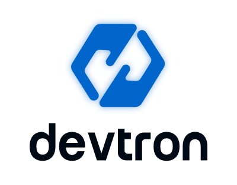

<p align="center"></p>
<p align="center">Devtron is an open source software delivery workflow for kubernetes written in go.
<br>
<a href="https://docs.devtron.ai/" rel="nofollow"><strong>Explore documentation »</strong></a>
<br>
<br>
<a href="https://devtron.ai/">Website</a>
·
<a href="https://devtron.ai/blog/">Blog</a>
·
<a href="https://discord.gg/jsRG5qx2gp">Join Discord</a>
·
<a href="https://twitter.com/DevtronL">Twitter</a>

</p>
<p align="center">
<a href="https://discord.gg/jsRG5qx2gp"></a>
<a href="https://goreportcard.com/badge/github.com/devtron-labs/devtron"></a>
<a href="./LICENSE"></a>
<a href="https://bestpractices.coreinfrastructure.org/projects/4411"></a>
<a href="http://golang.org"></a>
<a href="http://devtron.ai/"></a>

</p>

## :book: Menu

- [Why Devtron](https://github.com/devtron-labs/devtron#bulb-why-devtron) 
- [Features](https://github.com/devtron-labs/devtron#tada-features)
- [Getting Started](https://github.com/devtron-labs/devtron#rocket-getting-started)
- [Documentation](https://docs.devtron.ai/)
- [Compatibility Notes](https://github.com/devtron-labs/devtron#memo-compatibility-notes)
- [Community](https://github.com/devtron-labs/devtron#busts_in_silhouette-community)
- [Contribute](https://github.com/devtron-labs/devtron#handshake-contribute)
- [Vulnerability Reporting](https://github.com/devtron-labs/devtron#beetle-vulnerability-reporting)
- [License](https://github.com/devtron-labs/devtron#bookmark-license)
 
## :bulb: Why Devtron?
It is designed as a self-serve platform for operationalizing and maintaining applications (AppOps) on kubernetes in a developer friendly way. 
<br>
<br>

<br>
<br>
## :tada: Features
<details>
<summary> 
 <b> Zero code software delivery workflow </b>
  </summary>
<br>

- Workflow which understands the domain of **kubernetes, testing, CD, SecOps** so that you dont have to write scripts
- Reusable and composable components so that workflows are easy to contruct and reason through
</details>

<details>
<summary> <b> Multi cloud deployment </b></summary>
 <br> 
 
 - Deploy to multiple kubernetes cluster
</details>
<details>
 <summary> <b> Easy dev-sec-ops integration </b> </summary>
<br>
 
- Multi level security policy at global, cluster, environment and application for efficient hierarchical policy management
- Behavior driven security policy
- Define policies and exception for kubernetes resources
- Define policies for events for faster resolution
</details>

<details>
 <summary> <b> Application debugging dashboard </b> </summary>
<br>
 
- One place for all historical kubernetes events 
- Access all manifests securely for e.g. secret obfuscation 
- ***Application metrics*** for cpu, ram, http status code and latency with comparison between new and old 
- ***Advanced logging*** with grep and json search 
- Intelligent ***correlation between events, logs*** for faster triangulation of issue 
- Auto issue identification 
</details>

<details>
<summary> <b>Enterprise grade security and compliances </b></summary>
<br>
 
- Fine grained access control; control who can edit configuration and who can deploy
- Audit log to know who did what and when
- History of all CI and CD events
- Kubernetes events impacting application
- Relevant cloud events and their impact on applications
- Advanced workflow policies like blackout window, branch environment relationship to secure build and deployment pipelines
</details>
<details>
<summary> <b> Gitops aware  </b></summary>
<br>
 
- Gitops exposed through API and UI so that you dont have to interact with git cli
- Gitops backed by postgres for easier analysis
- Enforce finer access control than git

</details>
<details>
<summary> <b>Operational insights  </b></summary>
<br>
 
- Deployment metrics to measure success of agile process. It captures mttr, change failure rate, deployment frequency, deployment size out of the box.
- Audit log to understand the failure causes
- Monitor changes across deployments and revert easily

</details>


## :rocket: Getting Started

#### Quick in stallation with default settings

This installation will use Minio for storing build logs and cache. Please make sure to edit the POSTGRESQL_PASSWORD value.

```bash
helm repo add devtron https://helm.devtron.ai
helm install devtron devtron/devtron-operator --create-namespace --namespace devtroncd \
--set secrets.POSTGRESQL_PASSWORD=change-me
```

For detailed instructions and other options, check out [devtron installation documentation](https://docs.devtron.ai/setup/install)


#### :key: Access Devtron dashboard

If you did not provide a **BASE\_URL** during install or have used the default installation, Devtron creates a loadbalancer for you on its own. Use the following command to get the dashboard url.

```text
kubectl get svc -n devtroncd devtron-service -o jsonpath='{.status.loadBalancer.ingress}'
```

You will get result something like below

```text
[test2@server ~]$ kubectl get svc -n devtroncd devtron-service -o jsonpath='{.status.loadBalancer.ingress}'
[map[hostname:aaff16e9760594a92afa0140dbfd99f7-305259315.us-east-1.elb.amazonaws.com]]
```

The hostname mentioned here \( aaff16e9760594a92afa0140dbfd99f7-305259315.us-east-1.elb.amazonaws.com \) is the Loadbalancer URL where you can access the Devtron dashboard.

**PS:** You can also do a CNAME entry corresponding to your domain/subdomain to point to this Loadbalancer URL to access it at a custom domain.

| Host | Type | Points to |
| ---: | :--- | :--- |
| devtron.yourdomain.com | CNAME | aaff16e9760594a92afa0140dbfd99f7-305259315.us-east-1.elb.amazonaws.com |


*****Devtron Admin credentials*****


For admin login use username:`admin` and for password run the following command.

```bash
kubectl -n devtroncd get secret devtron-secret -o jsonpath='{.data.ACD_PASSWORD}' | base64 -d
```

*****[Detail configuration options](https://docs.devtron.ai/setup/install#configuration)*****

#### Using devtron
  
- [Deploying First Application](https://docs.devtron.ai/user-guide/creating-application)
- [Deploying Helm charts](https://docs.devtron.ai/user-guide/deploy-chart)
- [Configure Security policy](https://docs.devtron.ai/user-guide/security-features)
- [Detail Userguide](https://docs.devtron.ai)


<!--
## Why another Deployment tool? 

**TODO**
-->

## :memo: Compatibility notes

- It uses modified version of [argo rollout](https://argoproj.github.io/argo-rollouts/)
- Application metrics only works for k8s 1.16+

## :busts_in_silhouette: Community

Get updates on Devtron's development and chat with the project maintainers, contributors and community members.

 - Join the [Discord Community](https://discord.gg/jsRG5qx2gp) 
 - Follow [@DevtronL on Twitter](https://twitter.com/DevtronL)
 - Raise feature requests, suggest enhancements, report bugs at [GitHub issues](https://github.com/devtron-labs/devtron/issues)
 - Read the [Devtron blog](https://devtron.ai/blog/)


## :handshake: Contribute

Check out our [contributing guidelines](CONTRIBUTING.md). Included are directions for opening issues, coding standards, and notes on our development processes.

## :beetle: Vulnerability Reporting

We at Devtron take security and our users' trust very seriously. If you believe you have found a security issue in Devtron, please responsibly disclose us at security@devtron.ai.

## :bookmark: License

Devtron is available under the [Apache License, Version 2.0](LICENSE)

