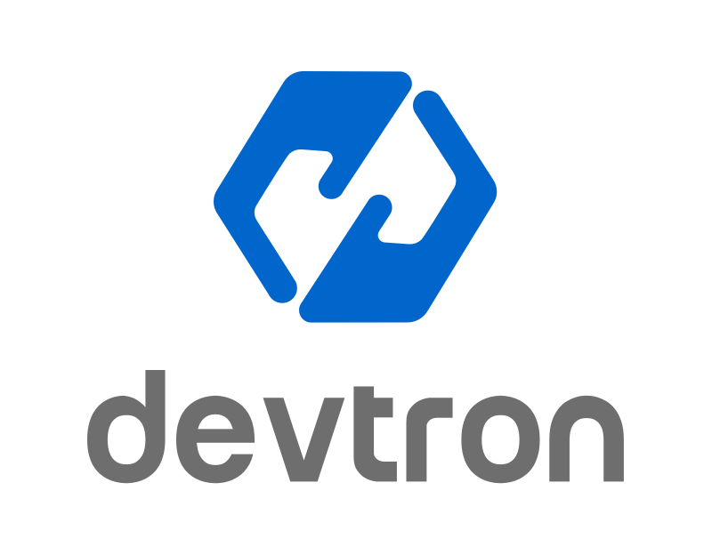
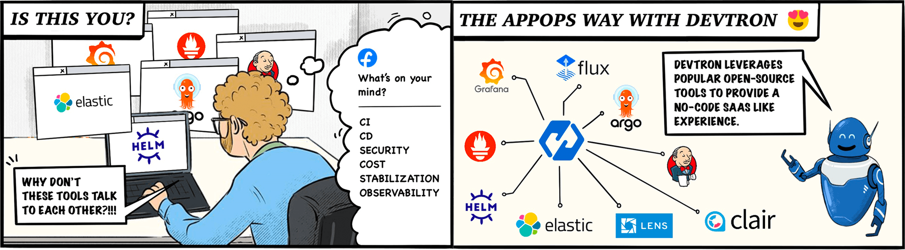
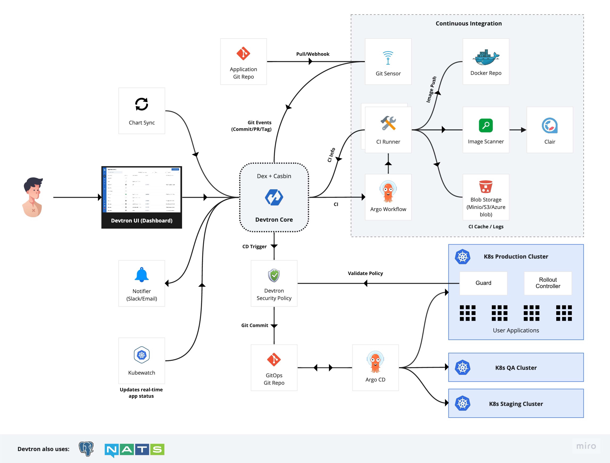
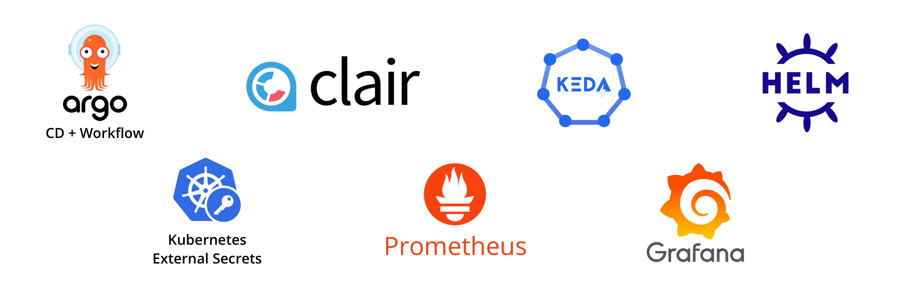

<p align="center">
<h1 align= "center">Tool integration platform for Kubernetes</h1>
</p>
 
<p align="center">
<br>
<a href="https://docs.devtron.ai/" rel="nofollow"><strong>Explore documentation »</strong></a>
<br>
<a href="https://devtron.ai/">Website</a>
·
<a href="https://devtron.ai/blog/">Blogs</a>
·
<a href="https://discord.gg/jsRG5qx2gp">Join Discord channel</a>
·
<a href="https://twitter.com/DevtronL">Twitter</a>
.
<a href="https://www.youtube.com/channel/UCAHRp9qp0z1y9MMtQlcFtcw">YouTube</a>
 
</p>
<p align="center">
<a href="https://discord.gg/jsRG5qx2gp"></a>
<a href="https://goreportcard.com/badge/github.com/devtron-labs/devtron"></a>
<a href="./LICENSE"></a>
<a href="https://bestpractices.coreinfrastructure.org/projects/4411"></a>
<a href="http://golang.org"></a>
<a href="http://devtron.ai/"></a>
<a href="https://twitter.com/intent/tweet?text=Devtron%20helps%20in%20simplifying%20software delivery%20workflow%20for%20Kubernetes,%20check%20it%20out!!%20&hashtags=OpenSource,Kubernetes,DevOps,CICD,go&url=https://github.com/devtron-labs/devtron%0a"></a>
 
<p align="center">
<a href="https://devtron.ai/support.html">🔥 Want to accelerate K8s adoption? Our team would love to help 100 companies do it the Devtron way! 🔥
<br>
<br>
Apply Now 👋
</a>
</p>
<h1></h1>

Devtron deeply integrates with products across the lifecycle of microservices,i.e., CI, CD, security, cost, debugging, and observability via an intuitive web interface.
<br>
<p align="center"></p>

[Devtron](#install-devtron) helps you deploy, observe, manage & debug existing Helm apps in all your clusters.

## Devtron features

<details><summary><b>Application-level Resource grouping for easier Debugging</b></summary>
<br>
 
- Devtron groups your Kubernetes objects deployed via Helm charts and display them in a slick UI for easier monitoring or debugging. Access pod logs and resource manifests right from the Devtron UI and even edit them!
 
</details>
<details><summary> <b>Centralized Access Management</b></summary>
<br>
- Control and give customizable view-only, edit access to users on Project, Environment and Application levels
</details>

<details><summary> <b>Deploy, Manage and Observe on multiple clusters</b></summary>
<br>
- Deploy and manage Helm charts, applications across multiple Kubernetes clusters (hosted on multiple clouds/on-prem) right from a single Devtron setup
</details>

<br>

## Integrations

Devtron is designed to be modular, and its functionality can be easily extended with the help of integrations.

### CI/CD integration

[Devtron CI/CD with GitOps](#install-devtron-with-cicd-integration) integration is used to automate the builds and deployments and enables the software development teams to focus on meeting the business requirements, code quality, and security.

* Devtron leverages Kubernetes auto-scaling and centralized caching to give you unlimited cost-efficient CI workers.
* Supports pre-CI and post-CI integrations for code quality monitoring.
* Seamlessly integrates with Clair for image vulnerability scanning.
* Supports different deployment strategies: Blue/Green, Rolling, Canary, and Recreate.
* Implements GitOps to manage the state of Kubernetes applications,
* Integrates with ArgoCD for continuous deployment.
* Checks logs, events, and manifests or exec inside containers for debugging.
* Provides deployment metrics like; deployment frequency, lead time, change failure rate, and mean-time recovery.
* Seamlessly integrates with Grafana for continuous application metrics like CPU and memory usage, status code, throughput, and latency on the dashboard.

## Architecture

<p align="center"></p>

## Installation

Before you begin, you must create a [Kubernetes cluster](https://kubernetes.io/docs/tutorials/kubernetes-basics/create-cluster/) (preferably K8s 1.16 or higher) and install [Helm](https://helm.sh/docs/intro/install/).

### Install Devtron

```bash
helm repo add devtron https://helm.devtron.ai

helm install devtron devtron/devtron-operator --create-namespace --namespace devtroncd

```

### Install Devtron with CI/CD integration

Run the following command to install the latest version of Devtron along with the CI/CD module:

```bash
helm repo add devtron https://helm.devtron.ai

helm install devtron devtron/devtron-operator \
--create-namespace --namespace devtroncd \
--set installer.modules={cicd}
```

Please refer to the document on how to [install Devtron with CI/CD](./docs/setup/install/install-devtron-with-cicd.md) for more information.

#### Installation status

The above install command for CI/CD integration starts Devtron-operator, which takes about 20 minutes to spin up all of the Devtron microservices one by one. You can check the status of the installation with the following command:

```bash
kubectl -n devtroncd get installers installer-devtron \
-o jsonpath='{.status.sync.status}'
```

The command executes with one of the following output messages, indicating the status of the installation:

* **Downloaded**: The installer has downloaded all the manifests, and installation is in progress.
* **Applied**: The installer has successfully applied all the manifests, and the installation is complete.

### Devtron Dashboard

Use the following command to get the dashboard URL:

```bash
kubectl get svc -n devtroncd devtron-service -o jsonpath='{.status.loadBalancer.ingress}'
```

#### Dashboard credentials

For admin login, use the username:`admin`, and run the following command to get the admin password:

```bash
kubectl -n devtroncd get secret devtron-secret -o jsonpath='{.data.ACD_PASSWORD}' | base64 -d
```

Please refer to the document for more information on how to [access the Devtron Dashboard](./docs/setup/install/install-devtron-with-cicd.md/#access-devtron-dashboard).

## :blue_heart: Technology
 
Devtron is built on some of the most trusted and loved technologies:
<br>
<p align="center"></p>
 
## :video_camera: Videos
 
- [Devtron - A Comprehensive Overview](https://youtu.be/FB5BI3Ef7uw?t=363)
- [Viktor Farcic's review](https://youtu.be/ZKcfZC-zSMM)
- [Running an application on Devtron](https://youtu.be/bA6zgjPD_yA?t=2927)
- [Devtron Demo](https://youtu.be/ekxHV2Gje-E?t=7856)

## :memo: Blogs from Community

* [How Livspace revolutionised its CI/CD saga](https://blog.livspace.io/how-livspace-revolutionised-its-ci-cd-saga-3120724e271b)
* [AppOps with Kubernetes and Devtron: The Perfect Fit](https://hackernoon.com/appops-with-kubernetes-and-devtron-the-perfect-fit-sj934qj)
* [Getting started with GitOps on Kubernetes with Devtron](https://piotrminkowski.com/2022/05/04/getting-started-with-gitops-on-kubernetes-with-devtron)
* [Zero to hero on Kubernetes with Devtron](https://dzone.com/articles/zero-to-hero-on-kubernetes-with-devtron)
* [Kubernetes deployment made easy](https://medium.com/container-talks/kubernetes-deployment-made-easy-cc74f0242f06)

## :muscle: Trusted By
 
Devtron is trusted by Enterprises and Communities all across the globe:
<br>

- [Delhivery:](https://www.delhivery.com/) Delhivery is an Indian delivery and e-commerce logistics company, that provides end-to-end Supply Chain solutions through cutting-edge technology
- [BharatPe:](https://bharatpe.com/) Bharatpe is an Indian fintech company that offers a range of products including interoperable QR codes for UPI payments, POS machines for card acceptance, and small business financing
- [Livspace:](https://www.livspace.com/in) Livspace is a home interior and renovation company, that provides interior design and renovation services in Singapore and India
- [Moglix:](https://www.moglix.com/) Moglix is an industrial B2B marketplace and an e-commerce platform for industrial tools and equipment, used largely by businesses in India
- [Xoxoday:](https://www.xoxoday.com/) Xoxoday provides technology infrastructure to enable businesses to automate rewards, incentives & payouts for employees, customers & channel partners
 
## :question: FAQs & Troubleshooting
 
- Devtron - [see here](https://docs.devtron.ai/devtron/faqs-and-troubleshooting/devtron-troubleshoot)
 
## :page_facing_up: Compatibility
 
### Current build
 
- Devtron uses modified version of [Argo Rollout](https://argoproj.github.io/argo-rollouts/)
- Application metrics only work for K8s version 1.16+
 
## Support, Contribution, and Community
 
## :busts_in_silhouette: Community
 
Get updates on Devtron's development and chat with project maintainers, contributors, and community members
- Follow [@DevtronL on Twitter](https://twitter.com/DevtronL)
- Raise feature requests, suggest enhancements, and report bugs in our [GitHub Issues](https://github.com/devtron-labs/devtron/issues)
- Articles, Howtos, Tutorials - [Devtron Blogs](https://devtron.ai/blog/)
 
### Join us at Discord channel
<p>
<a href="https://discord.gg/jsRG5qx2gp">
   
</a>
</p>
## :handshake: Contribute
 
Check out our [contributing guidelines](CONTRIBUTING.md). Included, are directions for opening issues, coding standards, and notes on our development processes. We deeply appreciate your contribution.
 
Please look at our [community contributions](COMMUNITY_CONTRIBUTIONS.md) and feel free to create a video or blog around Devtron and add your valuable contribution to the list.
 
### Contributors:
 
We are deeply grateful to all our amazing contributors!
 
<a href="https://github.com/devtron-labs/devtron/graphs/contributors">
 
</a>
 
## :bug: Vulnerability Reporting
 
We at Devtron, take security and our users' trust very seriously. If you believe you have found a security issue, please report it to <b>security@devtron.ai</b>.
 
## :bookmark: License
 
Devtron is licensed under [Apache License, Version 2.0](LICENSE)
