Note: We have restructured the readme. If you are looking for Devtron's CI/CD capabilities, please [click here](#devtron-platform)
#

<p align="center">
<picture>
  <source media="(prefers-color-scheme: dark)"  srcset="./assets/devtron-darkmode-logo.png">
  <source media="(prefers-color-scheme: light)"  srcset="./assets/devtron-lightmode-logo.png">
  
</picture>
<h1 align= "center">The Kubernetes Platform That Eliminates Operational Chaos</h1>
</p>
 
<p align="center">
<br>
<a href="https://docs.devtron.ai/" rel="nofollow"><strong>«Explore Documentation»</strong></a> <strong>||</strong>
<a href="https://preview.devtron.ai/dashboard/" rel="nofollow"><strong>«Try Devtron Demo»</strong></a>
<br>
<a href="https://devtron.ai/">Website</a>
·
<a href="https://devtron.ai/blog/">Blogs</a>
·
<a href="https://discord.gg/jsRG5qx2gp">Join Discord channel</a>
·
<a href="https://twitter.com/DevtronL">Twitter</a>
.
<a href="https://www.youtube.com/channel/UCAHRp9qp0z1y9MMtQlcFtcw">YouTube</a>
 

</p>
<p align="center">
<a href="https://discord.gg/jsRG5qx2gp"></a>
<a href="https://goreportcard.com/badge/github.com/devtron-labs/devtron"></a>
<a href="./LICENSE"></a>
<a href="./CONTRIBUTING.md"></a>
<a href="https://github.com/devtron-labs/devtron"></a>
<a href="https://bestpractices.coreinfrastructure.org/projects/4411"></a>
<a href="http://golang.org"></a>
<a href="http://devtron.ai/"></a>
<a href="https://github.com/devtron-labs/devtron/releases"></a>
<a href="https://twitter.com/intent/tweet?text=Devtron%20helps%20in%20simplifying%20software delivery%20workflow%20for%20Kubernetes,%20check%20it%20out!!%20&hashtags=OpenSource,Kubernetes,DevOps,CICD,go&url=https://github.com/devtron-labs/devtron%0a"></a>
<h1></h1>

Devtron's **extensible Kubernetes Dashboard** provides clear visibility into your Kubernetes clusters and streamlines Helm app management through a single, intuitive interface.<br> 
With built-in RBAC, it ensures secure access while offering integrated insights into workloads deployed via GitOps tools like **ArgoCD** and **FluxCD** across multiple clusters. Devtron creates a centralized DevOps hub, accelerating operations by up to 20x :rocket:

Check out the below video to experience the full power of the **Kubernetes Dashboard**.

<a href="https://youtu.be/oqCAB9b-SGQ?si=YoUJfHL43VXRU5wx">
<br>
<p align="center">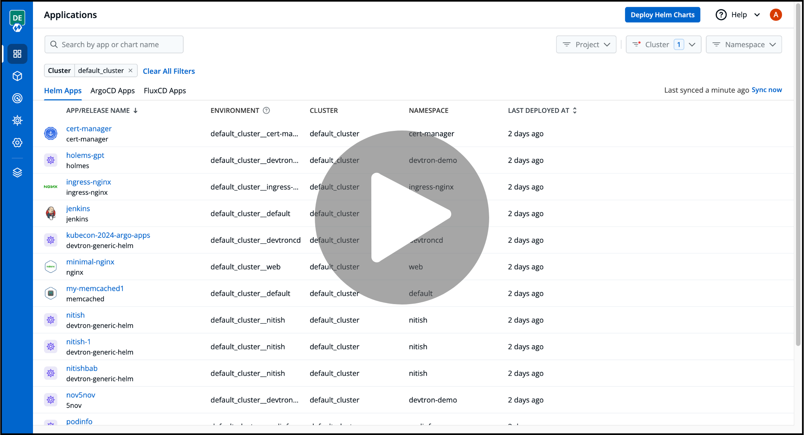</p>
</a>

Out of the box, Devtron's Kubernetes Dashboard includes:
- [Helm Application Management](https://docs.dashboard.devtron.ai/user-guide/helm-apps) to streamline deploying, configuration, and management of Helm apps 
- [Resource Browser](https://docs.dashboard.devtron.ai/user-guide/resource-browser) to visualize and manage different cluster resources like Nodes, Pods, ConfigMaps, Custom Resource Definations (CRDs), etc
- [Single Sign On (SSO)](https://docs.dashboard.devtron.ai/operator-guide/authorization/sso-login-services) to simplify onboarding and authenticating team members.
- [Fine Grained RBAC](https://docs.dashboard.devtron.ai/operator-guide/authorization) to control the level of access users have to different Dashboard and Cluster resources.

[Devtron](#devtron-platform) helps you deploy, observe, manage & debug existing Helm apps in all your clusters.

---

## Devtron Dashboard 

Devtron's Kubernetes Dashboard offers a variety of different features, giving you flexibility to manage your clusters as you desire.

### Features 🤩

- Simplified configuration and management for Helm applications with easy rollback
- Compare and reconcile configuration drifts across environments
- Manage Helm deployments to multiple Kubernetes environments
- A single pane of glass for Helm, ArgoCD, and FluxCD applications across multiple clusters
- Centralized Dashboard to view and manage K8s resources across multiple clusters
- Comprehensive SSO and RBAC to ensure secure dashboard access for team collaboration

To get a more comprehensive understanding of Devtron's Kubernetes Dashboard, please visit the [documentation](https://docs.dashboard.devtron.ai/)

### Installation

Before you begin, you must create a [Kubernetes cluster](https://kubernetes.io/docs/tutorials/kubernetes-basics/create-cluster/) (preferably K8s 1.16 or higher) and install [Helm](https://helm.sh/docs/intro/install/).

### Install Devtron's Kubernetes Dashboard

Run the following command to install the latest version of Devtron's Kubernetes Dashboard:

```bash
helm repo add devtron https://helm.devtron.ai

helm install devtron devtron/devtron-operator \
--create-namespace --namespace devtroncd
```

### Access Devtron

**URL**: Use the following command to get the dashboard URL:

```bash
kubectl get svc -n devtroncd devtron-service -o jsonpath='{.status.loadBalancer.ingress}'
```

**Credentials**:

**UserName**:  `admin` <br>
**Password**:   Run the following command to get the admin password for Devtron version v0.6.0 and higher

```bash
kubectl -n devtroncd get secret devtron-secret -o jsonpath='{.data.ADMIN_PASSWORD}' | base64 -d
```

For Devtron version less than v0.6.0, run the following command to get the admin password:

```bash
kubectl -n devtroncd get secret devtron-secret -o jsonpath='{.data.ACD_PASSWORD}' | base64 -d
```

Please refer to the document for more information on how to [access the Devtron Dashboard](https://docs.dashboard.devtron.ai/getting-started/install-devtron-dashboard).

---

## Devtron Platform

The Devtron Platform provides a complete solution for all DevOps requirements, helping to create a single centralized DevOps Platform for managing all applications across Kubernetes clusters. <br>

With Devtron Platform, you can accelerate your application delivery lifecycle by leveraging advanced features like canary deployments, A/B testing, and automated rollbacks. Devtron Platform helps you achieve faster time-to-market and improved application reliability by simplifying Kubernetes operations and streamlining development workflows.

<p align="center">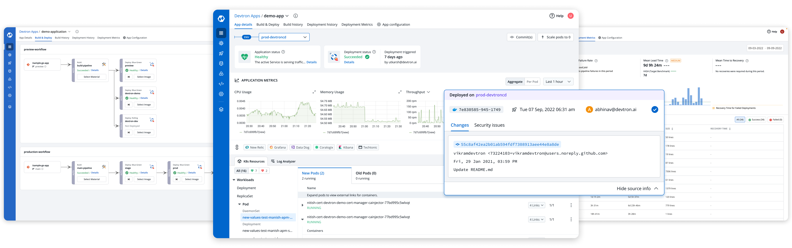</p>

Devtron deeply integrates with products across the lifecycle of microservices,i.e., CI, CD, security, cost, debugging, and observability via an intuitive web interface and helps you deploy, observe, manage & debug applications across all your Kubernetes clusters.

### Devtron Integrations

By harnessing the potential of diverse integrations, Devtron Dashboard can evolve into a robust platform, automating Kubernetes application workflows, from CI/CD pipelines to ongoing maintenance

Devtron comes with the following integrations:

- [Build and Deploy (CI/CD)](https://docs.devtron.ai/usage/integrations/build-and-deploy-ci-cd) integration enables software development teams to automate the build and deployment process, allowing them to focus on meeting the business requirements, maintaining code quality, and ensuring security
- [GitOps (Argo CD)](https://docs.devtron.ai/usage/integrations/argocd) integration uses ArgoCD to implement GitOps for continuous delivery with GitOps patterns
- [Vulnerability Scanning (Clair)](https://docs.devtron.ai/usage/integrations/clair) integration enables you to scan the vulnerabilities of the images during the time of image build only.
- [Vulnerability Scanning (Trivy)](https://docs.devtron.ai/usage/integrations/clair) integration enables you to scan the vulnerabilities of the images during the time of image build only.
- [Notifications](https://docs.devtron.ai/usage/integrations/notifications) integration, lets you receive alerts for build and deployment pipelines on trigger, success, and failure events to your email or a Slack channel via SES and SMTP.
- [Monitoring (Grafana)](https://docs.devtron.ai/usage/integrations/grafana) integration uses Grafana to gather application metrics like CPU, Memory utilization, Status 4xx/ 5xx/ 2xx, Throughput, and Latency.


### Features 🤩

- End-to-End CI/CD pipeline enabling a No Code software delivery workflow for Kubernetes through Helm or GitOps with ArgoCD
- Deploy applications to multiple Kubernetes clusters on multiple cloud/on-prem from one Devtron setup
- Robust DevSecOps implementation with battle tested tools like Trivy and Clair
- A Single dashboard to cater to all debugging requirements for applications
- Deployment metrics to measure the success of the agile process. It captures MTTR, change failure rate, deployment frequency, and deployment size.

To get a more comprehensive understanding of Devtron Platform's features, please visit the [documentation](https://docs.devtron.ai/)

### Install Devtron Platform

Run the following command to install the latest version of the Devtron Platform:

```bash
helm install devtron devtron/devtron-operator --namespace devtroncd \
--set installer.modules={cicd} --set argo-cd.enabled=true \ 
--set security.enabled=true  --set notifier.enabled=true  \
--set security.trivy.enabled=true --set monitoring.grafana.enabled=true
```

---

## Core Tools and Technologies
 
Here are the components that Devtron uses internally as part of its own architecture:

| Logo     | Tool     | Purpose    | GitHub Repository   | License |
| -------- | -------- | ---------- | ------------------- | ------- |
| 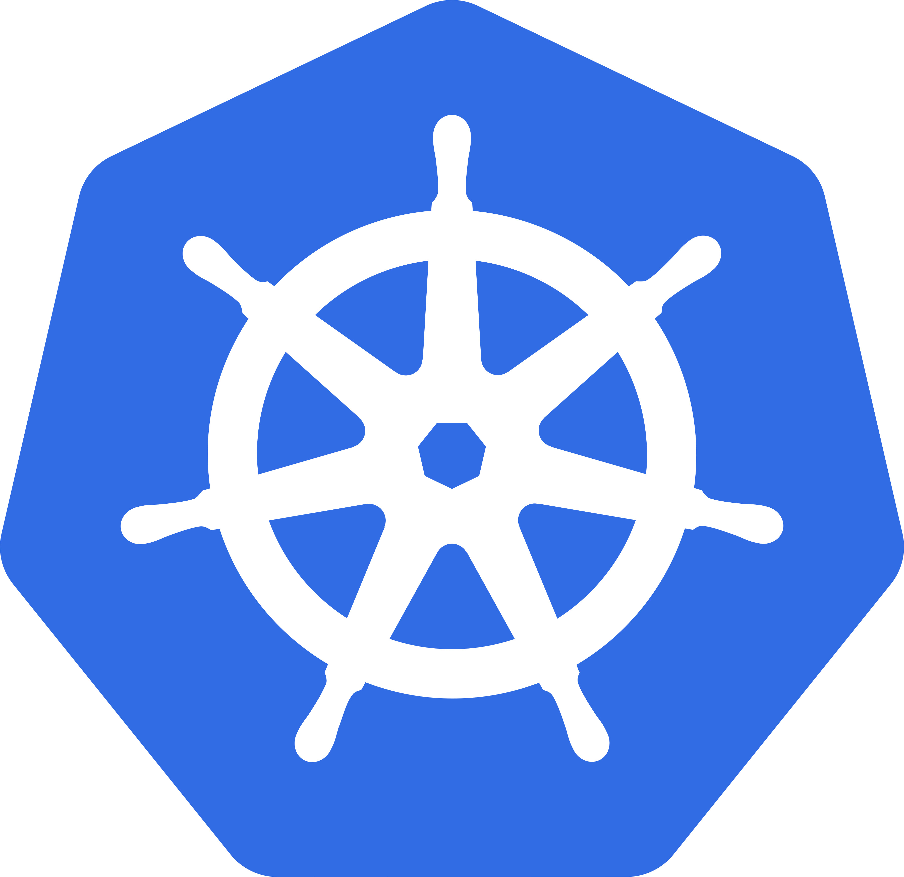 | **Kubernetes** | Container orchestration foundation powering Devtron | [Repo Link](https://github.com/kubernetes/kubernetes) | [License Link](https://github.com/kubernetes/kubernetes/blob/master/LICENSE) |
|      | **Golang**     | Programming language used to build Devtron | [Repo Link](https://github.com/golang/go) | [License Link](https://github.com/golang/go/blob/master/LICENSE) |
| 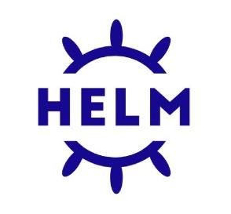       | **Helm**       | Kubernetes package manager  | [Repo Link](https://github.com/helm/helm)  | [License Link](https://github.com/helm/helm/blob/main/LICENSE)                             |
| 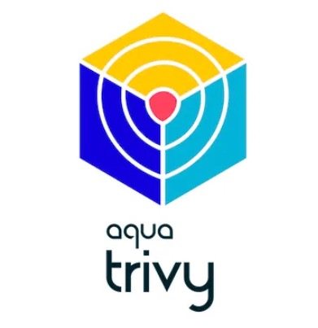      | **Trivy**      | Find vulnerabilities, misconfigurations, secrets, SBOM in containers, Kubernetes, code repositories, clouds and more | [Repo Link](https://github.com/aquasecurity/trivy) | [License Link](https://github.com/aquasecurity/trivy/blob/main/LICENSE) |
| 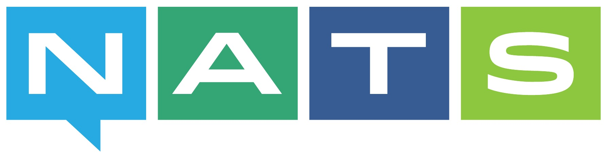       | **NATS**       | High-performance server for NATS.io, the cloud and edge native messaging system | [Repo Link](https://github.com/nats-io/nats-server)    | [License Link](https://github.com/nats-io/nats-server/blob/main/LICENSE)  |
| 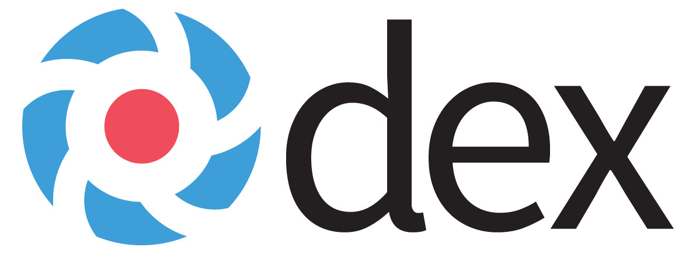        | **Dex**        | Identity service used for authentication (SSO) | [Repo Link](https://github.com/dexidp/dex) | [License Link](https://github.com/dexidp/dex/blob/master/LICENSE)  |
|      | **Casbin**     | Access control library for authorization (RBAC)  | [Repo Link](https://github.com/casbin/casbin) | [License Link](https://github.com/casbin/casbin/blob/master/LICENSE) |


---

## Optional Components

Here are some of the optional components that Devtron supports:

| Logo     | Tool     | Purpose    |
| -------- | -------- | ---------- |
| 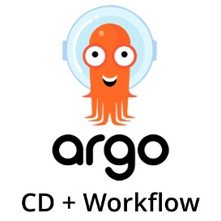  | [**Argo CD / Argo Workflows**](https://github.com/argoproj/argo-cd) | GitOps deployment and workflow automation | 
| 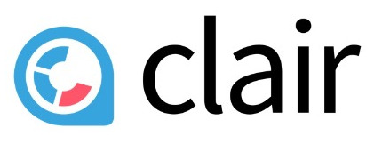 | [**Clair**](https://github.com/quay/clair)   | Vulnerability Static Analysis for Containers |
| 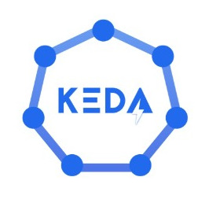  | [**KEDA**](https://github.com/kedacore/keda) | Event driven autoscaling for Kubernetes workloads |  
| 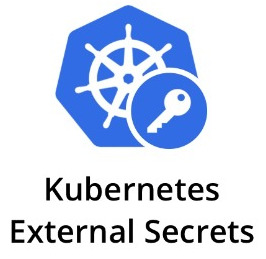 | [**Kubernetes External Secrets**](https://github.com/external-secrets/external-secrets) | Sync secrets from external secret stores     | 
| 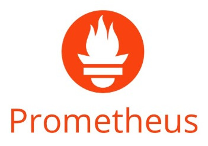  | [**Prometheus**](https://github.com/prometheus/prometheus) | Metrics collection and alerting |
| 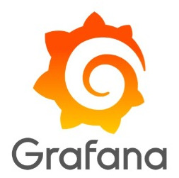     | [**Grafana**](https://github.com/grafana/grafana) | Monitoring dashboards and visualization  | 

---

## :question: FAQs & Troubleshooting
 
- For troubleshooting Devtron please [refer to this docs page](https://docs.devtron.ai/resources/devtron-troubleshoot)
 
## :busts_in_silhouette: Community
 
Get updates on Devtron's development and chat with project maintainers, contributors, and community members
- Follow [@DevtronL on Twitter](https://twitter.com/DevtronL)
- Raise feature requests, suggest enhancements, and report bugs in our [GitHub Issues](https://github.com/devtron-labs/devtron/issues)
- Articles, Howtos, Tutorials - [Devtron Blogs](https://devtron.ai/blog/)
- Devtron is trusted by communities all across the globe. The list of organizations using Devtron can be found [here](./USERS.md).
 
### Join us at Discord channel
<p>
<a href="https://discord.gg/jsRG5qx2gp">
   
</a>
</p>

---

## :handshake: Contribute
 
Check out our [contributing guidelines](CONTRIBUTING.md). Included, are directions for opening issues, coding standards, and notes on our development processes. We deeply appreciate your contribution.
 
Please look at our [community contributions](COMMUNITY_CONTRIBUTIONS.md) and feel free to create a video or blog around Devtron and add your valuable contribution to the list.
 
### Contributors:
 
We are deeply grateful to all our amazing contributors!
 
<a href="https://github.com/devtron-labs/devtron/graphs/contributors">
 
</a>

---
 
## :bug: Vulnerability Reporting
 
We at Devtron, take security and our users' trust very seriously. If you believe you have found a security issue, please report it to <b>security@devtron.ai</b>.

---
 
## :bookmark: License
 
Devtron is licensed under [Apache License, Version 2.0](LICENSE)
