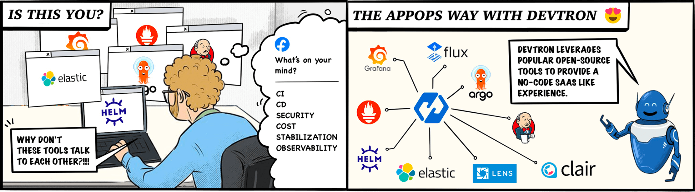

# Overview
 
## Devtron 🚀
 
Devtron is a tool integration platform for Kubernetes.

Devtron deeply integrates with products across the lifecycle of microservices,i.e., CI, CD, security, cost, debugging, and observability via an intuitive web interface.
 
> To quickly get started, refer to the [Devtron Installation Guide ⎈](setup/install/README.md) ⎈
 

 
## Why Devtron?
 
To improve the use of Kubernetes, we employ several tools. Using these tools at the same time, however, is cumbersome and complex.
This is because these tools do not communicate with one another to manage different aspects of the application lifecycle, such as CI, CD, security, cost, observability, and stabilization.
 
Devtron is a one-stop solution for the complexity of the tools mentioned above!
 

 
Devtron is an open-source modular product that provides a 'seamless' and 'implementation agnostic uniform interface', that can be integrated with both open-source and commercial tools across the entire lifecycle. All this is achieved while focusing on a slick user experience, including a self-serve model.
 
You can efficiently handle security, stability, cost, and more in a unified experience.
 
### Devtron Features:
 
#### Zero code software delivery workflow for Kubernetes
 
* Workflow which understands the domain of **Kubernetes, testing, CD, SecOps** so that you don't have to write scripts
* Reusable and composable components so that workflows are easy to construct and reason through
 
#### Multi cloud deployment
 
* Deploy to multiple Kubernetes clusters on multiple cloud/on-prem from one Devtron setup.
* Works for all cloud providers and on-premise Kubernetes clusters.
 
#### Easy DevSecOps integration
 
* Multi-level security policy at global, cluster, environment, and application-level for efficient hierarchical policy management
* Behavior-driven security policy
* Define policies and exceptions for Kubernetes resources
* Define policies for events for faster resolution
 
#### Application debugging dashboard
 
* One place for all historical Kubernetes events
* Access all manifests securely, such as secret obfuscation
* _**Application metrics**_ for CPU, RAM, HTTP status code, and latency with a comparison between new and old
* _**Advanced logging**_ with grep and JSON search
* Intelligent _**correlation between events, logs**_ for faster triangulation of issue
* Auto issue identification
 
#### Enterprise-Grade security and compliances
 
* Fine-grained access control; control who can edit the configuration and who can deploy.
* Audit log to know who did what and when
* History of all CI and CD events
* Kubernetes events impacting application
* Relevant cloud events and their impact on applications
* Advanced workflow policies like blackout window, branch environment relationship to secure build and deployment pipelines
 
#### GitOps aware
 
* GitOps exposed through API and UI so that you don't have to interact with git CLI
* GitOps backed by Postgres for easy analysis
* Enforce finer access control than Git
 
#### Operational insights
 
* Deployment metrics to measure the success of the agile process. It captures MTTR, change failure rate, deployment frequency, and deployment size out of the box.
* Audit log to understand the failure causes
* Monitor changes across deployments and reverts easily
 
## Compatibility notes
 
* It uses a modified version of [argo rollout](https://argoproj.github.io/argo-rollouts/).
* Application metrics only work for k8s 1.16+
 
## What's next
 
* [Install Devtron](setup/install/README.md)
 
## Contribute
 
Check out our [contributing guidelines](https://github.com/devtron-labs/devtron/blob/main/CONTRIBUTING.md). Directions for opening issues, coding standards, and notes on our development processes are all included.
 
## Community
 
Get updates on Devtron's development and chat with the project maintainers, contributors, and community members.
 
* Join the [Discord Community](https://discord.gg/jsRG5qx2gp)
* Follow [@DevtronL on Twitter](https://twitter.com/DevtronL)
* Raise feature requests, suggest enhancements, report bugs at [GitHub issues](https://github.com/devtron-labs/devtron/issues)
* Read the [Devtron blog](https://devtron.ai/blog/)
 
## Vulnerability Reporting
 
We at Devtron take security and our users' trust very seriously. If you believe you have found a security issue in Devtron, please responsibly disclose it by contacting us at security@devtron.ai.
 
## License
 
Devtron is available under the [Apache License, Version 2.0](https://github.com/devtron-labs/devtron/blob/main/LICENSE).
