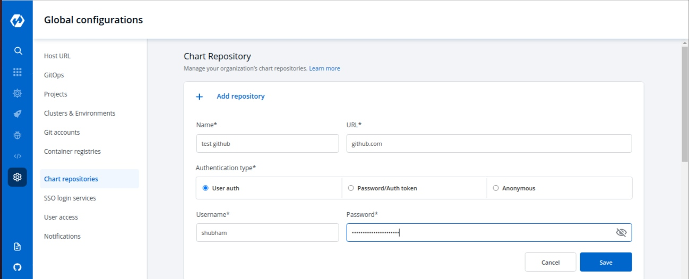

# Chart Repository

This feature allows you to add more chart repositories to Devtron. Once added they will be available in the `Discover section` of the `Chart Store`. 

Learn more about [Discover chart link](https://docs.devtron.ai/user-guide/deploy-chart/overview-of-charts#deploying-chart)

## Add Chart Repository

Select the Chart Repository section of global configuration and click on `Add Repository` button at the top of the Chart Repository Section. To add new chart, you need to provide three inputs as below:

1. Name
2. URL
3. Authentication type

### 1. Name

Provide a `Name` to your Chart Repository. This name is added as prefix to the name of the chart in the listing on the helm chart section of application.

### 2. URL

Provide the `URL`. **For example**- github.com for Github, [https://gitlab.com](https://gitlab.com) for GitLab, etc.

### 3. Authentication type

Here you have to provide the type of Authentication required by your version controller. We support three types of authentications, You can choose the one that suits you the best.

* **Anonymous**

If you select `Anonymous` then you do not have to provide any username, password, or authentication token. Just click on `Save` to save your chart repository details.

* **Password/Auth token**

If you select Password/Auth token, then you have to provide the `Access Token` for the authentication of your version controller account inside the Access token box. Click on `Save` to save your chart repository details.

* **User Auth**

If you choose `User Auth` then you have to provide the `Username` and `Password` of your version controller account. Click on `Save` to save your chart repository details.

## Update Chart Repository

You can update your saved chart repository settings at any point in time. Just click on the chart repository which you want to update. Make the required changes and click on `Update` to save you changes.

> Note: You can enable and disable your chart repository setting. If you enable it, then you will be able to see that enabled chart in `Discover` section of `Chart Store`.

Learn more about [Discover chart link](https://docs.devtron.ai/user-guide/deploy-chart/overview-of-charts#deploying-chart)

