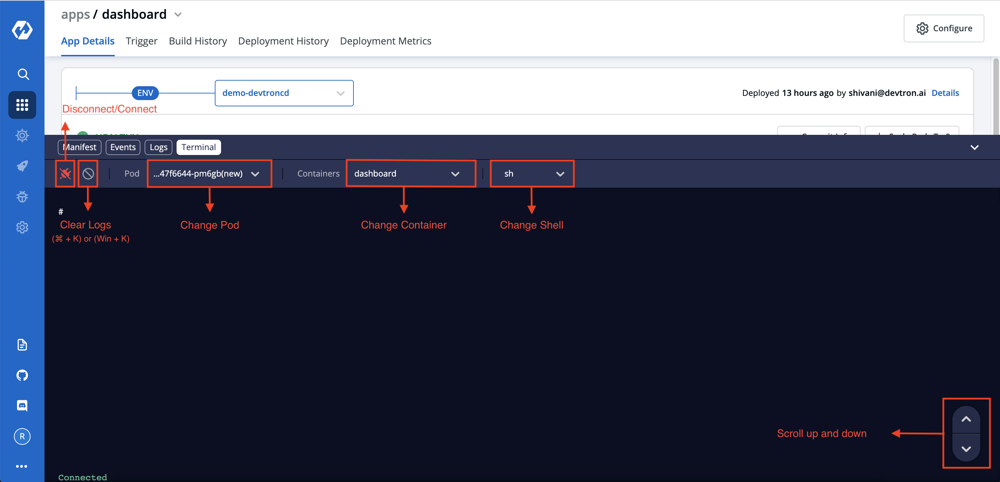

# Terminal

Command line utility that runs in a container, communication is based on websocket. Everytime user changes pod, container or shell, it creates a new connection.

### Connection Status

- Connected: socket connection has established successfully
- Connecting: signal to create a new socket connection 
- Disconnecting: signal to terminal current socket connection
- Disconnected: socket is disconnected