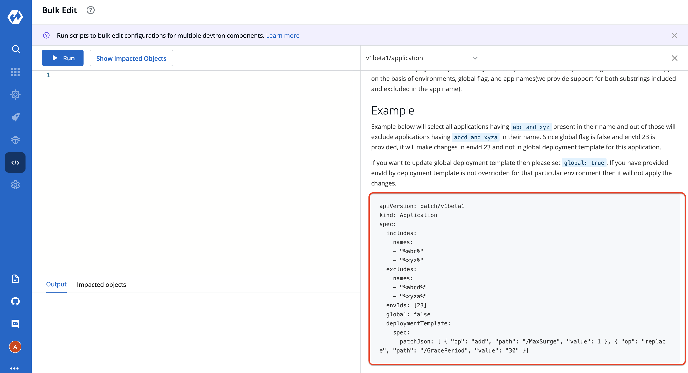
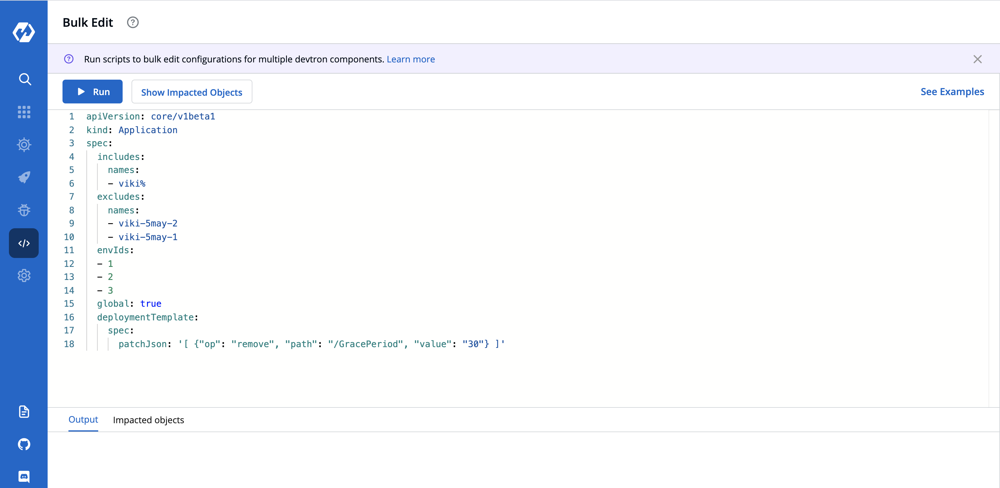
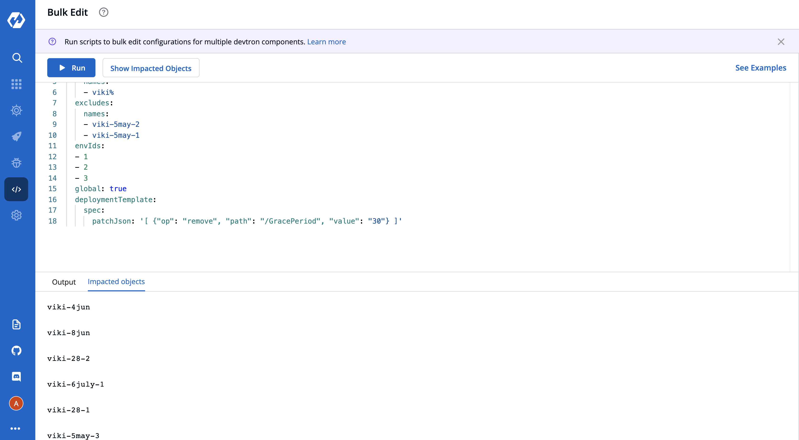
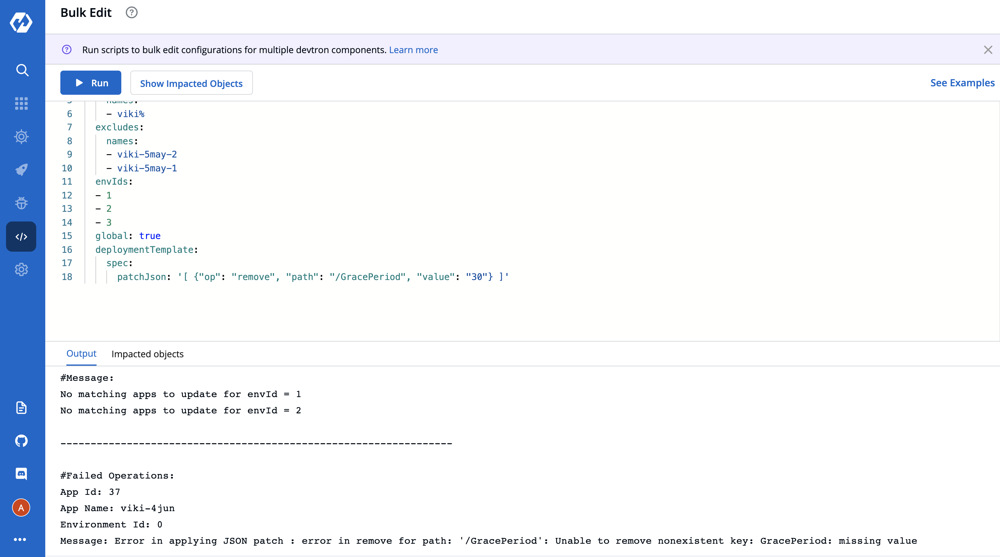

# Bulk Updates

## Overview

Need to make some common changes across multiple devtron applications?
**Bulk Edit** allows you to do that.<br>
Eg. You can change the value for `MaxReplicas` in Deployment Templates of multiple devtron applications.

## Support
Bulk edit is currently supported for:
 - Deployment Template

_Ability to edit more devtron components will be added in future._

## Steps:

1. Click on the `Bulk Edit` option in the main navigation. This is where you can write and execute scripts to perform bulk updates.
 <br><br>

<br>

2. To help you get started, a script template is provided under the `See Examples` section.<br><br>

<br>

3. Copy and Paste the `Sample Script` in the code editor and make desired changes. Refer `Payload Configuration` in the Readme to understand the parameters.<br><br>


### Sample Script

This is the piece of code which works as the input and has to be pasted in the code editor for achieving bulk updation
task.

```
apiVersion: batch/v1beta1
kind: Application
spec:
includes:
names:
- abc%
- xyz%
excludes:
names:
- abcx%
- xyz%
envIds: [23]
global: false
deploymentTemplate:
spec:
patchJson: [ { "op": "add", "path": "/MaxSurge", "value": 1 }, { "op": "replace", "path": "/GracePeriod", "value": "30" }]
```

### Payload Configuration

The following table lists the configurable parameters of the Payload component in the Script and their description along with example.

| Parameter                      | Description                        | Example                                                    |
| -------------------------- | ---------------------------------- | ---------------------------------------------------------- |
|`includes.names `        | Will filter apps having similar substrings (required)                | `["app%","%abc"]` (will include all apps having `"app%"` **
OR** `"%abc"` as one of their substring, example - app1, app-test, test-abc etc.)    |
| `excludes.names`          | Will filter apps not having similar substrings (optional)              | `["%z","%y"]`       (will filter out all apps having `"%z"` **
OR** `"%y"` as one of their substring, example - appz, test-app-y etc.)                                        |
| `envIds`       |Will filter apps by all environment with IDs in this array (optional)             | `[1,2,3]`                                                   |
| `global`       | Will filter apps by global flag (optional)           | `true`,`false`                                                        |
| `patchJson`      | String having the update operation(you can apply more than one changes at a time) (required for run only) | `''[ { "op": "add", "path": "/MaxSurge", "value": 1 }, { "op": "replace", "path": "/GracePeriod", "value": "30" }]''` |

Note - We use [JSON patch](http://jsonpatch.com/) logic for updation, visit the link for more info on this.', '{"kind": "Application", "spec": {"envIds": [1, 2, 3], "global": false, "excludes": {"names": ["%xyz%"]}, "includes": {"names": ["%abc%"]}, "deploymentTemplate": {"spec": {"patchJson": "Enter Patch String"}}}, "apiVersion": "core/v1beta1"}');

<br>

4. Once you have modified the script, you can click on the `Show Impacted Objects` button to see the names of all applications that will be modified when the script is `Run`.
<br><br>

<br>

5. Click on the `Run` button to execute the script. Status/Output of the script execution will be shown in the `Output` section of the bottom drawer.
<br><br>

<br>

