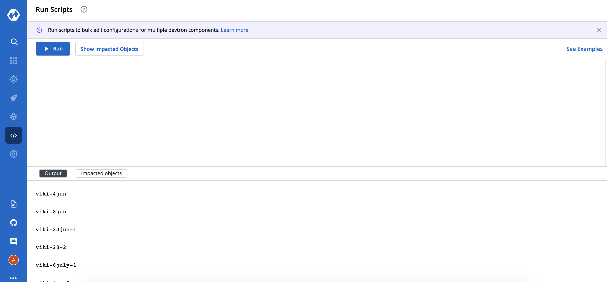

# Bulk Update

## OVERVIEW

This feature helps you to update deployment template for multiple apps in one go! You can filter the apps on the basis
of environments, global flag, and app names(we provide support for both substrings included and excluded in the app
name).

## Script Execution

Click on Bulk edit button at the left panel. To run a script, add the details as mentioned in sample script.


To execute the script click on `Run` button on the top. Result can be viewed in the `Output` tab at the bottom.
To check the impacted application from script that user has provided, click on `Show Impacted Objects` which will gives
you the result of app names.

Response will be write at bottom section, in the tab called `Impacted Objects`.



Readme can be fetch from right section, there is link `See Examples`, it will fetch the README based on option
you have selected from drop down. currently there is one `Application` which allow you to update your application
deployment template.


## Sample Script

This is the piece of code which works as the input and has to be pasted in the code editor for achieving bulk updation
task.

```
apiVersion: batch/v1beta1
kind: Application
spec:
includes:
names:
- "%abc%"
- "%xyz%"
excludes:
names:
- "%abcx%"
- "xyz"
envIds: [23]
global: false
deploymentTemplate:
spec:
patchJson: [ { "op": "add", "path": "/MaxSurge", "value": 1 }, { "op": "replace", "path": "/GracePeriod", "value": "30" }]
```

## Payload Configuration

The following tables list the configurable parameters of the Payload component in the Script and their description along
with example.

| Parameter                      | Description                        | Example                                                    |
| -------------------------- | ---------------------------------- | ---------------------------------------------------------- |
|`includes.names `        | Will filter apps having similar substrings (required)                | `["app%","%abc"]` (will include all apps having `"app%"` **
OR** `"%abc"` as one of their substring, example - app1, app-test, test-abc etc.)    |
| `excludes.names`          | Will filter apps not having similar substrings (optional)              | `["%z","%y"]`       (will filter out all apps having `"%z"` **
OR** `"%y"` as one of their substring, example - appz, test-app-y etc.)                                        |
| `envIds`       |Will filter apps by all environment with IDs in this array (optional)             | `[1,2,3]`                                                   |
| `global`       | Will filter apps by global flag (optional)           | `true`,`false`                                                        |
| `patchJson`      | String having the update operation(you can apply more than one changes at a time) (required for run only) | `''[ { "op": "add", "path": "/MaxSurge", "value": 1 }, { "op": "replace", "path": "/GracePeriod", "value": "30" }]''` |

Note - We use [JSON patch](http://jsonpatch.com/) logic for updation, visit the link for more info on this.', '{"
kind": "Application", "spec": {"envIds": [1, 2, 3], "global": false, "excludes": {"names": ["%xyz%"]}, "includes": {"
names": ["%abc%"]}, "deploymentTemplate": {"spec": {"patchJson": "Enter Patch String"}}}, "apiVersion": "core/v1beta1"
}');
