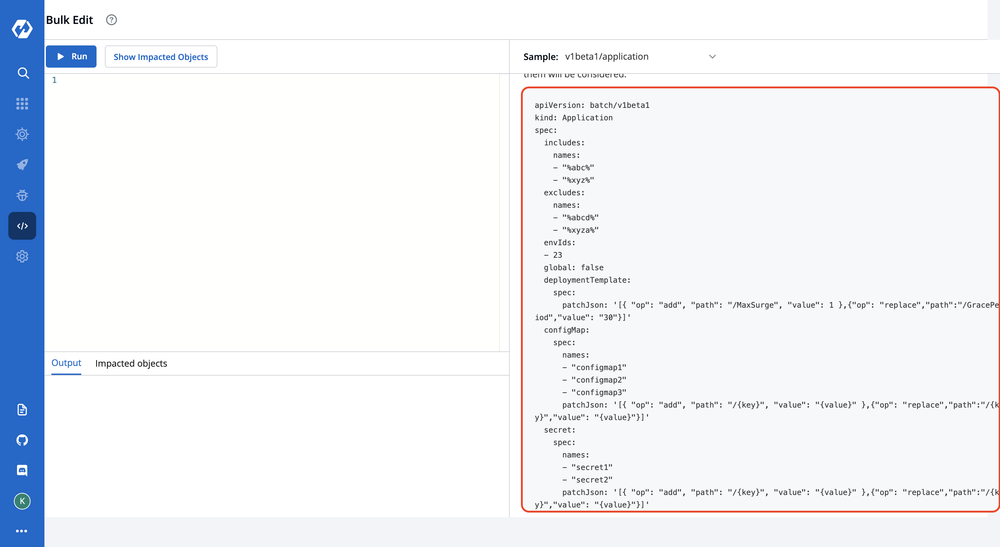
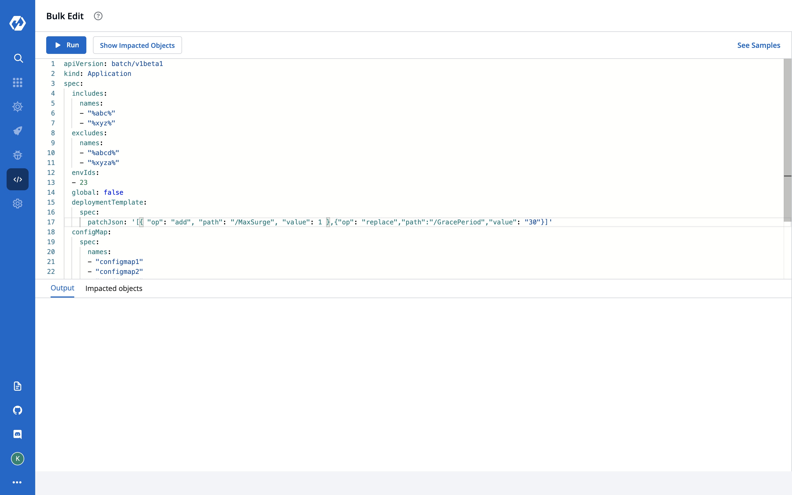
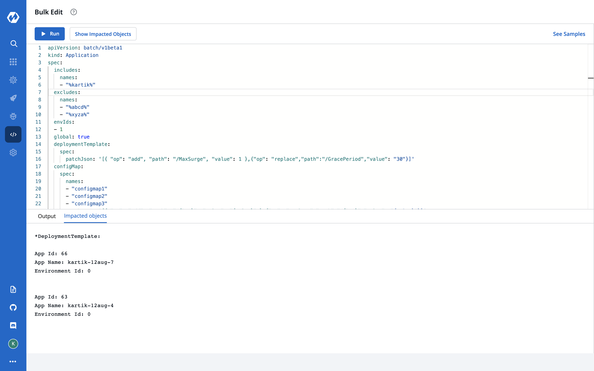

# Bulk Updates
This feature helps you to update Deployment Template, ConfigMaps & Secrets for multiple apps in one go! You can filter the apps on the basis of environments, global flag, and app names(we provide support for both substrings included and excluded in the app name).
## Overview

Need to make some common changes across multiple devtron applications?
**Bulk Edit** allows you to do that.<br>
Eg. You can change the value for `MaxReplicas` in Deployment Templates of multiple Devtron applications or you can add key-value pairs in multiple ConfigMaps & Secrets.

## Support
Bulk edit is currently supported for:
 - Deployment Template
 - ConfigMaps
 - Secrets


## Steps:

1.  Click on the `Bulk Edit` option in the main navigation. This is where you can write and execute scripts to perform bulk updates in Devtron objects.
 

<br>

2.  To help you get started, a script template is provided under the `See Samples` section.


<br>

3.  Copy and Paste the `Sample Script` in the code editor and make desired changes. Refer `Payload Configuration` in the Readme to understand the parameters.




### Example
Example below will select all applications having `abc and xyz` present in their name and out of those will exclude applications having `abcd and xyza` in their name. Since global flag is false and envId 23 is provided, it will make changes in envId 23 and not in global deployment template for this application.

If you want to update globally then please set `global: true`. If you have provided an envId but deployment template, configMap or secret is not overridden for that particular environment then it will not apply the changes.
Also, of all the provided names of configMaps/secrets, for every app & environment override only the names that are present in them will be considered.


### Sample Script

This is the piece of code which works as the input and has to be pasted in the code editor for achieving bulk updation
task.

```
apiVersion: batch/v1beta1
kind: Application
spec:
  includes:
    names:
    - "%abc%"
    - "%xyz%"
  excludes:
    names:
    - "%abcd%"
    - "%xyza%"
  envIds:
  - 23
  global: false
  deploymentTemplate:
    spec:
      patchJson: '[{ "op": "add", "path": "/MaxSurge", "value": 1 },{"op": "replace","path":"/GracePeriod","value": "30"}]'
  configMap:
    spec:
      names:
      - "configmap1"
      - "configmap2"
      - "configmap3"
      patchJson: '[{ "op": "add", "path": "/{key}", "value": "{value}" },{"op": "replace","path":"/{key}","value": "{value}"}]'
  secret:
    spec:
      names:
      - "secret1"
      - "secret2"
      patchJson: '[{ "op": "add", "path": "/{key}", "value": "{value}" },{"op": "replace","path":"/{key}","value": "{value}"}]'
```      


### Payload Configuration
The following tables list the configurable parameters of the Payload component in the Script and their description along with example. Also, if you do not need to apply updates on all the tasks, i.e. Deployment Template, ConfigMaps & Secrets, leave the Spec object empty for that respective task.

| Parameter                      | Description                        | Example                                                    |
| -------------------------- | ---------------------------------- | ---------------------------------------------------------- |
|`includes.names `        | Will filter apps having exact string or similar substrings                 | `["app%","%abc", "xyz"]` (will include all apps having `"app%"` **OR** `"%abc"` as one of their substring, example - app1, app-test, test-abc etc. **OR** application with name xyz)    |
| `excludes.names`          | Will filter apps not having exact string or similar substrings.              | `["%z","%y", "abc"]`       (will filter out all apps having `"%z"` **OR** `"%y"` as one of their substring, example - appz, test-app-y etc. **OR** application with name abc)                                        |
| `envIds`       | List of envIds to be updated for the selected applications.           | `[1,2,3]`                                                   |
| `global`       | Flag to update global deployment template of applications.            | `true`,`false`                                                        |
| `deploymentTemplate.spec.patchJson`       | String having the update operation(you can apply more than one changes at a time). It supports [JSON patch ](http://jsonpatch.com/) specifications for update. | `'[ { "op": "add", "path": "/MaxSurge", "value": 1 }, { "op": "replace", "path": "/GracePeriod", "value": "30" }]'` |
| `configMap.spec.names`      | Names of all ConfigMaps to be updated. | `configmap1`,`configmap2`,`configmap3` |
| `secret.spec.names`      | Names of all Secrets to be updated. | `secret1`,`secret2`|
| `configMap.spec.patchJson` / `secret.spec.patchJson`       | String having the update operation for ConfigMaps/Secrets(you can apply more than one changes at a time). It supports [JSON patch ](http://jsonpatch.com/) specifications for update. | `'[{ "op": "add", "path": "/{key}", "value": "{value}" },{"op": "replace","path":"/{key}","value": "{value}"}]'`(Replace the `{key}` part to the key you want to perform operation on & the `{value}`is the key's corresponding value |


<br>


4.  Once you have modified the script, you can click on the `Show Impacted Objects` button to see the names of all applications that will be modified when the script is `Run`.




<br>

5.  Click on the `Run` button to execute the script. Status/Output of the script execution will be shown in the `Output` section of the bottom drawer.


<br>


