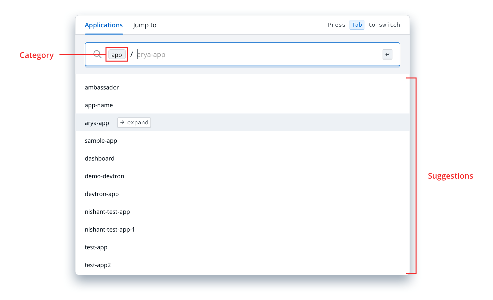
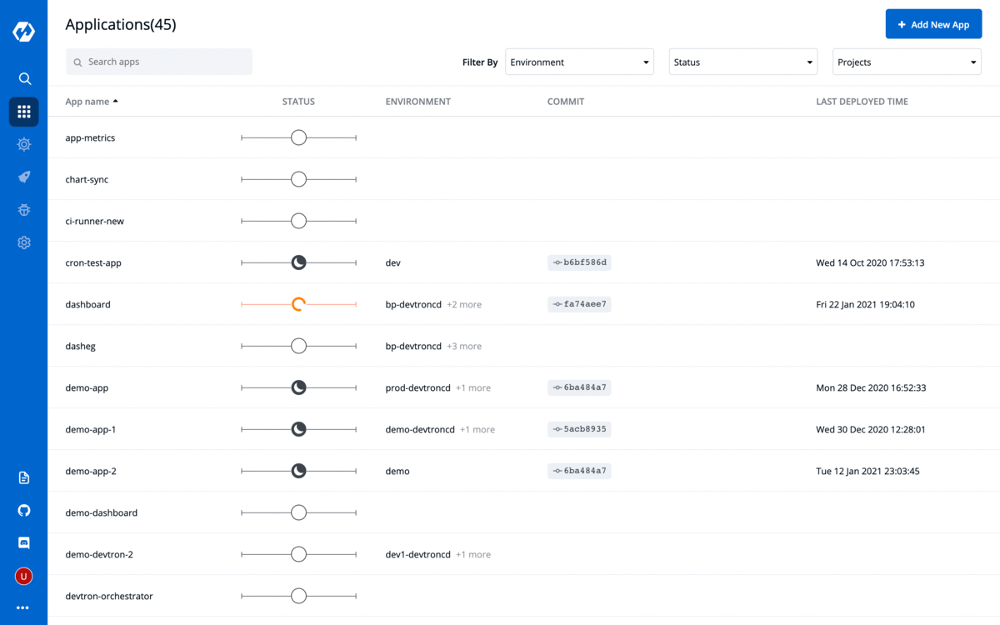
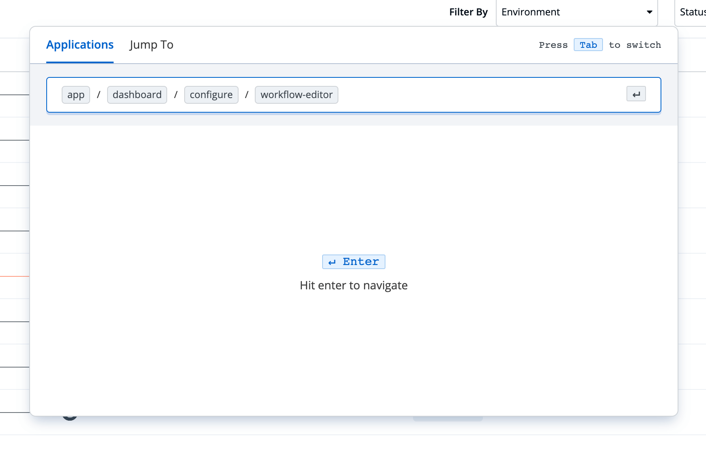

# Command bar
## Why command bar?
The command bar is designed to enable you to navigate across the devtron dashboard without having to click around the screen.

Top-level categories (eg. app, chart, security, global-config) are auto-filled depending upon your location on the Devtron dashboard.

> You can clear the top-level category to navigate within other category locations.

### Shortcuts
| Action | Keys |
| :--- | :--- |
| Open Command bar | `Cmd/Ctrl` + `/` |
| Navigate | `&#8595;` `&#8593;`|
| Explore nested options | `&#8594;` |
| Navigate to a screen | `Enter` |

 

### How to use the command bar (Eg. Navigate to Workflow editor of an App.)

 

 

### Steps

1. Open command bar by clicking the 🔍 search icon on left navbar or pressing `Cmd/Ctrl` + `/`

2. Start typing the app name you're looking for.

3. Navigate using `↓` `↑` between the matching results and press `→` to view nested options.

> Note: Pressing Enter on a highlighted option will navigate to the selected page location.

4. In this case, `app / dashboard / configure / workflow-editor` will navigate to the Workflow editor for `dashboard` application.

Similarly, you can use the command bar to navigate around the Devtron dashboard without a click.

We would love to know your experience with the command bar. Jump in to the [Devtron Discord Community](https://discord.gg/72JDKy4)