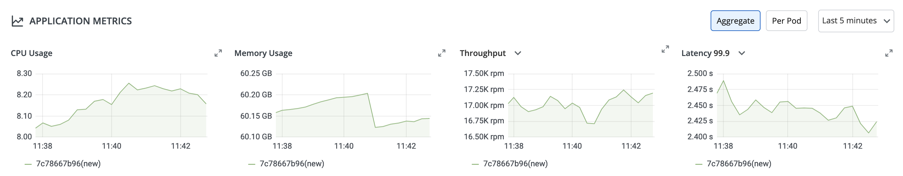

# Application Metrics

Application metrics can be enabled to see your application's metrics.

## Standard Metrics

Devtron provides certain metrics (CPU and Memory utilization) for each application by default i.e. you do not need to enable “Application metrics”. However, prometheus needs to be present in the cluster and the endpoint of the same should be updated in Global Configurations --> Clusters & Environments section. 

## Advanced Metrics

There are certain advanced metrics (like Latency, Throughput, 4xx, 5xx, 2xx) which are only available when "Application metrics" is enabled from the Deployment Template. When you enable these advanced metrics, devtron attaches a envoy sidecar container to your main container which runs as a transparent proxy and passes each request through it to measure the advanced metrics. 

**Note: Since, all the requests are passed through envoy, any misconfiguration in envoy configs can bring your application down, so please test the configurations in a non-production environment extensively.**

```yaml
envoyproxy:
  image: envoyproxy/envoy:v1.14.1
  configMapName: ""
  resources:
    limits:
      cpu: "50m"
      memory: "50Mi"
    requests:
      cpu: "50m"
      memory: "50Mi"
```





## CPU Usage Metrics

CPU usage is a utilization metric that shows the overall utilization of cpu by an application. It is available as both, aggregated or per pod.

## Memory Usage Metrics

 Memory usage is a utilization metric that shows the overall utilization of memory by an application. It is available as both, aggregated or per pod.


 ## Throughput Metrics

 This application metrics indicates the number of request processed by an application per minute. 

 ## Status Code Metrics

This metrics indicates the  application’s response to client’s request with a specific status code i.e 1xx(Communicate transfer protocol leve information), 2xx(Client’s request was accepted successfully), 3xx(Client must take some additional action to complete their request), 4xx(Client side error) or 5xx(Server side error).  

## Latency Metrics

Latency metrics shows the latency for an application. Latency measures the delay between an action and a response.


## Checklist for enabling Advanced Application metrics in Production

* [ ]  Have adjusted resources to the envoy sidecar container, by default Devtron allocates 50m CPU and 50Mi Memory as both limits as well as requests. This should be enough for handling traffic upto 3000rpm per pod, if each replica of your pod is expected to handle more than 3000rpm, please adjust the resources accordingly.
* [ ] If you are not leveraging http2 / streaming protocols, make sure to set supportStreaming and useHTTP2 in ContainerPort as false.
* [ ]  Use envoy image as "quay.io/devtron/envoy:v1.14.1" instead of default "envoyproxy/envoy:v1.14.1" if your cluster occasionally hit dockerhub pull rate limit or if you are running too many replicas/micro-services in a cluster.
* [ ] Enabled and tested extensively in non-production environment including load testing till highest rpm capacity per pod.