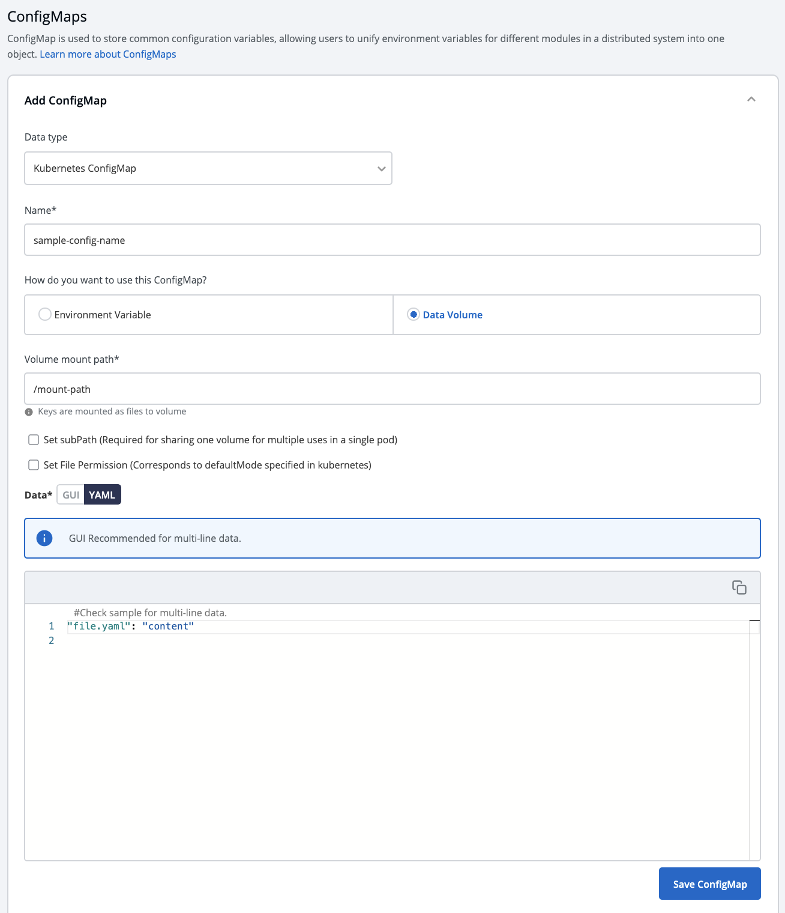
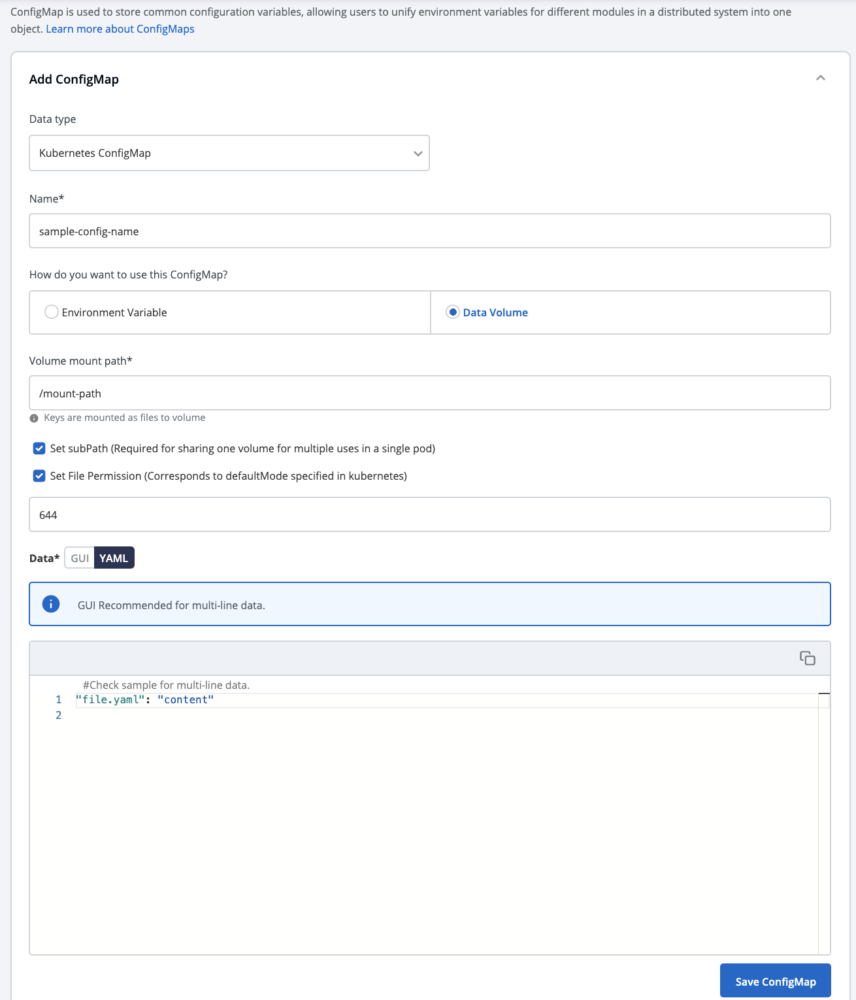

# Config Maps

The ConfigMap API resource holds key-value pairs of the  configuration data that can be consumed by pods or used to store configuration data for system components such as controllers. ConfigMap is similar to Secrets, but designed to more conveniently support working with strings that do not contain sensitive information.

Click on `Add ConfigMap` to add a config map to your application.

## Configure the ConfigMap

You can configure a configmap in two ways-

\(a\) Using data type **Kubernetes ConfigMap**

\(b\) Using data type **Kubernetes External ConfigMap**

| Key | Description |
| :--- | :--- |
| `Data Type (Kubernetes ConfigMap)` | Select your preferred data type for Kubernetes ConfigMap or Kubernetes External ConfigMap |
| `Name` | Provide a name to this ConfigMap. |
| `Use configmap as Environment Variable` | Select this option if you want to inject Environment Variables in pods using ConfigMap. |
| `Use configmap as Data Volume` | Select this option, if you want to configure a Data Volume that is accessible to Containers running in a pod and provide a Volume mount path. |
| `Key-Value` | Provide the actual key-value configuration data here. Key and corresponding value to the provided key. |

### \(A\) Using Kubernetes ConfigMap

**1. Data Type**

Select the Data Type as `Kubernetes ConfigMap`, if you wish to use the ConfigMap created by Devtron.

**2. Name**

Provide a name to your configmap.

**3. Use ConfigMap as**

Here we are providing two options, one can select any of them as per your requirement

-`Environment Variable` as part of your configMap or you want to add `Data Volume` to your container using Config Map.

* Environment Variable

Select this option if you want to add Environment Variables as a part of configMap. You can provide Environment Variables in key-value pairs, which can be seen and accessed inside a pod.

* Data Volume

Select this option if you want to add a `Data Volume` to your container using the Config Map.

Key-value pairs that you provide here, are provided as a file to the mount path. Your application will read this file and collect the required data as configured.

**4. Data**

In the `Data` section, you provide your configmap in key-value pairs. You can provide one or more than one environment variable.

You can provide variables in two ways-

* YAML \(raw data\)
* GUI \(more user friendly\)

Once you have provided the config, You can click on any option-`YAML` or `GUI` to view the key and Value parameters of the ConfigMap.

**Kubernetes ConfigMap using Environment Variable:**

If you select `Environment Variable` in 3rd option, then you can provide your environment variables in key-value pairs in the `Data` section using `YAML` or `GUI`.

`Data in YAML` \(please Check below screenshot\)

Now, Click on `Save ConfigMap` to save your configmap configuration.

**Kubernetes ConfigMap using Data Volume**

## Volume Mount Path

Provide the Volume Mount folder path in Volume Mount Path, a path where the data volume needs to be mounted, which will be accessible to the Containers running in a pod.

You can add Configuration data as in YAML or GUI format as explained above.

You can click on `YAML` or `GUI` to view the key and Value parameters of the ConfigMap that you have created.

You can click on `Save ConfigMap` to save the configMap.

## Sub Path
For multiple files mount at the same location you need to check sub path bool field, it will use the file name (key) as sub path. 
Sub Path feature is not applicable in case of external configmap.

## File Permission
File permission will be provide at the configmap level not on the each key of the configmap. It will take 3 digit standard permission for the file.

### \(B\) Kubernetes External ConfigMap

You can select `Kubernetes External ConfigMap` in the `data type` field if you have created a ConfigMap using the kubectl command.

By default, the data type is set to `Kubernetes ConfigMap`.

Kubernetes External ConfigMap is created using the `kubectl create configmap` command. 
If you are using `Kubernetes External ConfigMap`, make sure you give the name of ConfigMap the same as the name that you have given using kubectl create `Configmap <configmap-name> <data source>` command, otherwise, it might result in an error during the built.

You have to ensure that the External ConfigMap exists and is available to the pod.

The config map is created.

## Update ConfigMap

You can update your configmap anytime later but you cannot change the name of your configmap. If you want to change the name of the configmap then you have to create a new configmap. To update configmap, click on the configmap you have created make changes as required.

Click on `Update Configmap` to update your configmap.

## Delete ConfigMap

You can delete your configmap. Click on your configmap and click on the `delete sign` to delete your configmap.

