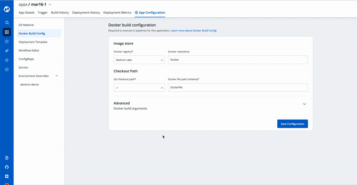
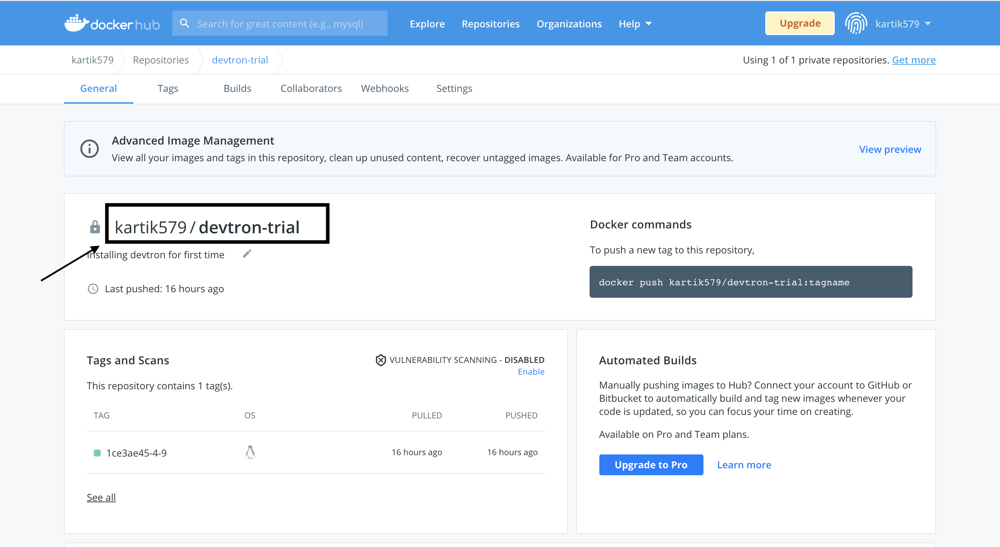

 # Docker Build Configuration

In the previous step, we discussed `Git Configurations`. In this section, we will provide information on the `Docker Build Configuration`.

Docker build configuration is used to create and push docker images in the docker registry of your application. You will provide all the docker related information to build and push docker images in this step.

Only one docker image can be created even for multi-git repository applications as explained in the [previous step](git-material.md).



To add **docker build configuration**, You need to provide three sections as given below:

* **Image store**
* **Checkout path**
* **Advanced**

## Image Store
In Image store section, You need to provide two inputs as given below: 
1. Docker registry
2. Docker repository

### 1. Docker Registry
Select the docker registry that you wish to use. This registry will be used to [store docker images](../global-configurations/docker-registries.md).

### 2. Docker Repository
In this field, add the name of your docker repository. The repository that you specify here will store a collection of related docker images. Whenever an image is added here, it will be stored with a new tag version.

**If you are using docker hub account, you need to enter the repository name along with your username. For example - If my username is *kartik579* and repo name is *devtron-trial*, then enter kartik579/devtron-trial instead of only devtron-trial.**




## Checkout path 
Checkout path including inputs:
1. Git checkout path
2. Docker file (relative)

### 1. Git checkout path
In this field, you have to provide the Git checkout path of your repository. This repository is the same that you had defined earlier in git configuration details.

### 2. Docker File Path
Here, you provide a relative path where your docker file is located. Ensure that the dockerfile is present on this path.

## Advanced 

### Set Target Platform for the build

Using this option, users can build images for a specific or multiple **architectures and operating systems (target platforms)**. They can select the target platform from the drop-down or can type to select a custom target platform.


Before selecting a custom target platform, please ensure that the architecture and the operating system is supported by the `registry type` you are using, otherwise builds will fail. Devtron uses BuildX to build images for mutiple target Platforms, which requires higher CI worker resources. To allocate more resources, you can increase value of the following parameters in the `devtron-cm` configmap in `devtroncd` namespace.

- LIMIT_CI_CPU 
- REQ_CI_CPU
- REQ_CI_MEM
- LIMIT_CI_MEM

To edit the `devtron-cm` configmap in `devtroncd` namespace:
```
kubectl edit configmap devtron-cm -n devtroncd 
```


If target platform is not set, Devtron will build image for architecture and operating system of the k8s node on which CI is running.

The Target Platform feature might not work in minikube & microk8s clusters as of now.


 Docker build arguments is a collapsed view including
   * Key
   * Value

### Key-value
This field will contain the key parameter and the value for the specified key for your [docker build](https://docs.docker.com/engine/reference/commandline/build/#options). This field is Optional. \(If required, this can be overridden at [CI step](../deploying-application/triggering-ci.md) later\)

