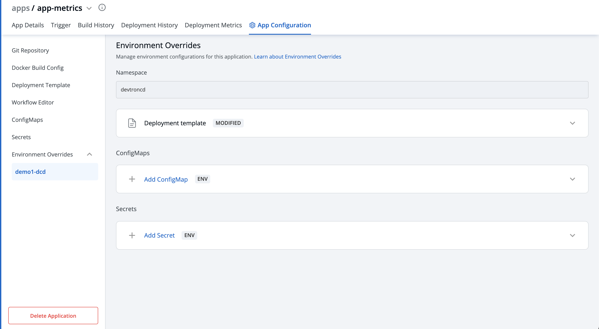

# Environment Overrides

You will see all your environments associated with an application under the `Environment Overrides` section.

You can customize your `Deployment template, ConfigMap, Secrets` in Environment Overrides section to add separate customizations for different environments such as dev, test, integration, prod, etc.

## Deployment template - Functionality

If you want to deploy an application in a non-production environment and then in production environment once testing is done in non-prod environment, then you do not need to create a new application for prod environment. Your existing pipeline\(non-prod env\) will work for both the environments with little customization in your deployment template under `Environment overrides`.

### Example customization:

In a Non-production environment, you may have specified 100m CPU resources in the deployment template but in the Production environment you may want to have 500m CPU resources as the traffic on Pods will be higher than traffic on non-prod env.

Configuring the Deployment template inside `Environment Overrides` for a specific environment will not affect the other environments because `Environment Overrides` will configure deployment templates on environment basis. And at the time of deployment, it will always pick the overridden deployment template if any.

If there are no overrides specified for an environment in the `Environment Overrides` section, the deployment template will be the one you specified in the `deployment template section` of the app creation.

*(Note: This example is meant only for a representational purpose. You can choose to add any customizations you want in your deployment templates in the `Environment Overrides` tab)*

Any changes in the configuration will not be added to the template, instead, it will make a copy of the template and lets you customize it for each particular environment. And now this overridden template will be used only for the specified Environment.

This will save you the trouble to manually create deployment files separately for each environment. Instead, all you have to do is to change the required variables in the deployment template.

## How to add Environment Overrides

In the `Environment Overrides` section, click on `Allow Override` and make changes to your Deployment template and click on `Save` to save your changes of the Deployment template.

### ConfigMaps & Secrets

The same goes for `ConfigMap` and `Secrets`. You can also create an environment-specific configmap and Secrets inside the `Environment override` section.

If you want to configure your ConfigMap and secrets at the application level then you can provide them in [ConfigMaps](config-maps.md) and [Secrets](secrets.md), but if you want to have environment-specific ConfigMap and secrets then provide them under the Environment override Section. At the time of deployment, it will pick both of them and provide them inside your cluster.

Click on `Update ConfigMap` to update Configmaps.

Click on `Update Secrets` to update Secrets.

