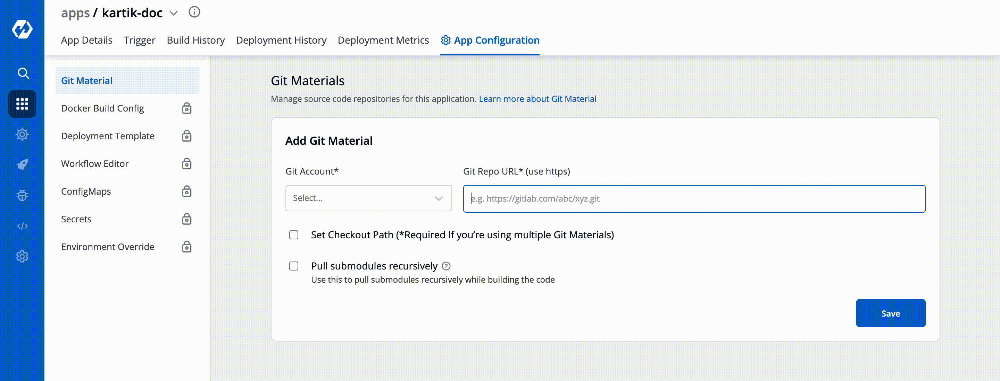
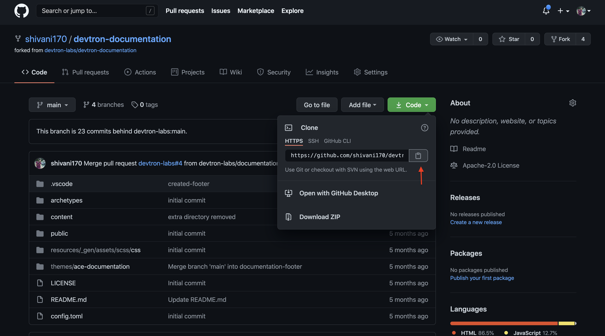
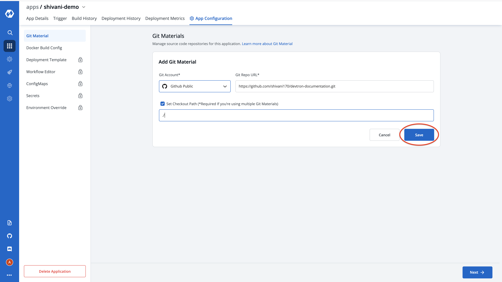

# Git Material

Git material is used to pull your application source code during the CI step. Select `Git Material` section of the  `App Configuration`. Inside `Git Material` when you click on `Add Git Material` you will see three options as shown below:

1. Git Provider
2. Git Repo URL
3. Checkout Path

Devtron also supports multiple git repositories in a single deployment. We will discuss this in detail in the multi git option [below](git-material.md#4-multi-git).

## 1. Git Provider

In this section, you have to select the git provider of your code repository like- Github, Gitlab, and Bitbucket, etc. If you are using a private git repository, you can configure your git provider via [git accounts](../global-configurations/git-accounts.md).

## 2. Git Repo URL

Inside the git repo URL, you have to provide your code repository’s https URL. For Example- [https://github.com/devtron-labs/django-repo](https://github.com/devtron-labs/django-repo)

You can find this URL by clicking on the '⤓ code' button on your git repository page.

Note: 
* Copy the HTTPS url of the repository
* Please make sure that you've added your [dockerfile](https://docs.docker.com/engine/reference/builder/) in the repo. 

## 3. Checkout Path

After clicking on checbox, git checkout path field appears. The git checkout path is the directory where your code is pulled or cloned for the repository you specified in the previous step.

This field is optional in case of a single git repository application and you can leave the path as default. Devtron assigns a directory by itself when the field is left blank. The default value of this field is `./`

If you want to go with a multi-git approach, then you need to specify a separate path for each of your repositories. The first repository can be checked out at the default `./` path as explained above. But, for all the rest of the repositories, you need to ensure that you provide unique checkout paths. In failing to do so, you may cause Devtron to checkout multiple repositories in one directory and overwriting files from different repositories on each other.

## 4. Multi Git:

As we discussed, Devtron also supports multiple git repositories in a single application. To add multiple repositories, click on add material and repeat steps 1 to 3. Repeat the process for every new git repository you add. Ensure that the checkout paths are unique for each.

Note: Even if you add multiple repositories, only one image will be created based on the docker file as shown in the [docker build config](docker-build-configuration.md).

## **Why do we need MultiGit support-**

Let’s look at this with an example:

Due to security reasons, you may want to keep sensitive configurations like third party API keys in a separate access restricted git repositories and the source code in a git repository that every developer has access to. To deploy this application, code from both the repositories is required. A multi-git support will help you to do that.

Few other examples, where you may want to have multiple repositories for your application and will need multi git checkout support:

* To make code modularize, you are keeping front-end and back-end code in different repositories.
* Common Library extracted out in different repo so that it can be used via multiple other projects.
* Due to security reasons you are keeping configuration files in different access restricted git repositories.

## **How Devtron's 'Checkout Path' works**

The checkout path is used by Devtron to assign a directory to each of your git repositories. Once you provide different checkout paths for your repositories, Devtron will clone your code at those locations and these checkout paths can be referenced in the docker file to create docker image for the application.
Whenever a change is pushed to any the configured repositories, the CI will be triggered and a new docker image file will be built based on the latest commits of the configured repositories and pushed to the docker registry.