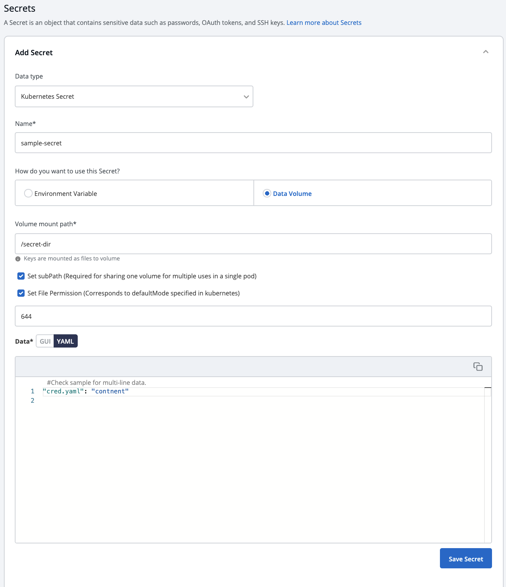
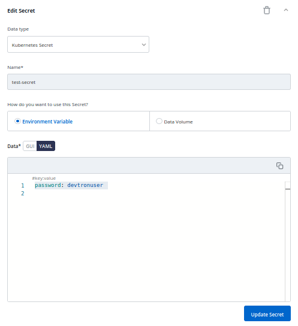

# Secrets

Secrets and configmaps both are used to store environment variables but there is one major difference between them: Configmap stores key-values in normal text format while secrets store them in base64 encrypted form. Devtron platform hides the data of secrets for the normal users and it is only visible to the users having edit permission.

Secret objects let you store and manage sensitive information, such as passwords, authentication tokens, and ssh keys. Embedding this information in secrets is safer and more flexible than putting it verbatim in a Pod definition or in a container image.

## Configure Secret

Click on `Add Secret` to add a new secret.

| Key | Description |
| :--- | :--- |
| `Name` | Provide a name to your Secret |
| `Data Type` | Provide the Data Type of your secret. To know about different Data Types available click on [Data Types](secrets.md#data-types) |
| `Data Volume` | Specify if there is a need to add a volume that is accessible to the Containers running in a pod. |
| `Use configmap as Environment Variable` | Select this option if you want to inject Environment Variables in your pods using ConfigMaps. |
| `Use configmap as Data Volume` | Select this option if you want to configure a Data Volume that is accessible to Containers running in a pod. Ensure that you provide a Volume mount path for the same. |
| `Key-Value` | Provide a key and the corresponding value of the provided key. |

## Data Types

There are five Data types that you can use to save your secret.

* **Kubernetes Secret**: The secret that you create using Devtron.
* **Kubernetes External Secret**: The secret data of your application is fetched by Devtron externally. Then the Kubernetes External Secret is converted to Kubernetes Secret.
* **AWS Secret Manager**: The secret data of your application is fetched from AWS Secret Manager and then converted to Kubernetes Secret from AWS Secret. 
* **AWS System Manager**: The secret data for your application is fetched from AWS System Secret Manager and all the secrets stored in AWS System Manager are converted to Kubernetes Secret.
* **Hashi Corp Vault**: The secret data for your application is fetched from Hashi Corp Vault and the secrets stored in Hashi Corp Vault are converted to Kubernetes Secret.

*Note: The conversion of secrets from various data types to Kubernetes Secrets is done within Devtron and irrespective of the data type, after conversion, the Pods access `secrets` normally.*

## Volume Mount Path

Specify the Volume Mount folder path in `Volume Mount Path`, a path where the data volume needs to be mounted. This volume will be accessible to the Containers running in a pod.

## Sub Path
For multiple files mount at the same location you need to check sub path `bool` field, it will use the file name (key) as sub path. 
Sub Path feature is not applicable in case of external configmap except
AWS Secret Manager, AWS System Manager and Hashi Corp Vault, for these cases `Name (Secret key)` as sub path will be picked up automatically. 

## File Permission
File permission will be provide at the configmap level not on the each key of the configmap. it will take 3 digit standard permission for the file.

Click on `Save Secret` to save the secret.

You can see the Secret is added.

## Update Secrets

You can update your secrets anytime later, but you cannot change the name of your secrets. If you want to change your name of secrets then you have to create a new secret.

To update secrets, click on the secret you wish to update.

Click on `Update Secret` to update your secret.

## Delete Secret

You can delete your secret. Click on your secret and click on the `delete sign` to delete your secret.

