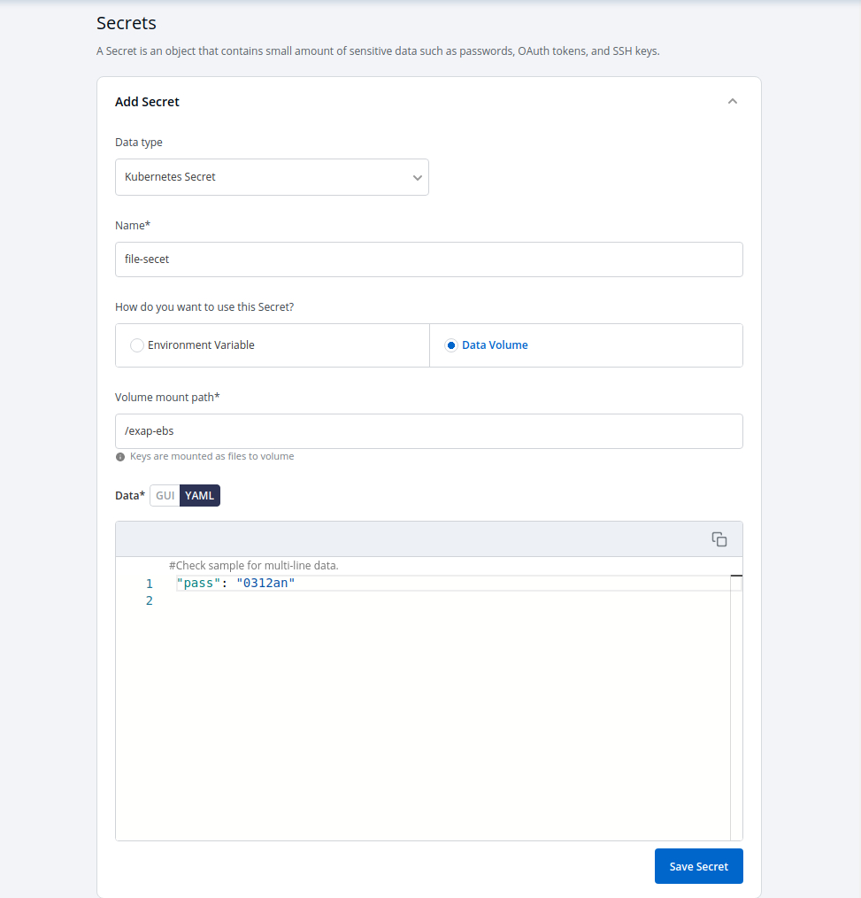

# Secrets

Secrets and configmaps both are used to store environment variables but there is only one major difference between them, Configmap stores key-values in normal text format, and secrets store them in base64 encrypted form. Devtron platform hides the data of secrets for the normal users and it is only visible to the users having edit permission.

Secret objects let you store and manage sensitive information, such as- passwords, auth tokens, and ssh keys. Embedding this information in a secret is safer and more flexible than putting it verbatim in a Pod definition or in a container image.

Click on `Add Secret` to add a new secret.

## Configure Secret

| Key | Description |
| :--- | :--- |
| `Name` | Provide a name to your Secret |
| `Data Type` | Provide the Data Type of your secret. To know about different Data Types available click on [Data Types](secrets.md#data-types) |
| `Data Volume` | Specify, if there is a volume that is accessible to Containers running in a pod needs to be added. |
| `Use configmap as Environment Variable` | Select this option if you want to inject Environment Variables in pods using ConfigMap. |
| `Use configmap as Data Volume` | Select this option, if you want to configure any Data Volume that is accessible to Containers running in a pod and provide a Volume mount path. |
| `Key-Value` | Provide the key and corresponding value of the provided key. |

## Data Types

There are five Data types that you can use to save your secret.

* **Kubernetes Secret**: The secret that you create using Devtron.
* **Kubernetes External Secret**: The secret data of your application is fetched externally, converts the Kubernetes External Secret to Kubernetes Secret. The conversion is completely transparent to Pods and secrets are accessed normally.
* **AWS Secret Manager**: The secret data of your application is fetched from AWS Secret Manager, converts AWS Secret to Kubernetes Secret. The conversion is completely transparent to Pods that can access secrets normally.
* **AWS System Manager**: The secret data for your application is fetched from AWS Secret Manager, converts the secrets stored in AWS System Manager to Kubernetes Secret. The conversion is completely transparent to Pods that can access secrets normally.
* **Hashi Corp Vault**: The secret data for your application is fetched from AWS Secret Manager, converts the secrets stored in Harshi Corp Vault to Kubernetes Secret. The conversion is completely transparent to Pods that can access secrets normally.

## Volume Mount Path

Specify the Volume Mount folder path in `Volume Mount Path`, a path where the data volume needs to be mounted. This volume will be accessible to the Containers running in a pod.

Click on `Save Secret` to save the secret.

You can see the Secret is added.

## Update Secrets

You can update your secrets anytime later, but you cannot change the name of your secrets. If you want to change your name of secrets then you have to create a new secret.

To update secrets, click on the secret you wish to update.

Click on `Update Secret` to update your secret.

## Delete Secret

You can delete your secret. Click on your secret and click on the `delete sign` to delete your secret.

