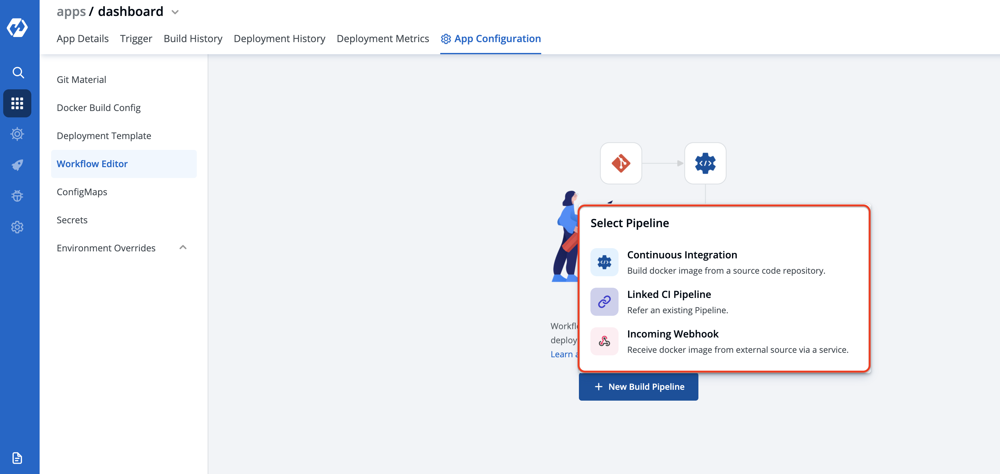

# Workflow

Workflow is a logical sequenece of different stages used for continous integration and continous deployment of an application.

Click on `New Build Pipeline` to create a new workflow

On clicking `New Build Pipeline` Three options appears are given below:

* **Continous Integration:** It will build image from a source code repository.
* **Linked CI Pipeline:** It will refer to an existing pipeline.
* **Incoming Webhook:** It will receive docker image from external source via service.

Then, Create CI/CD Pipelines for your application.

To know how to Create the CI Pipeline for your application Click On: [Create CI Pipelines](ci-pipeline.md)

To know how to Create the CD Pipeline for your application Click On: [Create CD Pipelines](cd-pipeline.md)

