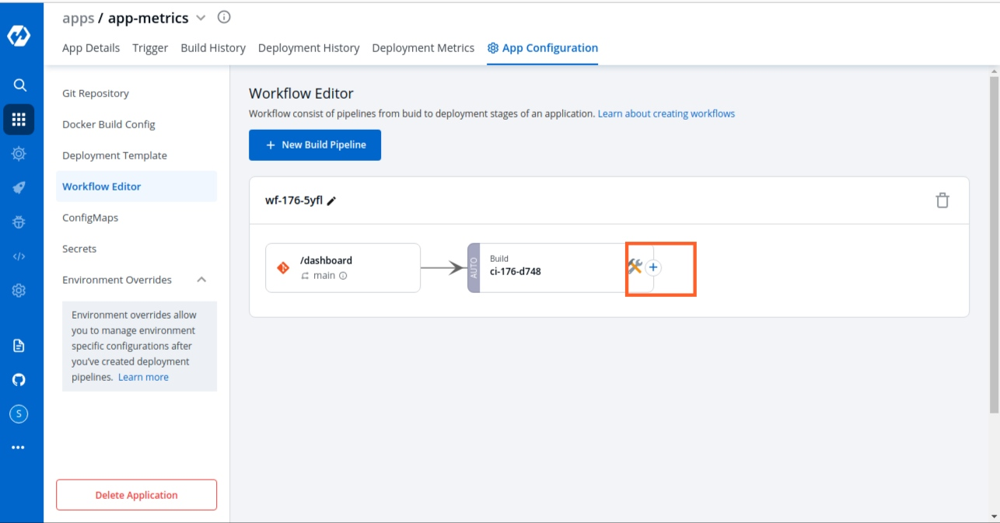
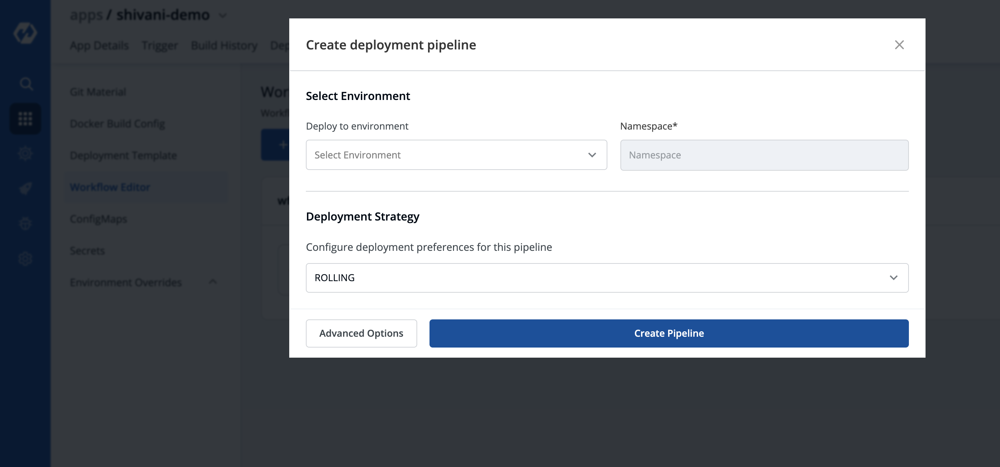
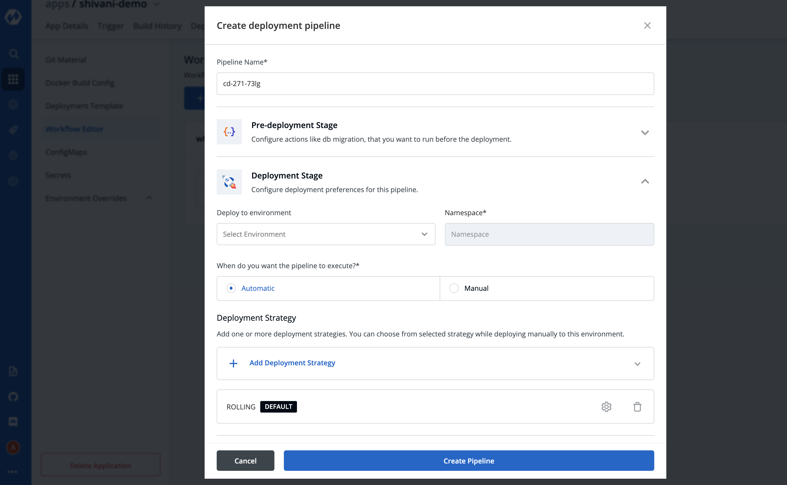
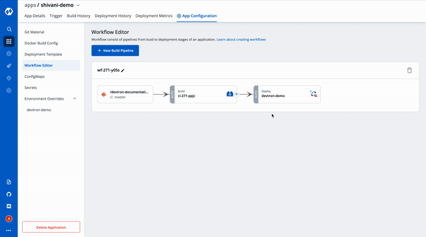
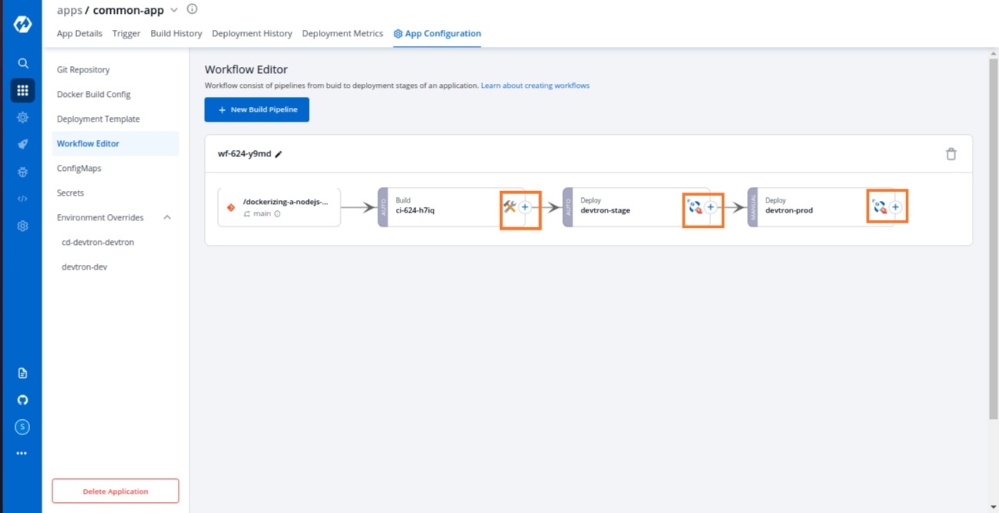

# CD Pipeline
Once you are done creating your CI pipeline, you can move start building your CD pipeline. Devtron enables you to design your CD pipeline in a way that fully automates your deployments.

## Creating CD Pipeline



Click on **“+”** sign on CI Pipeline to attach a CD Pipeline to it. A basic `Create deployment modal` will pop up.



This section expects two inputs:

* **Select Environment**
* **Deployment Strategy**

### 1. Select Environment
This section further including two inputs:

**\(a\) Deploy to Environment**

Select the environment where you want to deploy your application.

**\(b\) Namespace**

This field will be automatically populated with the `Namespace` corresponding to the `Environment` selected in the previous step.

Click on `Create Pipeline` to create a CD pipeline. 

> One can have a single CD pipeline connected to a CI pipeline or sequential CD pipelines for multiple environments connected to a CD pipeline in a sequential manner. Each CD pipeline corresponds to only one environment, or in other words, any single environment of an application can have only one CD pipeline in the pipeline sequence. So, the images created by the CI pipeline can be deployed into multiple environments through sequential CD pipelines originating from a single CI pipeline. If you already have one CD pipeline and want to add more, you can add them by clicking on the + sign on CD pipeline as per required sequence and then choosing the environment in which you want to deploy your application. Once a new CD Pipeline is created for the environment of your choosing, you can move ahead and configure the CD pipeline as required. Your CD pipeline can be configured for the pre-deployment stage, the deployment stage, and the post-deployment stage. You can also select the deployment strategy of your choice. You can add your configurations as explained below:


To configure the advance CD option click on `Advance Options` at the bottom.



| Key | Description |
| :--- | :--- |
| Pipeline Name | Enter the name of the pipeline to be created |
| Environment | Select the environment in which you want to deploy |
| Pre-deployment stage | Run any configuration and provide secrets before the deployment |
| Deployment stage | Select how and when you want the deployment to be triggered - Automatic or manual triggering of your CD Pipeline |
| Deployment Strategy | Select the type of deployment strategy that you want to enable by clicking `Add Deployment Strategy` |
| Post-deployment stage | If you need to run any configurations and provide secrets after the deployment, mention those here |


### 1. Pipeline Name

Pipeline name will be autogenerated.

### 2. Deploy to Environment

As we discussed above, Select the environment where you want to deploy your application. Once you select the environment, it will display the `Namespace` corresponding to your selected environment automatically.

## Stages
There are 3 dropdowns given below:

* **Pre-deployment stage**
* **Deployment stage**
* **Post-deployment stage**

### 3. Pre-deployment stage

Sometimes one has a requirement where certain actions like DB migration are to be executed before deployment, the `Pre-deployment stage` should be used to configure these actions.

Pre-deployment stages can be configured to be executed automatically or manually.

If you select automatic, `Pre-deployment Stage` will be triggered automatically after the CI pipeline gets executed and before the CD pipeline starts executing itself. But, if you select a manual, then you have to trigger your stage via console.

If you want to use some configuration files and secrets in pre-deployment stages or post-deployment stages, then you can use the `Config Maps` & `Secrets` options.

`Config Maps` can be used to define configuration files. And `Secrets` can be defined to store the private data of your application.

Once you are done defining Config Maps & Secrets, you will get them as a drop-down in the pre-deployment stage and you can select them as part of your pre-deployment stage.

These `Pre-deployment CD / Post-deployment CD` pods can be created in your deployment cluster or the devtron build cluster. It is recommended that you run these pods in the Deployment cluster so that your scripts \(if there are any\) can interact with the cluster services that may not be publicly exposed.

If you want to run it inside your application, then you have to check the `Execute in application Environment` option else leave it unchecked to run it within the Devtron build cluster.

Make sure your cluster has `devtron-agent` installed if you check the `Execute in the application Environment` option.


### 4. Deployment stage

**\(a\) Deploy to Environment**

Select the environment where you want to deploy your application. Once you select the environment, it will display the `Namespace` corresponding to your selected environment automatically.

**\(b\)We support two methods of deployments** - Manual and Automatic. If you choose automatic, it will trigger your CD pipeline automatically once the corresponding CI pipeline has been executed successfully.

If you have defined pre-deployment stages, then the CD Pipeline will be triggered automatically after the successful execution of your CI pipeline followed by the successful execution of your pre-deployment stages. But if you choose the manual option, then you have to trigger your deployment manually via console.

**\(c\) Deployment Strategy**

Devtron's tool has 4 types of deployment strategies. Click on `Add Deployment strategy` and select from the available options:

\(a\) Recreate

\(b\) Canary

\(c\) Blue Green

\(d\) Rolling

### 5. Post-deployment Stage

If you want to Configure actions like Jira ticket close, that you want to run after the deployment, you can configure such actions in the post-deployment stages.

Post-deployment stages are similar to pre-deployment stages. The difference is, pre-deployment executes before the CD pipeline execution and post-deployment executes after the CD pipeline execution. The configuration of post-deployment stages is similar to the pre-deployment stages.

You can use Config Map and Secrets in post deployments as well, as defined in the Pre-Deployment stages.


Once you have configured the CD pipeline, click on `Create Pipeline` to save it. You can see your newly created CD Pipeline on the Workflow tab attached to the corresponding CI Pipeline.


## Update CD Pipeline

You can update the deployment stages and the deployment strategy of the CD Pipeline whenever you require it. But, you cannot change the name of a CD Pipeline or its Deployment Environment. If you need to change such configurations, you need to make another CD Pipeline from scratch.

To Update a CD Pipeline, go to the `App Configurations` section, Click on `Workflow editor` and then click on the CD Pipeline you want to Update.




Make changes as needed and click on `Update Pipeline` to update this CD Pipeline.

## Delete CD Pipeline

If you no longer require the CD Pipeline, you can also Delete the Pipeline.

To Delete a CD Pipeline, go to the App Configurations and then click on the Workflow editor. Now click on the pipeline you want to delete. A pop will be displayed with CD details. Verify the name and the details to ensure that you are not accidentally deleting the wrong CD pipeline and then click on the Delete Pipeline option to delete the CD Pipeline.


## Deployment Strategies

A deployment strategy is a way to make changes to an application, without downtime in a way that the user barely notices the changes. There are different types of deployment strategies like Blue/green Strategy, Rolling Strategy, Canary Strategy, Recreate Strategy. These deployment configuration-based strategies are discussed in this section.

**Blue Green Strategy**

Blue-green deployments involve running two versions of an application at the same time and moving traffic from the in-production version \(the green version\) to the newer version \(the blue version\).

```markup
blueGreen:
  autoPromotionSeconds: 30
  scaleDownDelaySeconds: 30
  previewReplicaCount: 1
  autoPromotionEnabled: false
```

| Key | Description |
| :--- | :--- |
| `autoPromotionSeconds` | It will make the rollout automatically promote the new ReplicaSet to active Service after this time has passed |
| `scaleDownDelaySeconds` | It is used to delay scaling down the old ReplicaSet after the active Service is switched to the new ReplicaSet. |
| `previewReplicaCount` | It will indicate the number of replicas that the new version of an application should run |
| `autoPromotionEnabled` | It will make the rollout automatically promote the new ReplicaSet to the active service. |

**Rolling Strategy**

A rolling deployment slowly replaces instances of the previous version of an application with instances of the new version of the application. Rolling deployment typically waits for new pods to become ready via a readiness check before scaling down the old components. If a significant issue occurs, the rolling deployment can be aborted.

```markup
rolling:
  maxSurge: "25%"
  maxUnavailable: 1
```

| Key | Description |
| :--- | :--- |
| `maxSurge` | No. of replicas allowed above the scheduled quantity. |
| `maxUnavailable` | Maximum number of pods allowed to be unavailable. |

**Canary Strategy**

Canary deployments are a pattern for rolling out releases to a subset of users or servers. The idea is to first deploy the change to a small subset of servers, test it, and then roll the change out to the rest of the servers. The canary deployment serves as an early warning indicator with less impact on downtime: if the canary deployment fails, the rest of the servers aren't impacted.

```markup
canary:
  maxSurge: "25%"
  maxUnavailable: 1
  steps:
    - setWeight: 25
    - pause:
        duration: 15 # 1 min
    - setWeight: 50
    - pause:
        duration: 15 # 1 min
    - setWeight: 75
    - pause:
        duration: 15 # 1 min
```

| Key | Description |
| :--- | :--- |
| `maxSurge` | It defines the maximum number of replicas the rollout can create to move to the correct ratio set by the last setWeight |
| `maxUnavailable` | The maximum number of pods that can be unavailable during the update |
| `setWeight` | It is the required percent of pods to move to the next step |
| `duration` | It is used to set the duration to wait to move to the next step. |

**Recreate**

The recreate strategy is a dummy deployment that consists of shutting down version A then deploying version B after version A is turned off. A recreate deployment incurs downtime because, for a brief period, no instances of your application are running. However, your old code and new code do not run at the same time.

```markup
recreate:
```

It terminates the old version and releases the new one.

[Does your app has different requirements in different Environments? Also read Environment Overrides](../environment-overrides.md)

## Creating Sequential Pipelines

Devtron now supports attaching multiple deployment pipelines to a single build pipeline, in its workflow editor. This feature lets you deploy an image first to stage, run tests and then deploy the same image to production.


