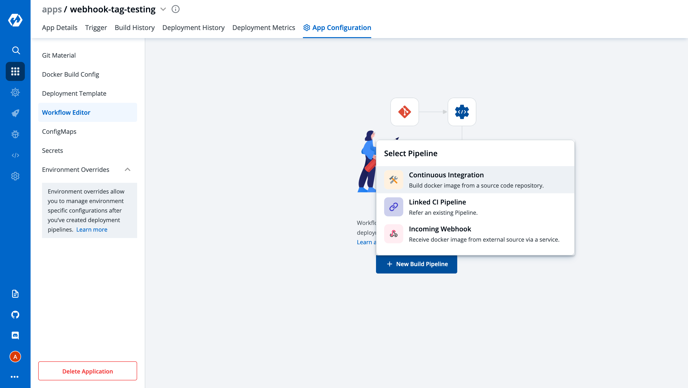
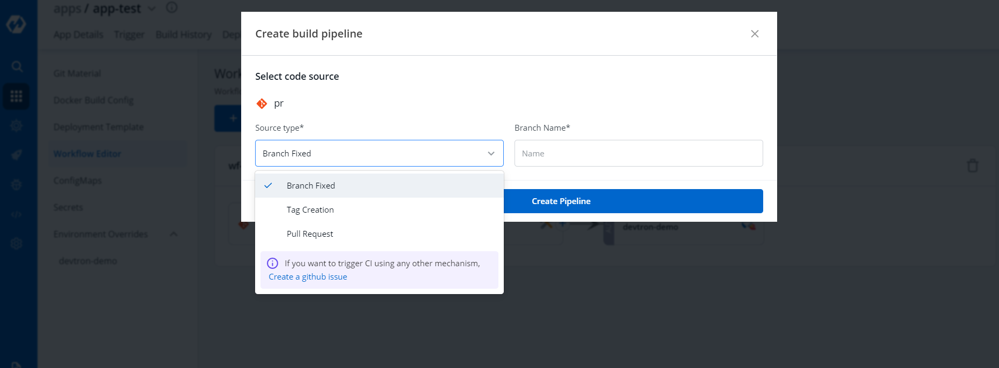
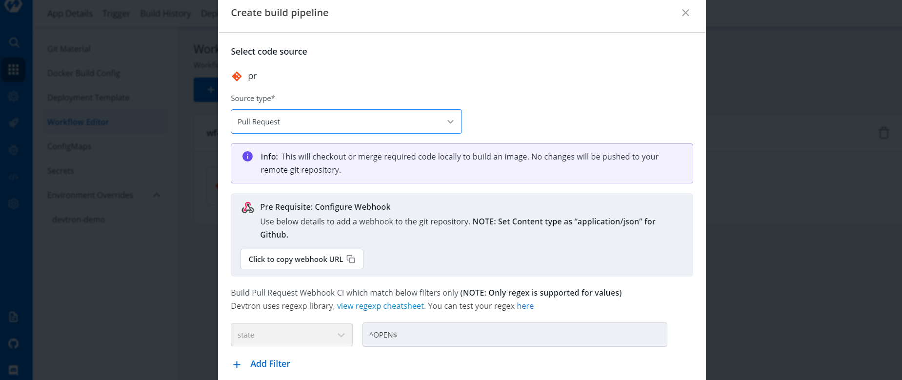
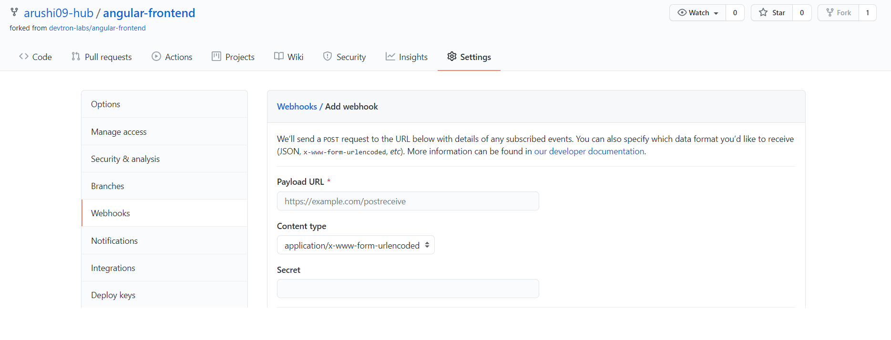
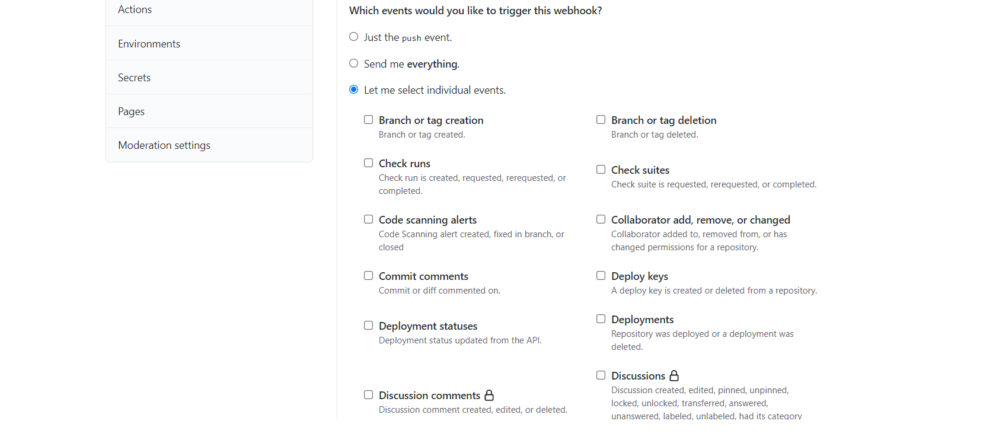
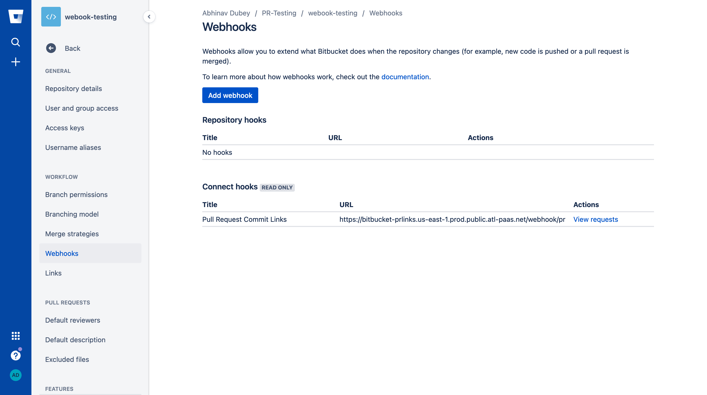
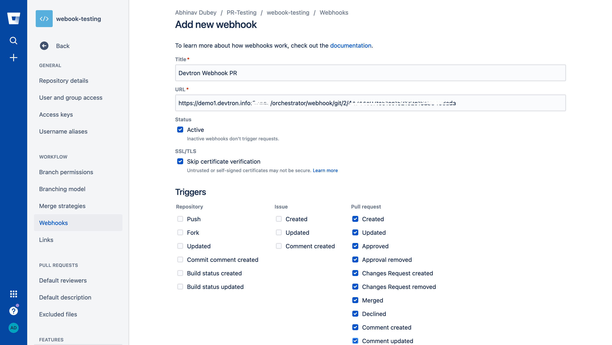
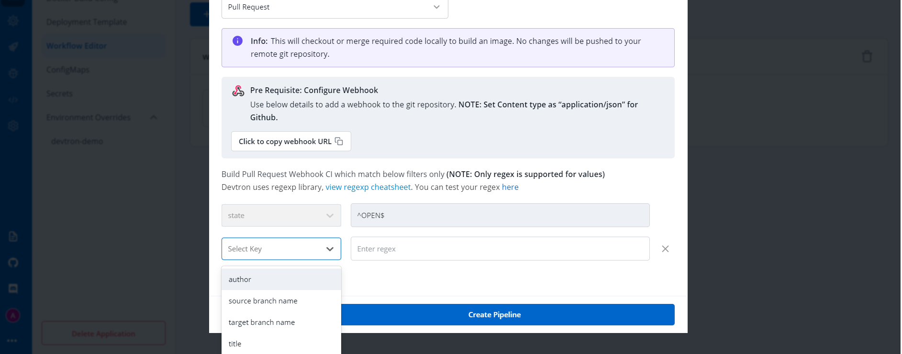
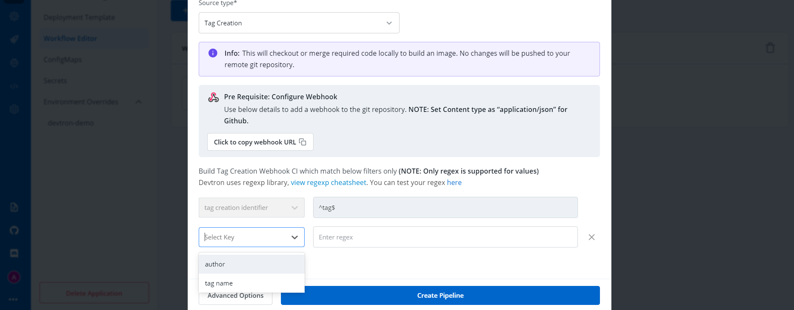

# CI Pipeline

CI Pipeline can be created in three different ways, Continuous Integration, Linked CI Pipeline and Incoming Webhook. Each of these methods have different use-cases which can be used according to the needs of the organization. Let’s begin with Continuous Integration.

## A. Continuous Integration

Click on Continuous Integration, a prompt comes up in which we need to provide our custom configurations. Below is the description of some configurations which are required.

| Key | Description |
| :--- | :--- |
| `Pipeline Name` | Name of the pipeline |
| `Pipeline Execution (Advanced)` | Select from automatic or manual execution depending upon your use-case |
| `Source Type` | Select the source through which the CI Pipeline will be triggered  |
| `Stages (Advanced)` | 1.**Pre-build Stages**- Scripts to be executed before building an image.   2.**Docker build Stages**- Provide a new argument and override an old argument in key-value pair.     3. **Post-build Stages**- Scripts to be executed after building image |
| `Scan for vulnerabilities (Advanced)` | It will scan your image and find if any vulnerabilities present |

[Note] Options such as pipeline execution, stages and scan for vulnerabilities, will be visible after clicking on advanced options present in the bottom left corner.

### I. Pipeline Name
Pipeline name is an auto-generated name which can also be renamed by clicking on Advanced options.

### II. Pipeline Execution
You can select the method you want to execute the pipeline. By default the value is automatic. In this case it will get automatically triggered if any changes are made to the respective git repository. You can set it to manual if you want to trigger the pipeline manually.

### III. Source Type
In source type, we can observe that we have three types of mechanisms which can be used for building your CI Pipeline. In the drop-down you can observe we have Branch Fixed, Pull Request and Tag Creation. 

#### i) Branch Fixed
If you select the Branch Fixed as your source type for building CI Pipeline, then you need to provide the corresponding Branch Name.

Branch Name is the name of the corresponding branch (eg. main or master, or any other branch)

#### ii) Pull Request
[Note] It only works if Git Host is Github or Bitbucket Cloud as of now. In case you need support for any other Git Host, please create a [github issue](https://github.com/devtron-labs/devtron/issues).

If you select the Pull Request option, you can configure the CI Pipeline using the generated PR. For this mechanism you need to configure a webhook for the repository added in the Git Material.

##### Prerequisites for Pull Request
**If using GitHub -**
To use this mechanism, as stated above you need to create a webhook for the corresponding repository of your Git Provider. In Github to create a webhook for the repository -

1. Go to settings of that particular repository
2. Click on webhook section under options tab
3. In the Payload URL section, please copy paste the Webhook URL which can be found at Devtron Dashboard when you select source type as Pull Request as seen in above image.
4. Change content type to - application/json
5. Copy paste the Secret as well from the Dashboard when you select the source type as Pull Request

Now,  scroll down and select the custom events for which you want to trigger the webhook to build CI Pipeline -

6. Check the radio button for **Let me select individual events**
7. Then, check the Branch or **Tag Creation** and **Pull Request** radio buttons under the individual events as mentioned in image below.

[Note] If you select **Branch or Tag Creation**, it will work for the **Tag Creation** mechanism as well.

After selecting the respective options, click on the generate the webhook button to create a webhook for your respective repository.

**If using Bitbucket Cloud -**
If you are using Bitbucket cloud as your git provider, you need to create a webhook for that as we created for Github in the above section.  Follow the steps to create webhook -

1. Go to Repository Settings on left sidebar of repository window
2. Click on Webhooks and then click on Add webhook as shown in the image.

3. Give any appropriate title as per your choice and then copy-paste the url which you can get from Devtron Dashboard when you select Pull Request as source type in case of Bitbucket Cloud as Git Host.
4. Check the Pull Request events for which you want to trigger the webhook and then save the configurations.

##### Filters
Now, coming back to the Pull Request mechanism, you can observe we have the option to add filters. In a single repository we have multiple PRs generated, so to have the exact PR for which you want to build the CI Pipeline, we have this feature of filters.

You can add a few filters which can be seen in the dropdown to sort the exact PR which you want to use for building the pipeline. 

Below are the details of different filters which you can use as per your requirement. Please select any of the filters and pass the value in regex format as one has already given for example and then click on **Create Pipeline**.

Devtron uses regexp library, view [regexp cheatsheet](https://yourbasic.org/golang/regexp-cheat-sheet/). You can test your custom regex from [here](https://regex101.com/r/lHHuaE/1).

| Key | Description |
| :--- | :--- |
| `Source branch name` | Branch from which the Pull Request is generated. |
| `Target branch name` | Branch to which the Pull request will be merged. |
| `Author` | The one who created the Pull Request. |
| `Title` | Title provided to the Pull Request. |
| `State` | It shows the state of PR and as of now it is fixed to Open which cannot be changed. |

#### iii) Tag Creation
The third option i.e, **Tag Creation**. In this mechanism you need to provide the tag name or author to specify the exact tag for which you want to build the CI Pipeline. To work with this feature as well, you need to configure the webhook for either Github or Bitbucket as we did in the previous mechanism i.e, **Pull Request**.

In this process as well you can find the option to filter the specific tags with certain filter parameters. Select the appropriate filter as per your requirement and pass the value in form of regex, one of the examples is already given.

| Filter | Description |
| :--- | :--- |
| `Author` | The one who created the tag. |
| `Tag name` | Name of the tag for which the webhook will be triggered. |

Select the appropriate filter and pass the value in the form of regex and then click on **Create Pipeline**.

### Advanced Options
When you click on the advanced options button which can be seen at the bottom-left of the screen, you can see some more configuration options which includes pipeline execution, stages and scan for vulnerabilities. 

####  Stages: 
There are 3 dropdowns given below:

* **Pre-build**
* **Docker build**
* **Post-build**

**\(a\) Pre-build**

This section is used for those steps which you want to execute before building the Docker image. To add a `Pre-build stage`, click on `Add Stage` and provide a name to your pre-stage and write your script as per your requirement. These stages will run in sequence before the docker image is built. Optionally, you can also provide the path of the directory where the output of the script will be stored locally.

You can add one or more than one stage in a CI Pipeline.

**\(b\) Docker build**

Though we have the option available in the `Docker build configuration` section to add arguments in key-value pairs for the docker build image. But one can also provide docker build arguments here as well. This is useful, in case you want to override them or want to add new arguments to build your docker image.

**\(c\) Post-build**

The post-build stage is similar to the pre-build stage. The difference between the post-build stage and the pre-build stage is that the post-build will run when your CI pipeline will be executed successfully.

Adding a post-build stage is similar to adding a pre-build stage. Click on `Add Stage` and provide a name to your post-stage. Here you can write your script as per your requirement, which will run in sequence after the docker image is built. You can also provide the path of the directory in which the output of the script will be stored in the `Remote Directory` column. And this is optional to fill because many times you run scripts that do not provide any output.

**NOTE:**

**(a)** You can provide pre-build and post-build stages via the Devtron tool’s console or can also provide these details by creating a file `devtron-ci.yaml` inside your repository. There is a pre-defined format to write this file. And we will run these stages using this YAML file.
You can also provide some stages on the Devtron tool’s console and some stages in the devtron-ci.yaml file. But stages defined through the `Devtron` dashboard are first executed then the stages defined in the `devtron-ci.yaml` file.

**(b)** The total timeout for the execution of the CI pipeline is by default set as 3600 seconds. This default timeout is configurable according to the use-case. The timeout can be edited in the configmap of the orchestrator service in the env variable `env:"DEFAULT_TIMEOUT" envDefault:"3600"`

####  Scan for vulnerabilities

`Scan for vulnerabilities` adds a security feature to your application. If you enable this option, your code will be scanned for any vulnerabilities present in your code. And you will be informed about these vulnerabilities. For more details please check doc

You have provided all the details required to create a CI pipeline, now click on `Create Pipeline`.

#### Update CI Pipeline

You can also update any configuration of an already created CI Pipeline, except the pipeline name. The pipeline name can not be edited.

Click on your CI Pipeline, to update your CI Pipeline. A window will be popped up with all the details of the current pipeline.

Make your changes and click on `Update Pipeline` at the bottom to update your Pipeline.

#### Delete CI Pipeline

You can only delete CI Pipeline if you have no CD Pipeline created in your workflow.

To Delete a CI Pipeline, go to the `App Configurations` and then click on `Workflow` editor

Click on `Delete Pipeline` at the bottom to delete the CD Pipeline

#### Automated Test suite integration in the CI step using devtron-ci.yaml

Users can run the Test case using the Devtron Dashboard or by including the Test cases in the devtron.ci.yaml file in the source git repository. For reference, check: [https://github.com/kumarnishant/getting-started-nodejs/blob/master/devtron-ci.yaml](https://github.com/kumarnishant/getting-started-nodejs/blob/master/devtron-ci.yaml)

The test cases given in the script will run before the Test Cases given in the devtron.ci.yaml

| Field | Description |
| :--- | :--- |
| `version` | specify the version of yaml |
| `appliesTo` | applies the changes to a specified branch |
| `type` | branch type on which changes are to be applied, it can be **BRANCH\_FIXED** or **TAG\_PATTERN** |
| `value` | branch name on which changes are to be applied, it can take a value as the name of branch \(“master”\) or as a regular expression \("%d.%d.%d-rc"\) |
| `script` | A script which you want to execute, you can also execute the docker commands here |
| `beforeDockerBuildStages` | script to run before the docker build step |
| `afterDockerBuildStages` | script to run after the docker build step |
| `outputLocation` | The location where you want to see the output of the report of Test cases |

## B. Linked CI Pipeline

If one code is shared across multiple applications, Linked CI Pipeline can be used, and only one image will be built for multiple applications because if there is only one build, it is not advisable to create multiple CI Pipelines.

## C. Incoming Webhook

You can use Devtron for Deployments on Kubernetes while using your own CI tool such as Jenkins. External CI features can be used for cases where the CI tool is hosted outside the Devtron platform.

You can send the ‘Payload script’ to your CI tools such as Jenkins and Devtron will receive the build image every time the CI Service is triggered or you can use the Webhook URL which will build an image every time CI Service is triggered using Devtron Dashboard.

| Key | Description |
| :--- | :--- |
| `Pipeline Name` | Name of the pipeline |
| `Source Type` | ‘Branch Fixed’ or ‘Tag Regex’ |
| `Branch Name` | Name of the branch |

