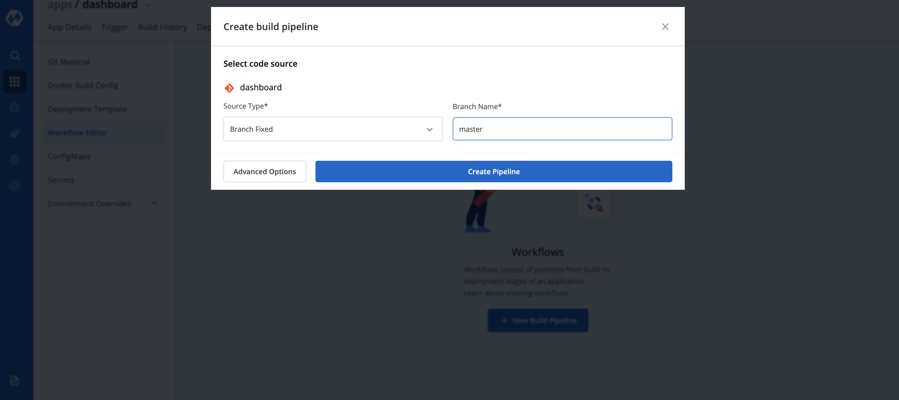
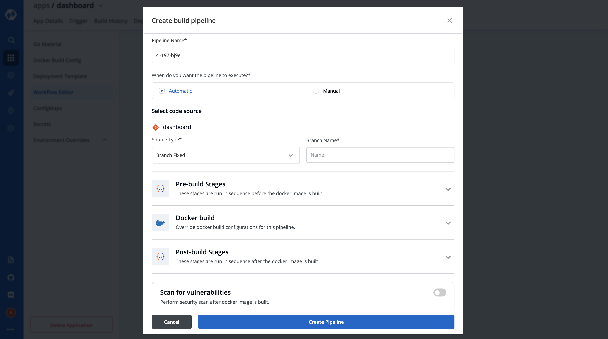
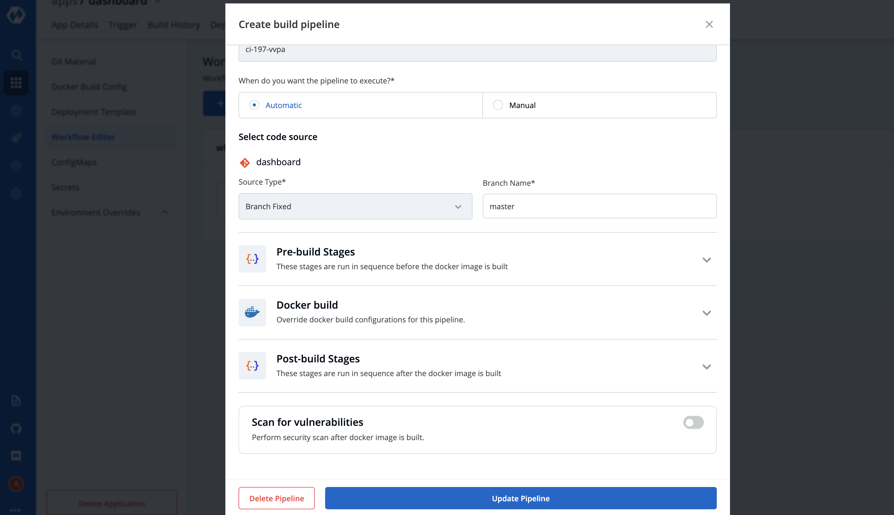
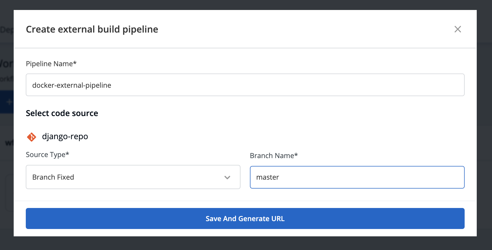
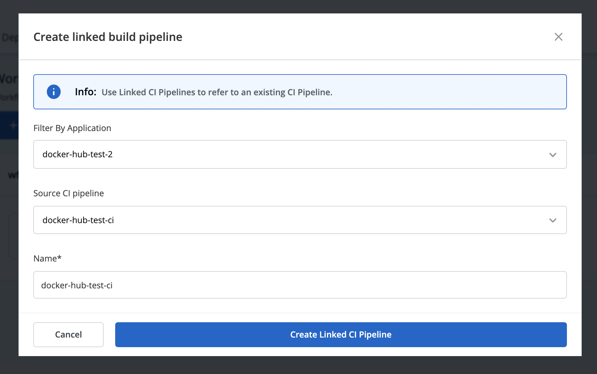

# CI Pipeline

## A. Continuous Integration

CI related configuration is provided under this section. Key concepts of CI pipeline are: 

| Key | Description |
| :--- | :--- |
| `Pipeline Name` | Name of the pipeline |
| `Source Type` | Select the source through which the CI Pipeline will be triggered by Automatic or Manual. |
| `Branch Name/Tag Regex` | Enter branch name/tag regex. |
| `Stages` | 1.**Pre-build Stages**- Scripts to be executed before building an image.   2.**Docker build Stages**- Provide a new argument and override an old argument in key-value pair.    3. **Post-build Stages**- Scripts to be executed after building image |
| `Scan for vulnerabilities` | It will scan your image and find if any vulnerabilities present |

After Clicking on `Continuous Integration` to configure CI Pipeline, a new window will appear. 

This is the basic modal to configure the CI pipeline, You need to provide 2 inputs as given below:

### 1. Source Type
In source type, select between Automatic or Manual. Here if you select Automatic, the CI pipeline will be triggered automatically whenever you push any commit to your repository. But if you select Manual, then you have to trigger your CI pipeline every time manually through the dashboard.

### 2. Branch Name
In this column, you have to provide the branch or tag name for which you would want the CI pipeline to be executed. It supports both exact names as well as regex for both branch and tag.

Example- It can be a master branch in the production and development/staging branch in the dev environment.
Click on the `Create Pipeline` button to create a CI pipeline. 
To get Advance options, Click on the `Advance Options` button, a new advanced window will appear.

### 1. Pipeline Name

Pipeline name will be autogenerated.

### 2. Source Type

In source type, select between Automatic or Manual. Here if you select Automatic, the CI pipeline will be triggered automatically whenever you push any commit to your repository. But if you select Manual, then you have to trigger your CI pipeline every time manually through the console.

### 3. Branch Name

In this column, you have to provide your branch or tag regex where your code is present and the branch to want this CI pipeline to be linked with.

**Example**- It can be a master branch in the production and development/staging branch in the dev environment. But the branch name completely depends on the user, which branch name the user wants to provide here.

### 4. Stages: 
There are 3 dropdowns given below:

* **Pre-build**
* **Docker build**
* **Post-build**

**\(a\) Pre-build**

This section is used for those steps which you want to execute before building the Docker image. To add a `Pre-build stage`, click on `Add Stage` and provide a name to your pre-stage and write your script as per your requirement. These stages will run in sequence before the docker image is built. Optionally, you can also provide the path of the directory where the output of the script will be stored locally.

You can add one or more than one stage in a CI Pipeline.

**\(b\) Docker build**

Though we have the option available in the `Docker build configuration` section to add arguments in key-value pairs for the docker build image. But one can also provide docker build arguments here as well. This is useful, in case you want to override them or want to add new arguments to build your docker image.

**\(c\) Post-build**

The post-build stage is similar to the pre-build stage. The difference between the post-build stage and the pre-build stage is that the post-build will run when your CI pipeline will be executed successfully.

Adding a post-build stage is similar to adding a pre-build stage. Click on `Add Stage` and provide a name to your post-stage. Here you can write your script as per your requirement, which will run in sequence after the docker image is built. You can also provide the path of the directory in which the output of the script will be stored in the `Remote Directory` column. And this is optional to fill because many times you run scripts that do not provide any output.

**NOTE:**

You can provide pre-build and post-build stages via the Devtron tool’s console or can also provide these details by creating a file `devtron.ci.yaml` inside your repository. There is a pre-defined format to write this file. And we will run these stages using this YAML file.

You can provide some stages on the Devtron tool’s console and some stages in the devtron.ci.yaml file. But stages defined through the `Devtron` dashboard are first executed then the stages defined in the `devtron.ci.yaml` file.

### 5. Scan for vulnerabilities

`Scan for vulnerabilities` adds a security feature to your application. If you enable this option, your code will be scanned for any vulnerabilities present in your code. And you will be informed about these vulnerabilities. For more details please check doc

You have provided all the details required to create a CI pipeline, now click on `Create Pipeline`.

### Update CI Pipeline

You can also update any configuration of an already created CI Pipeline, except the pipeline name. The pipeline name can not be edited.

Click on your CI Pipeline, to update your CI Pipeline. A window will be popped up with all the details of the current pipeline.

Make your changes and click on `Update Pipeline` at the bottom to update your Pipeline.

### Delete CI Pipeline

You can only delete CI Pipeline if you have no CD Pipeline created in your workflow.

To Delete a CI Pipeline, go to the `App Configurations` and then click on `Workflow` editor

Click on `Delete Pipeline` at the bottom to delete the CD Pipeline

### Automated Test suite integration in the CI step using devtron-ci.yaml

Users can run the Test case using the Devtron Dashboard or by including the Test cases in the devtron.ci.yaml file in the source git repository. For reference, check: [https://github.com/kumarnishant/getting-started-nodejs/blob/master/devtron-ci.yaml](https://github.com/kumarnishant/getting-started-nodejs/blob/master/devtron-ci.yaml)

The test cases given in the script will run before the Test Cases given in the devtron.ci.yaml

| Field | Description |
| :--- | :--- |
| `version` | specify the version of yaml |
| `appliesTo` | applies the changes to a specified branch |
| `type` | branch type on which changes are to be applied, it can be **BRANCH\_FIXED** or **TAG\_PATTERN** |
| `value` | branch name on which changes are to be applied, it can take a value as the name of branch \(“master”\) or as a regular expression \("%d.%d.%d-rc"\) |
| `script` | A script which you want to execute, you can also execute the docker commands here |
| `beforeDockerBuildStages` | script to run before the docker build step |
| `afterDockerBuildStages` | script to run after the docker build step |
| `outputLocation` | The location where you want to see the output of the report of Test cases |

## B. External CI Pipeline

You can use Devtron for Deployments on Kubernetes while using your own CI tool such as Jenkins. External CI features can be used for cases where the CI tool is hosted outside the Devtron platform.

You can send the ‘Payload script’ to your CI tools such as Jenkins and Devtron will receive the build image every time the CI Service is triggered or you can use the Webhook URL which will build an image every time CI Service is triggered using Devtron Dashboard.

| Key | Description |
| :--- | :--- |
| `Pipeline Name` | Name of the pipeline |
| `Source Type` | ‘Branch Fixed’ or ‘Tag Regex’ |
| `Branch Name` | Name of the branch |

## C. Linked CI Pipeline

If one code is shared across multiple applications, Linked CI Pipeline can be used, and only one image will be built for multiple applications because if there is only one build, it is not advisable to create multiple CI Pipelines.

