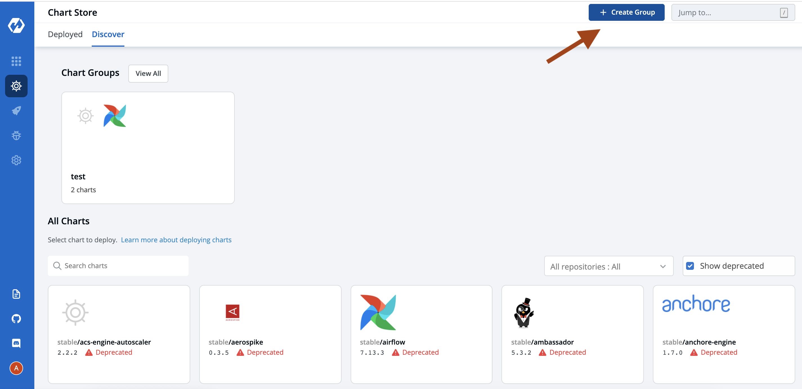
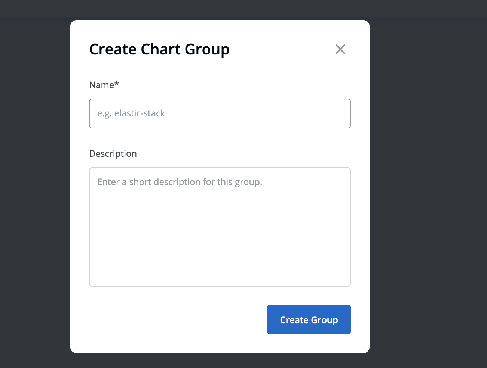
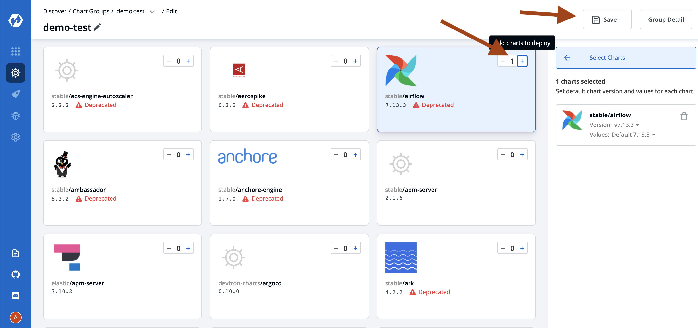
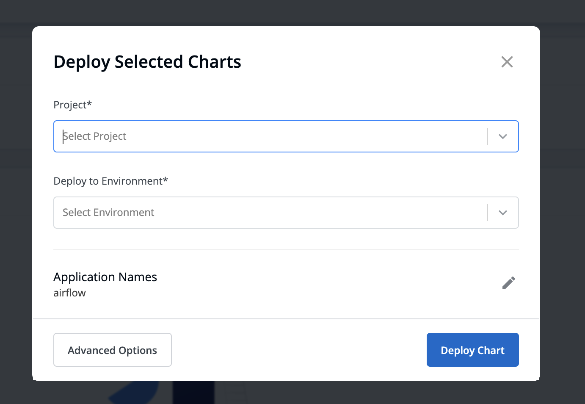
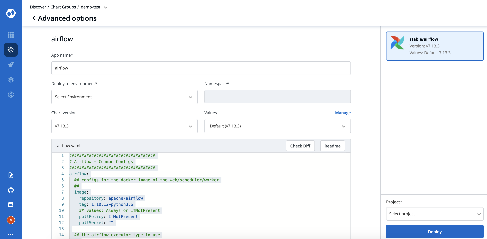

# Chart Operations 

## Introduction

Create Chart Group And Deploy App store applications.

## 1. Create Group 

Select the `Charts` section from the left pane, you will be landed to the `Chart Store` page. 
Click on `Discover` and Click Button on right top `Create Group`.

It will pop-up a dialog, fill required data.

And click on right bottom button `Create Group`.

It will land you to the page where you can discover charts to add in this group and later deploy by single click.

## 2. Add Charts To Group 

Choose any chart and add by plus button, save this group by pressing `Save`.

For Running Instances and Group Detail Click on `Group Detail` from here you can Edit yous charts as well.

## 3.Bulk Deploy and Edit Option for Charts

Charts are visible in right panel you can deploy it right bottom button `Deploy To ..`

It will open a dialog box, select project and environment where you want to deploy this specific chart.

Click on `Advanced Option` for more deploy option like values yaml environment and project selection for each chart.

