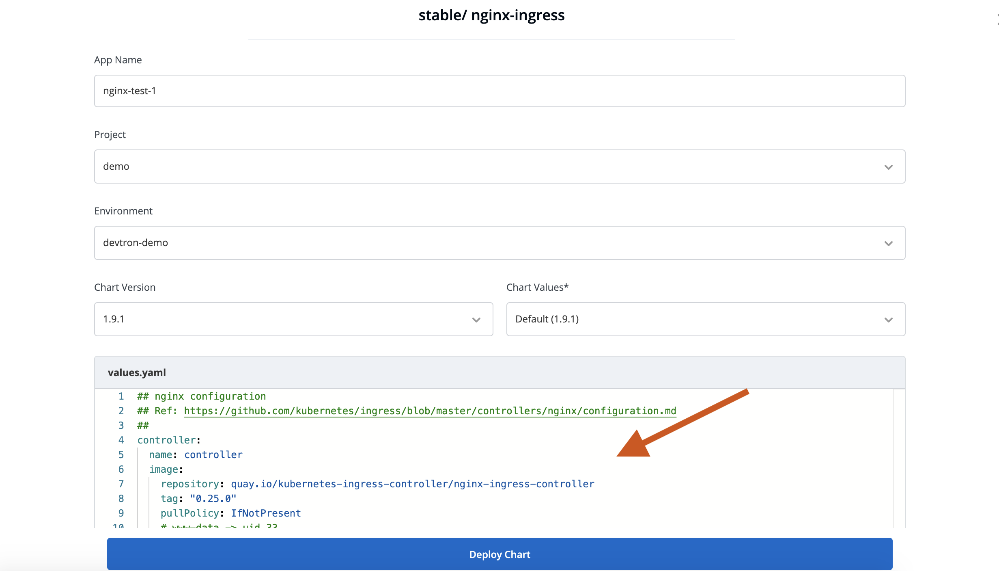
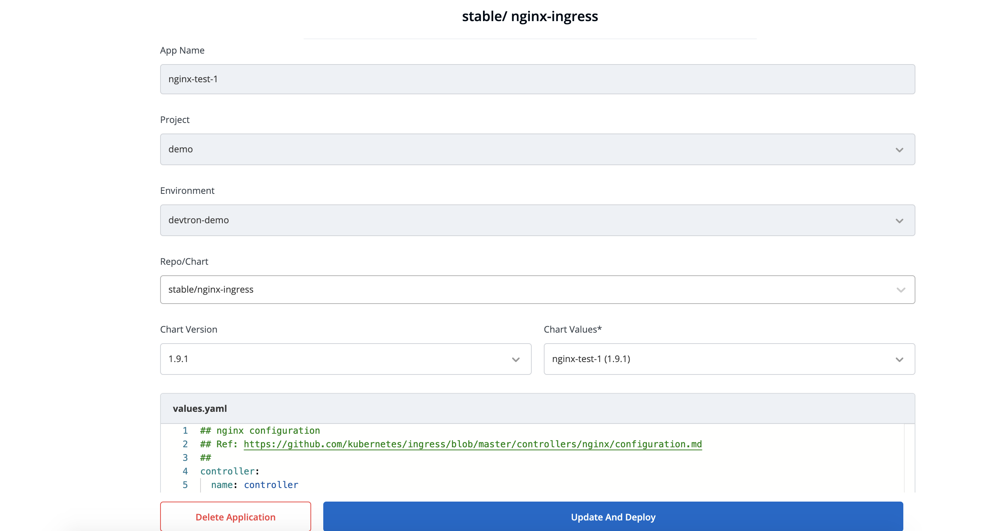
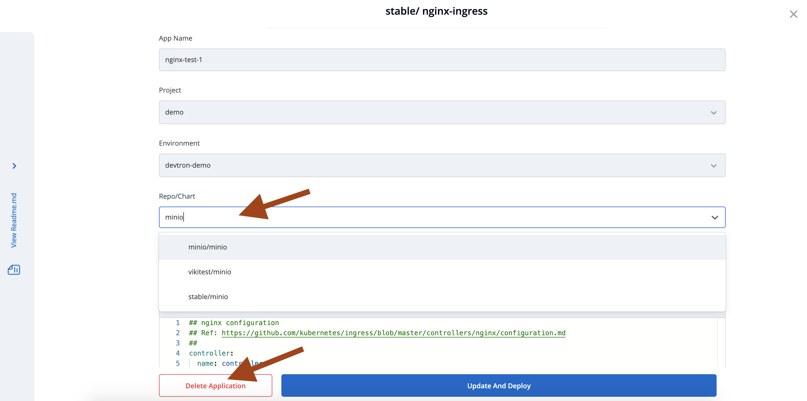
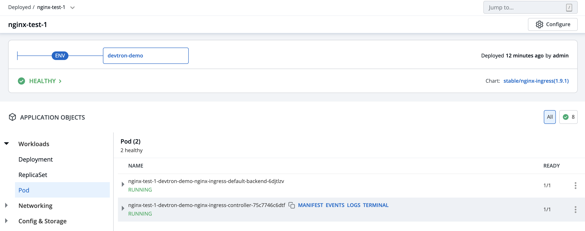
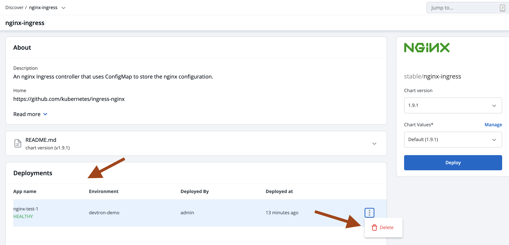

# Chart Operations 

## Introduction

Discover, Create, Deploy, Update, Upgrade, Delete App store applications.

## 1. Discover the chart from the Chart Store

Select the `Charts` section from the left pane, you will be landed to the `Chart Store` page. 
Click on `Discover` and search `nginx` or any other charts in search filter.

Click on charts it will land you to the app store detail page. where you can see number of instances deployed by the same chart

## 2. Configure the Chart

After selecting the version and values, click on `Deploy`

Enter the following details, to deploy chart:

| Key | Description |
| :--- | :--- |
| `App Name` | Name of the Chart Unique|
| `Project` |  Project in which you want to deploy the chart |
| `Environment` | Environment in which you want to deploy the chart |
| `Chart Version` | Chart version |
| `Chart Value` | Latest default value or create a custom value |

you can choose any chart version, values and update it on values.yaml

Click on `Deploy` to deploy the Chart

## 3. Status of Deployment 

After clicking on `Deploy` you will land on a page, that shows the Status of the deployment of the Chart.

The Status of the chart should be `Healthy`. It might take few seconds after initiating the deployment of the chart.

In case the Status, of the deployment is `Degraded` or takes a long time to get deployed.

Click on the `Status` or check the logs of the pods to debug the issue.

Arrow 3 will land you to the page where you can update or upgrade chart

Arrow 4 will land you to the page where you can se all the running instances of this chart.

## 4. Update or Upgrade Chart

For update you can change its chart version and values yaml and than click on `Update And Deploy` Button.

For upgrade click on `Repo/Chart` field and search any chart name like `minio` and change values corresponding to that chart and `Click on Update And Deploy` Button.

After Update and Upgrade you again will land on detail page where you can check pods and service name.

## 5. App Store Detail and Delete Charts

From detail page there is link to redirect you to the app store detail page. where you can see number of instances installed by this chart. 
also you can delete chart instance from here.

