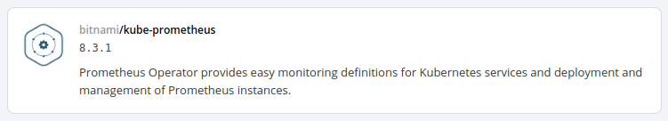
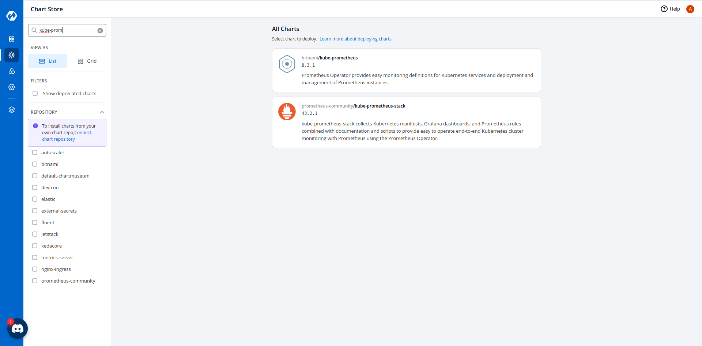
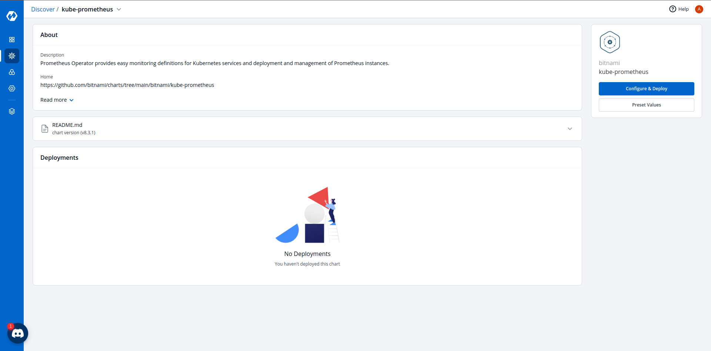
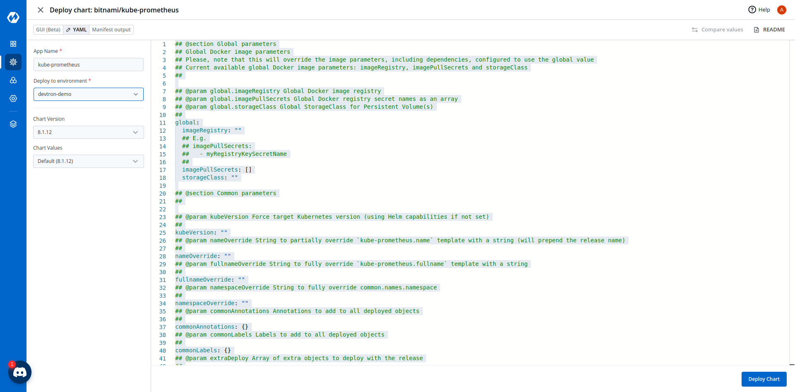
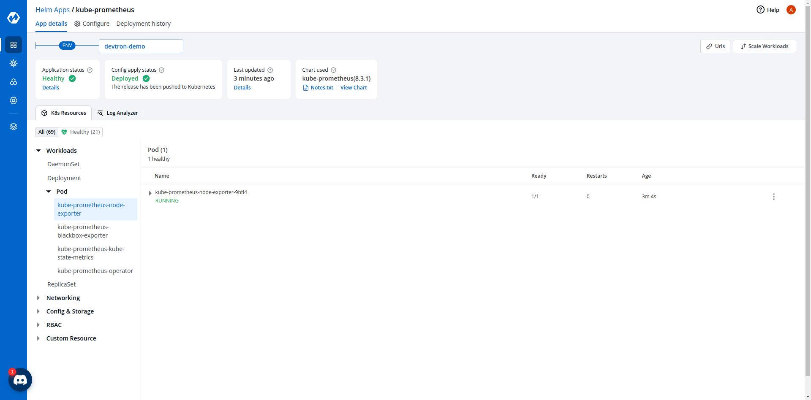
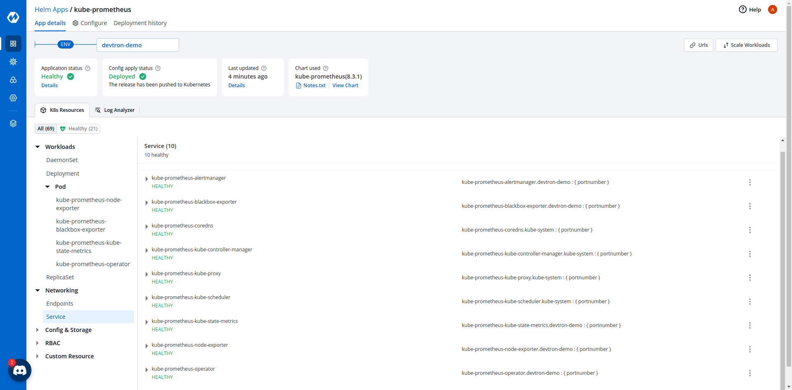

# Deploying Kube-Prometheus Helm Chart

## Introduction

`bitnami/kube-prometheus` Helm chart bootstraps a single node kube-prometheus deployment on a Kubernetes cluster using the Helm package manager.

## 1. Discover Kube-Prometheus chart from Chart Store

Select `Chart Store` from the left panel. On the `Search charts` bar, type `kube-prometheus`, click `bitnami/kube-prometheus`.

## 2. Configure the Chart

After selecting the `bitnami/kube-prometheus` Helm chart, click `Configure & Deploy`.

Enter the following details, to deploy Kube-Prometheus chart:

| Key | Description |
| :--- | :--- |
| `App Name` | Name of the Chart. |
| `Project` | Select the name of your Project in which you want to deploy the chart. |
| `Environment` | Select the environment in which you want to deploy the chart. |
| `Chart Version` | Select the latest Chart Version. |
| `Chart Value` | Select the default value or create a custom value. |

### Configure `values.yaml`

You can configure the `values.yaml` according to your project's requirements.

Click `Deploy Chart` to deploy the chart.

## 3. Check the Status of Deployment

After clicking `Deploy`, you will be redirected to `App Details` page where you can see deployment status of the chart. The Status of the chart must be `Healthy`. It might take few seconds after initiating the deployment of the chart.

In case the Status, of the deployment is `Degraded` or takes a long time to get deployed.
Click the status details or check the logs of the pods to debug the issue.

## 4. Extract the Service Name

Copy URL of the service name which will be used to connect your application to Kube-Prometheus.

