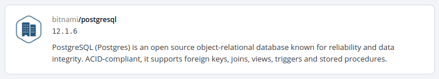
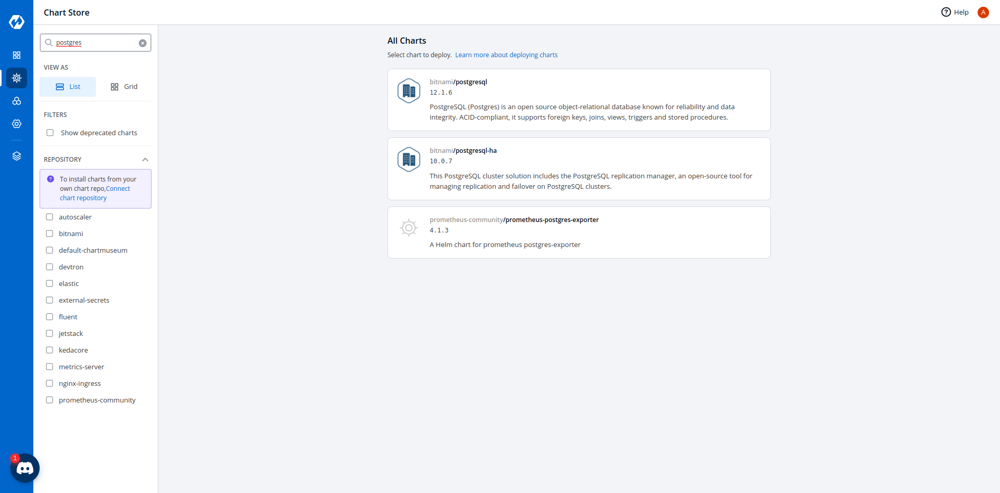
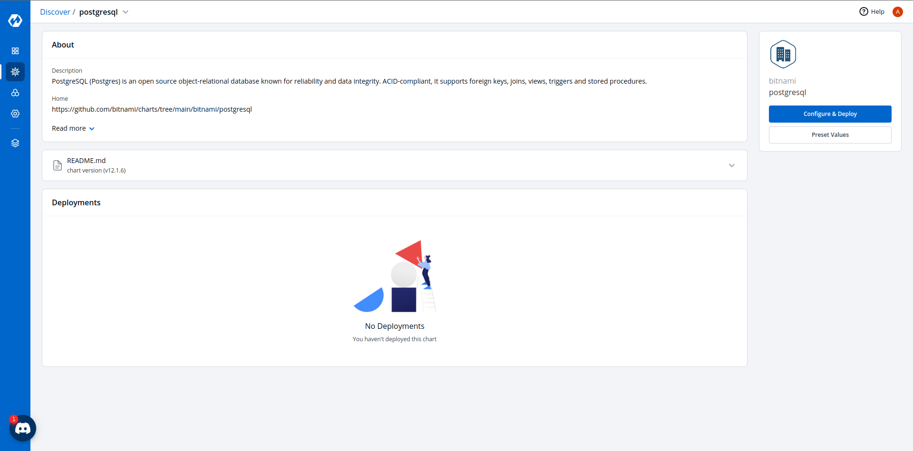
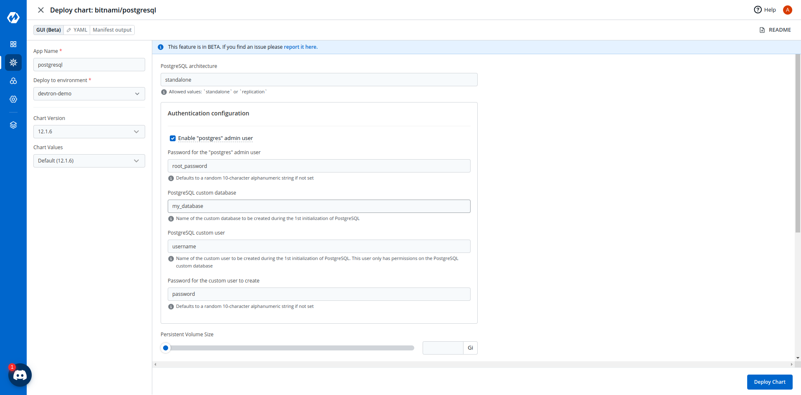
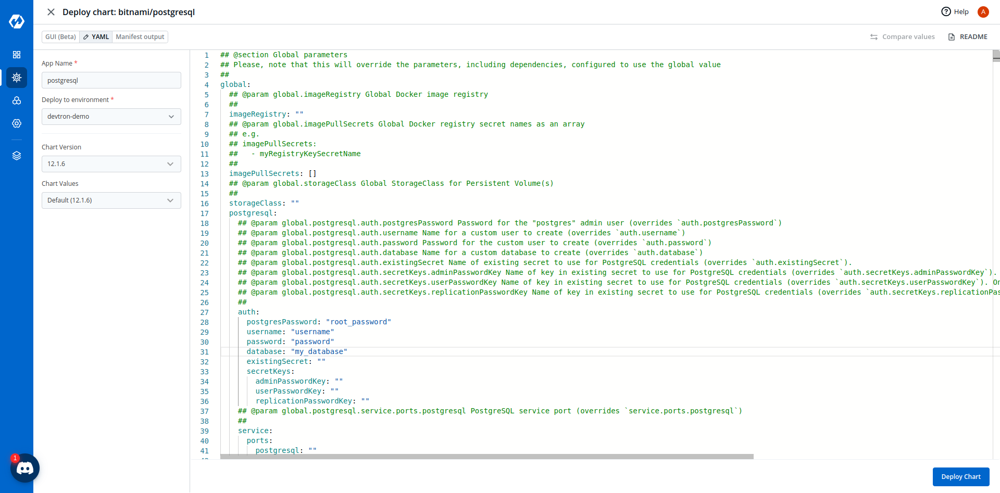
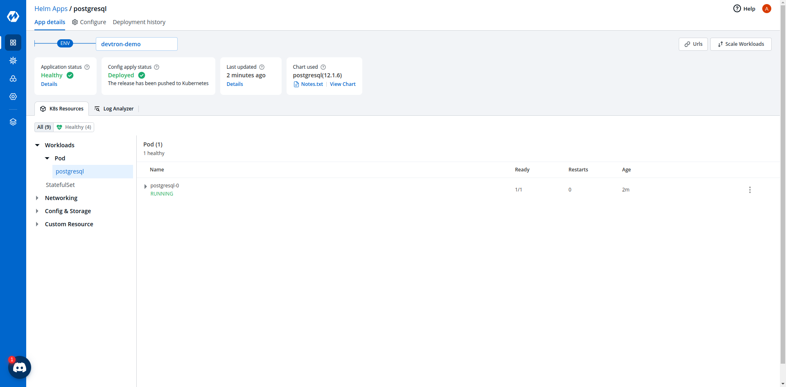
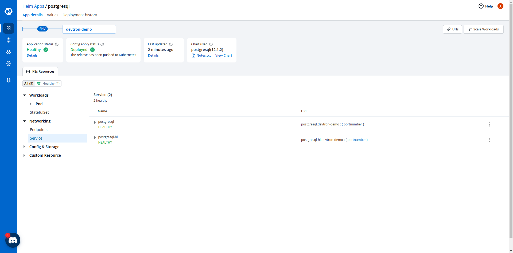

# Deploying Postgresql Helm Chart

## Introduction

`bitnami/postgresql` Helm chart bootstraps a single node Postgresql deployment on a Kubernetes cluster using the Helm package manager.

## 1. Discover Postgresql chart from Chart Store

Select `Charts` from the left panel to visit the `Chart Store` page. You will see numerous of charts on the page from which you have to find `bitnami/postgresql` chart. You also can use the search bar to search the Postgresql chart.

## 2. Configure the Chart

After selecting the `bitnami/postgresql` Helm chart, click on `Deploy`.

Enter the following details, to deploy Postgresql chart:

| Key | Description |
| :--- | :--- |
| `App Name` | Name of the Chart |
| `Project` | Select the name of your Project in which you want to deploy the chart |
| `Environment` | Select the environment in which you want to deploy the chart |
| `Chart Version` | Select the latest Chart Version |
| `Chart Value` | Select the default value or create a custom value |

### Configure `values.yaml`

Set the following parameters in the chart.

| Parameters | Description |
| :--- | :--- |
| `postgresqlRootPassword` | Password for the root user. Ignored if existing secret is provided |
| `postgresqlDatabase` | Name of your Psotgresql database |
| `postgresqluser` | Username of new user to create |
| `postgresqlPassword` | Password for the new user. Ignored if existing secret is provided |

You can set these values in either the GUI mode or the YAML mode.

Click on `Deploy Chart` to deploy the Chart.

## 3. Check the Status of Deployment

After clicking on `Deploy` you will be redirected to app details page where you can see deployment status of the chart. The Status of the chart should be `Healthy`. It might take few seconds after initiating the deployment of the chart.

In case the Status, of the deployment is `Degraded` or takes a long time to get deployed.
Click on the `Status` or check the logs of the pods to debug the issue.

## 4. Extract the Service Name

Copy the service name, it will be used to connect your application to Postgresql.

