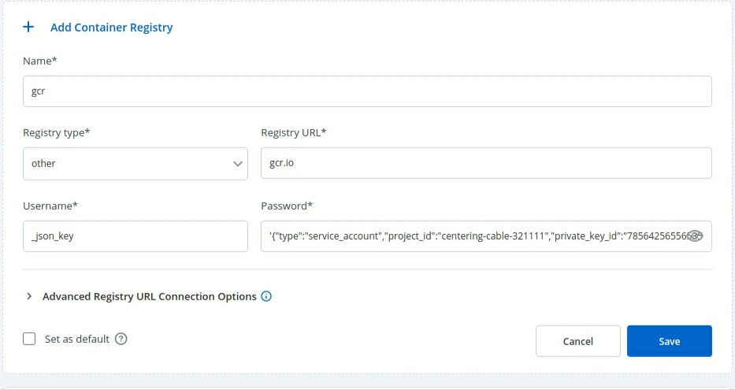

# Container Registries

Container registries are used for storing images built by the CI Pipeline. You can configure the container registry using any different cloud provider of your choice. It allows you to build, deploy and manage your container images with easy-to-use UI. 

When configuring an application, you can choose the specific container registry and repository in the App Configuration > [Docker Build Config](user-guide/creating-application/docker-build-configuration.md) section.

## Add Container Registry:

Go to the `Container Registry` section of `Global Configuration`. Click **Add Container Registry**.

You will see below the input fields to configure the container registry.

| Fields | Description |
| --- | --- |
| **Container Registry** | Select the container registry from the drop-down list. |
| **Container Repository** | Enter the name of the container repository. |

* Name
* Registry Type
  * ecr
    * AWS region
    * Access key ID
    * Secret access key
  * docker hub
    * Username
    * Password
  * Others
    * Username
    * password
* Registry URL
* Set as default


### Name

Provide a name to your registry, this name will be shown to you in Docker Build Config as a drop-down.

### Registry Type

Here you can select the type of the Registry. We are supporting three types- `docker hub`, `ecr` and `others`. You can select any one of them from the drop-down. By default, this value is `ecr`. If you select ecr then you have to provide some information like- `AWS region, Access Key`, and `Secret Key`. If you select docker hub then you have to provide `Username` and `Password`. And if you select others then you have to provide the `Username` and `Password`.

### Registry URL

Select any type of Registry from the drop-down, you have to provide the URL of your registry. Create your registry and provide the URL of that registry in the URL box.

### Registry Type: ECR

To add an Amazon Elastic Container Registry (ECR), select the `ECR` Registry type.
Amazon ECR is an AWS-managed container image registry service.
The ECR provides resource-based permissions to the private repositories using AWS Identity and Access Management (IAM).
ECR allows both Key-based and Role-based authentications.

Before you begin, create an [IAM user](https://docs.aws.amazon.com/AmazonECR/latest/userguide/get-set-up-for-amazon-ecr.html), and attach only ECR policy ( AmazonEC2ContainerRegistryFullAccess ) if using Key-based auth. Or attach the ECR policy ( AmazonEC2ContainerRegistryFullAccess) to the cluster worker nodes IAM role of your Kubernetes cluster if using Role-based access.

| Fields | Description |
| --- | --- |
| **Name** | User-defined name for the registry in Devtron |
| **Registry Type** | Select **ECR** |
| **Registry URL** | This is the URL of your private registry in AWS. <br></br> For example, the URL format is: `https://xxxxxxxxxxxx.dkr.ecr.<region>.amazonaws.com`. <br></br>`xxxxxxxxxxxx` is your 12-digit AWS account Id. |
| **Authentication Type** | <br></br> * **EC2 IAM role**: Authenticate with workernode IAM role. <br></br> * **User Auth**: Authenticate with an authorization token <br></br>  - **Access key ID**: Your AWS access key <br></br>  - **Secret access key**: Your AWS secret access key ID |


To set this `ECR` as the default registry hub for your images, select **[x] Set as default registry**.

Select **Save**.

To use the ECR container image, go to the **Applications** page and select your application, and then select **App Configuration > [Docker Build Config](./../creating-application/docker-build-configuration.md)**.

### Registry Type- Docker Hub 

You have to provide the below information if you select the registry type as Docker Hub.

* **Username**

Give the username of the docker hub account you used for creating your registry in.

* **Password**

Give the password/[token](https://docs.docker.com/docker-hub/access-tokens/) corresponding to your docker hub account.


### Registry Type Others:

You have to provide the below information if you select the registry type as others.

* **Username**

Give the username of your account, where you have created your registry in.

* **Password**

Give the password corresponding to the username of your registry.


### Set as default:

If you enable the `Set as default` option, then this registry name will be set as default in the `Container Registry` section inside the `Docker build config` page. This is optional. You can keep it disabled.

### Advance Registry Url connection options:

* If you enable the `Allow Only Secure Connection` option, then this registry allows only secure connections.

* If you enable the `Allow Secure Connection With CA Certificate` option, then you have to upload/provide private CA certificate (ca.crt).

* If the container registry is insecure (for eg : SSL certificate is expired), then you enable the `Allow Insecure Connection` option.

Now click on `Save` to save the configuration of the `Container registry`.

### Note:

You can use any registry which can be authenticated using `docker login -u <username> -p <password> <registry-url>`. However these registries might provide a more secured way for authentication, which we will support later.
Some popular registries which can be used using username and password mechanism:

* **Google Container Registry (GCR)** : JSON key file authentication method can be used to authenticate with username and password. Please follow [link](https://cloud.google.com/container-registry/docs/advanced-authentication#json-key) for getting username and password for this registry. Please remove all the white spaces from json key and wrap it in single quote while putting in password field.  



* **Google Artifact Registry (GAR)** : JSON key file authentication method can be used to authenticate with username and password. Please follow [link](https://cloud.google.com/artifact-registry/docs/docker/authentication#json-key) for getting username and password for this registry. Please remove all the white spaces from json key and wrap it in single quote while putting in password field.
* **Azure Container Registry (ACR)** : Service principal authentication method can be used to authenticate with username and password. Please follow [link](https://docs.microsoft.com/en-us/azure/container-registry/container-registry-auth-service-principal) for getting username and password for this registry.

## Integrating With External Container Registry

If you want to use a private registry for container registry other than ecr, this will be used to push image and then create a secret in same environment to pull the image to deploy. To create secret, go to charts section and search for chart ‘dt-secrets’ and configure the chart. Provide an App Name and select the Project and Environment in which you want to deploy this chart and then configure the values.yaml as shown in example. The given example is for DockerHub but you can configure similarly for any container registry that you want to use.

```yaml
name: regcred
type: kubernetes.io/dockerconfigjson
labels:
 test: chart
secrets:
 data:
   - key: .dockerconfigjson
     value: '{"auths":{"https://index.docker.io/v1/":{"username":"<username>","password":"<password>}}}'
```     

The `name` that you provide in values.yaml ie. `regcred` is name of the secret that will be used as `imagePullSecrets` to pull the image from docker hub to deploy. To know how `imagePullSecrets` will be used in the deployment-template, please follow the [documentation](https://docs.devtron.ai/devtron/user-guide/creating-application/deployment-template/rollout-deployment#imagepullsecrets).


## Pull an Image from a Private Registry

You can create a Pod that uses a `Secret` to pull an image from a private container image registry or repository. There are many private registries in use. This task uses [Docker Hub](https://www.docker.com/products/docker-hub) as an example registry.

Super admin users can decide if they want to auto-inject registry credentials or use a secret to pull an image for deployment to environments on specific clusters.

To manage the access of registry credentials, click **Manage**.

There are two options to manage the access of registry credentials:

| Fields | Description |
| --- | --- |
| **Do not inject credentials to clusters** | Select the clusters for which you do not want to inject credentials. |
| **Auto-inject credentials to clusters** | Select the clusters for which you want to inject credentials. |

You can choose one of the three options for defining credentials:

### Use Registry Credentials

If you select **Use Registry Credentials**, the clusters will be auto-injected with the registry credentials of your registry type. As an example: If you select `Docker` as Registry Type and `docker.io` as Registry URL, the registry credentials of the clusters will be the `username` and `password` which you define.
Click **Save**.


### Specify Image Pull Secret

You can create a Secret by providing credentials on the command line.

Create this Secret, naming it `regcred`:

```bash
kubectl create -n <namespace> secret docker-registry regcred --docker-server=<your-registry-server> --docker-username=<your-name> --docker-password=<your-pword> --docker-email=<your-email>
```

where:
* <namespace> is your virtual cluster. E.g., devtron-demo
* <your-registry-server> is your Private Docker Registry FQDN. Use https://index.docker.io/v1/ for DockerHub.
* <your-name> is your Docker username.
* <your-pword> is your Docker password.
* <your-email> is your Docker email.

You have successfully set your Docker credentials in the cluster as a Secret called `regcred`.

**Note**: Typing secrets on the command line may store them in your shell history unprotected, and those secrets might also be visible to other users on your PC during the time when kubectl is running.

Enter the `Secret` name in the **Name** field and click **Save**.

### Create Image Pull Secret

With this option, you can define the following fields to create image pull secret:

| Fields | Description |
| --- | --- |
| **Registry URL** | The URL of your registry. E.g., `docker.io` |
| **Username** | Username of the registry hub account you used for creating registry. |
| **Email** | Email address of the registry hub account you used for creating registry. This field is optional. |
| **Password** | Password corresponding to your registry hub account. |

**Note**: If you leave all the fields blank, then the clusters will be auto-injected with the registry credentials which you define on the **Registry Type**.


