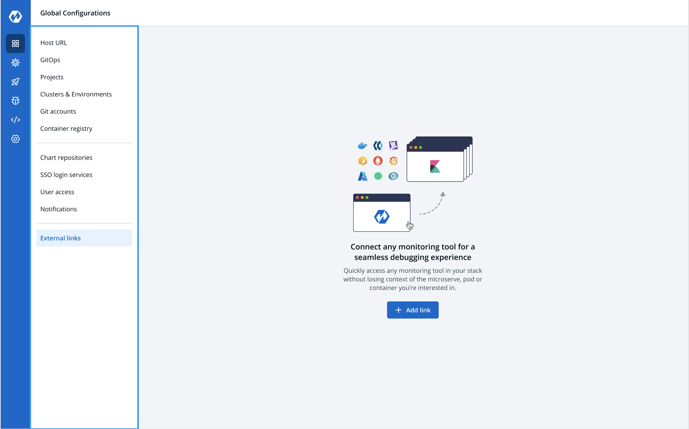

# Link to external Monitoring Tools

External links allow you to connect to the third-party Monitoring Tools within your Devtron dashboard for seamlessly debugging your applications.
The Monitoring Tool is available as a bookmark at different component levels, such as application, pods, and container levels.

## Use case

To monitor/debug an application using a specific Monitoring Tool (such as Grafana, Kibana, etc.), you may need to navigate to the tool's page, then to the respective app/resource page.

External links allow you to directly go to the tool's page, which includes the complete context of the app, environment, pod, and container.

[Prerequisites](#prerequisites)

[Add an external link](#add-an-external-link)

[Access the external link](#access-the-external-links)

[Modify an external link](#modify-an-external-link)

## Prerequisites

- A configured application in Devtron
- Super admin access*
- Monitoring tool URL

*External links can only be added/managed by a super admin, but other users can [access the configured Monitoring tools](#access-the-external-link) on their app's page.

## Add an external link

1. On the Devtron dashboard, select `Global Configurations` from the left navigation panel.
2. Select `External links`.
3. Select **Add link**.

Screenshot: filled

1. On the `External links` page, enter the following fields:

<table>
    <row>
        <th>Field name</th>
        <th>Description</th>
    </row>
    <tr>
        <td>Monitoring Tool</td>
        <td>Select a monitoring tool from the drop-down list. To add a different tool, select 'Other'.</td>
    </tr>
    <tr>
        <td>Name</td>
        <td>
            Choose the Clusters for which you wan to configure the selected tool.
            <ul>
                <li>Multiple Clusters may be selected by checking more than one Cluster name</li>
                <li>All Clusters may be selected, to include the existing Clusters as well as any future Clusters</li>                
            </ul>
        </td>
    </tr>
    <tr>
        <td>URL Template</td>
        <td>
            The configured URL Template is used by apps deployed on the selected Clusters.            
            By combining one or more of the env variables, a URL with the structure shown below can be created:  
            <i>http://www.domain.com/{namespace}/{appName}/details/{appId}/env/{envId}/details/{podName}</i>
              
            The env variables:
            <ul>
                <li>{appName}</li>
                <li>{appId}</li>
                <li>{envId}</li>
                <li>{namespace}</li>
                <li>{podName}</li>
                <li>{containerName}</li>
            </ul>
            <b>Note: URL template is dynamically generated from the env variables provided at the time of adding the link.</b>  
            For example:
            <code>https://www.grafana.com/grafana/devtroncd/demo-app/details/24/prod/191/details/my-pod-name</code>
        </td>
    </tr>
</table>

> Tip: To add multiple links, select **+ Add another** at the top-left corner.

5. Select **Save**.

## Access an external link

1. Select **Applications** from the left navigation panel.
2. Select one of the tabs from **Devtron Apps** or **Helm Apps**.
3. Select a deployed application.

> **Note**: Only the external link configured on the cluster where your app is located is visible.

The monitoring tool appears at the configured component level, as indicated in the screenshot:

4. Select an external link to access the Monitoring Tool.
 
The link opens up in a new tab with the context you provided in the [Add an external link](#add-an-external-link) section as env variables.

## Manage external links

The configured external links can be filtered/searched, and can also be edited/deleted on this page.

1. Select `Global Configurations > External links`.

* Filter and search the links based on the tool's name or a user-defined name.
* Edit a link by selecting the edit (pencil icon) icon next to an external link.
* Delete an external link by selecting the delete icon next to a link. The bookmarked link will be removed from the clusters for which the link was configured.

## Limitations

- Bulk delete is not allowed

