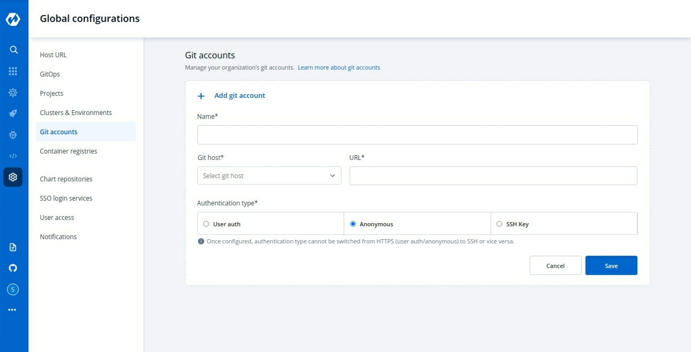
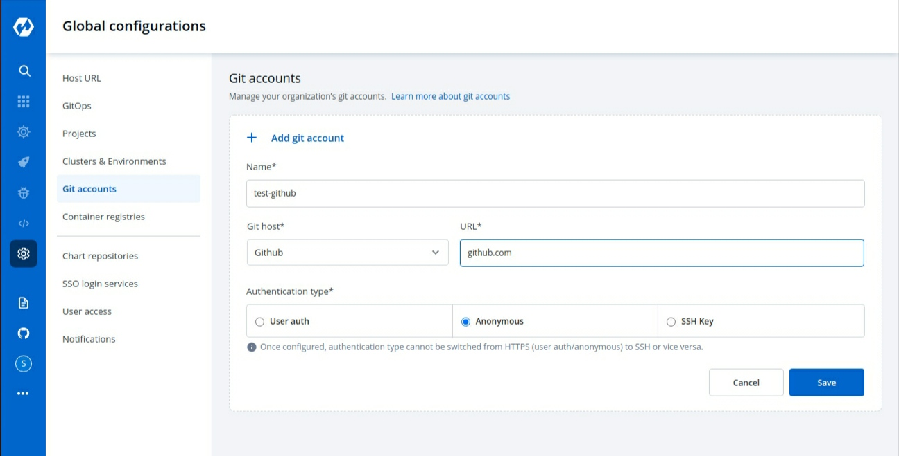
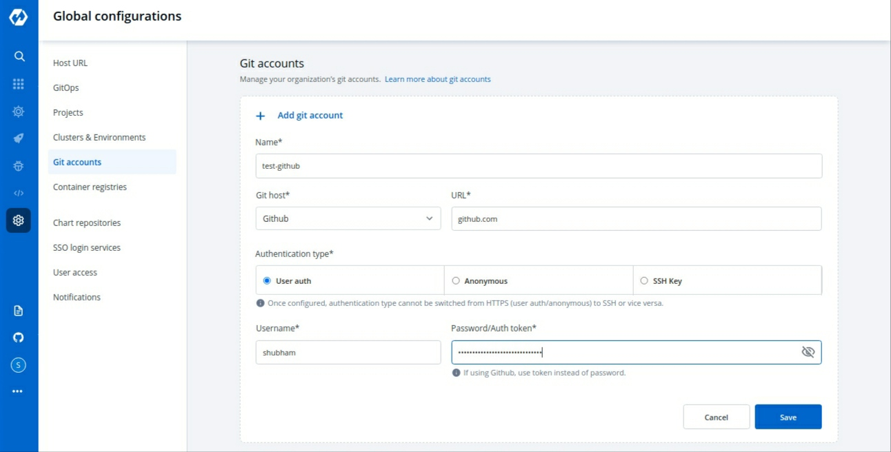
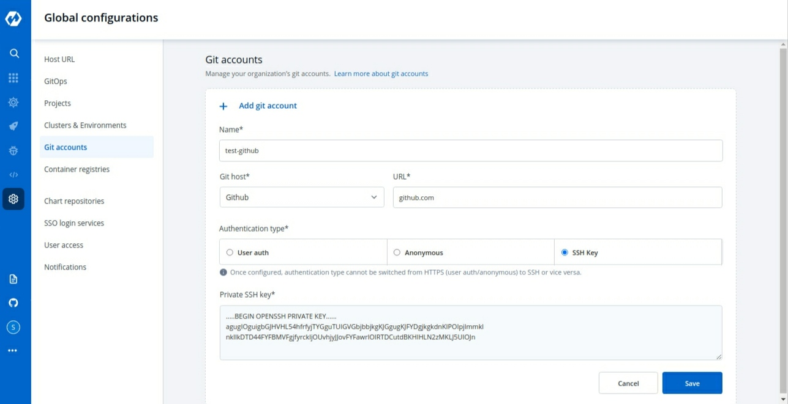
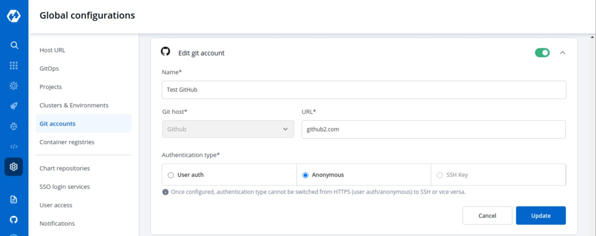
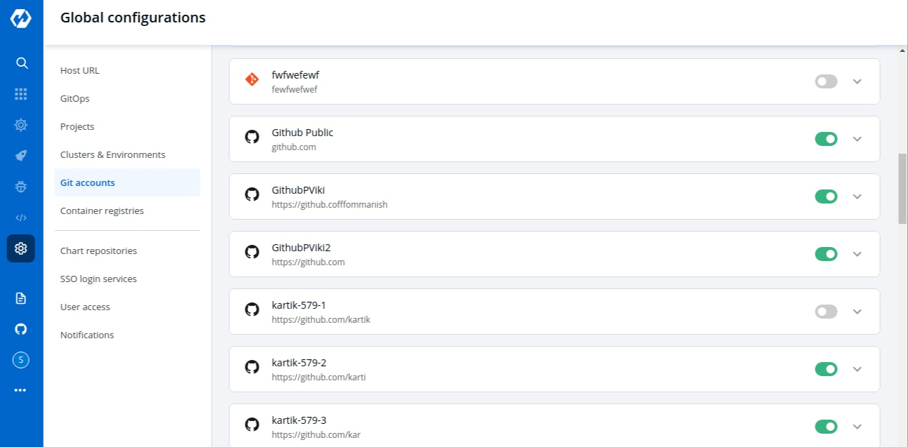

# Git Accounts

Git Accounts allow you to connect your code source with Devtron. You will be able to use these git accounts to build the code using the CI pipeline.

## Git Account Configuration

`Global Configuration` helps you to add a Git provider. Click on `Add git account` button at the top of the Git Account Section. To add a new git provider, add the details as mentioned below.

1. Name
2. Git Host
3. URL
4. Authentication type

### 1. Name

Provide a `Name` to your Git provider. This name will be displayed in the the Git Provider drop-down inside the Git Material configuration section.

### 2. Git Host

It is the git provider on which corresponding application git repository is hosted. By default you will get Bitbucket and GitHub but you can add many as you want clicking on **[+ Add Git Host]**.

### 3. URL

Provide the `URL`. **For example**- [https://github.com](https://github.com) for Github, [https://gitlab.com](https://gitlab.com) for GitLab, etc.

### 4. Authentication type

Here provide the type of authentication required by your version controller. Devtron supports three types of authentications. You can choose the one that suits you the best.

* **Anonymous**

If authentication type is set as `Anonymous` then you do not need to provide any username, password/authentication token or SSH key. Just click on `Save` to save the git account provider details. 
>If authentication type is set as `Anonymous`, only public git repository will be accessible.

* **User Auth**

If you select `User Auth` then you have to provide the `Username` and either of `Password` or `Auth Token` for the authentication of your version controller account. Click on `Save` to save the git account provider details.

* **SSH Key**

If you choose `SSH Key` then you have to provide the `Private SSH Key` corresponding to the public key added in your version controller account. Click on `Save` to save the git account provider details.

## Update Git Account

You can update your saved git account settings at anytime. To update the git account:

1. Click on the git account which you want to update. 
2. Make the required changes 
3. Click on `Update` to save the changes.

Updates can only be made within one Authentication type or one protocol type, i.e. HTTPS(Anonymous or User Auth) & SSH. You can update from Anonymous to User Auth & vice versa, but not from Anonymous/User Auth to SSH or reverse.

### Note:

You can enable or disable a git account. Enabled git accounts will be available to be used in Application configuration > [Git repository](../creating-application/git-material.md).

Disabled git accounts will be unavailable for use in future applications. Applications already using a disabled git account will not be affected.

