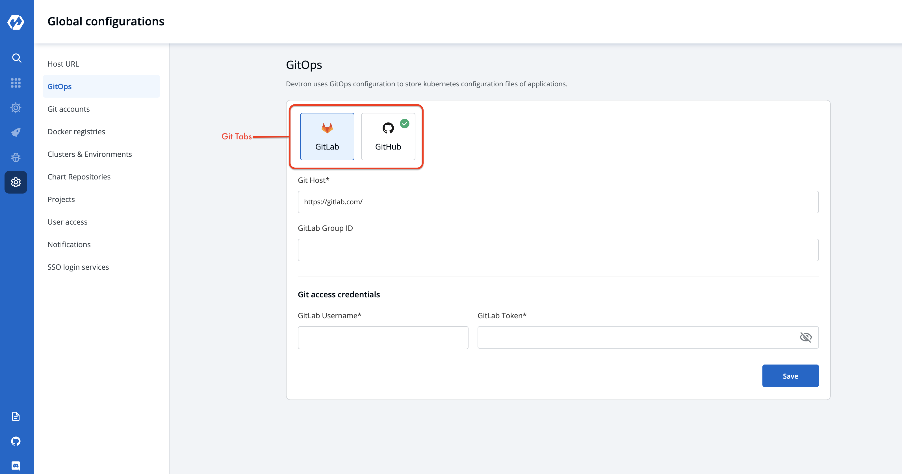

# Gitops

This feature in Global Configuration allows you to select Git

## Add Git Configuration

Select the gitops section of global configuration . At the top of the section two git tabs are available.

1. Gitlab
2. Github

Select one of the git tab.To add three inputs as mentioned below:
1. Git Host
2. Git Lab Group id / Git Hub Organization id
3. Git access credential

### 1. Git Host: 

This field is by default filled, showing url of selected tab. For example- https://github.com for Github, https://gitlab.com for GitLab

### 2. GitLab Group Id:

Provide `id` to your account.

### 3. Git access credential

you have to provide the `Username` and `Token` of your version controller account. Click on Save to save your gitops configuration details.

