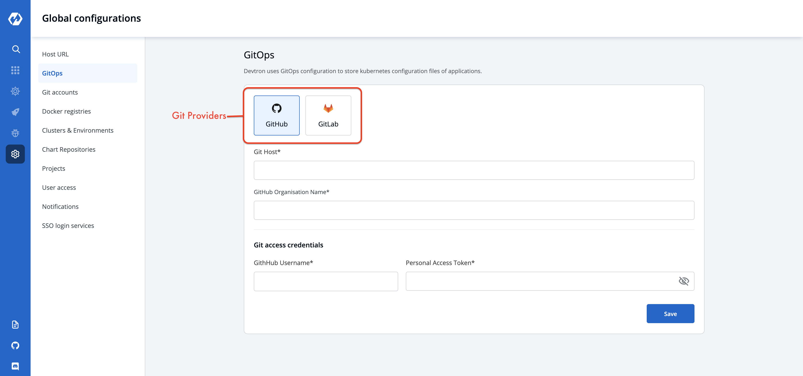
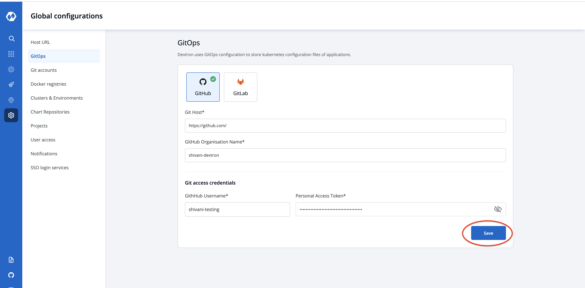

# Gitops

## Why Devtron takes Gitops Configuration?
Devtron uses GitOps and stores configurations in git; Git Credentials can be entered at `Global Configuration > GitOps` is used by Devtron for configuration management and storing desired state of the application configuration. 

In case GitOps is not configured, Devtron cannot deploy any application or charts. Areas impacted by GitOps are:

* Deployment Template, [click here](https://docs.devtron.ai/user-guide/creating-application/deployment-template) to learn more.
* Charts, [click here](https://docs.devtron.ai/user-guide/deploy-chart) to learn more.

## Add Git Configuration

Select the Gitops section of global configuration. At the top of the section, two Git providers are available.

* **GitHub**
* **GitLab**

Select one of the Git providers. To add git account, You need to provide three inputs as given below:
1. Git Host
2. Github Organization Name / Gitlab Group id 
3. Git access credential

### 1. Git Host: 

This field is filled by default, Showing the URL of the selected git providers. For example- https://github.com for Github, https://gitlab.com for GitLab.

### 2. Github Organization Name / GitLab Group Id:

In the case of Github provide `Github Organization Name`. Learn more about [GitHub organization Name](https://docs.github.com/en/github/setting-up-and-managing-organizations-and-teams/about-organizations), Similarly for Gitlab provide `Gitlab group Id`. Learn more about [Gitlab group Id]()

### 3. Git access credential

Provide Git `Username` and `Personal Access Token` of your git account. 
Permissions required for the gitops are:

#### For Github Organization Name [Creating a Github personal access token](https://docs.github.com/en/github/authenticating-to-github/creating-a-personal-access-token):
* repo
* admin

#### For GitLab Group Id [Creating a Gitlab personal access token](https://docs.gitlab.com/ee/user/profile/personal_access_tokens.html):

* api 
* read_user 
* read_api 
* read_repository 
* write_repository 
* read_registry 
* write_registry

Click on Save to save your gitops configuration details.
 

> Note: A Green tick will appear on the saved gitops provider.