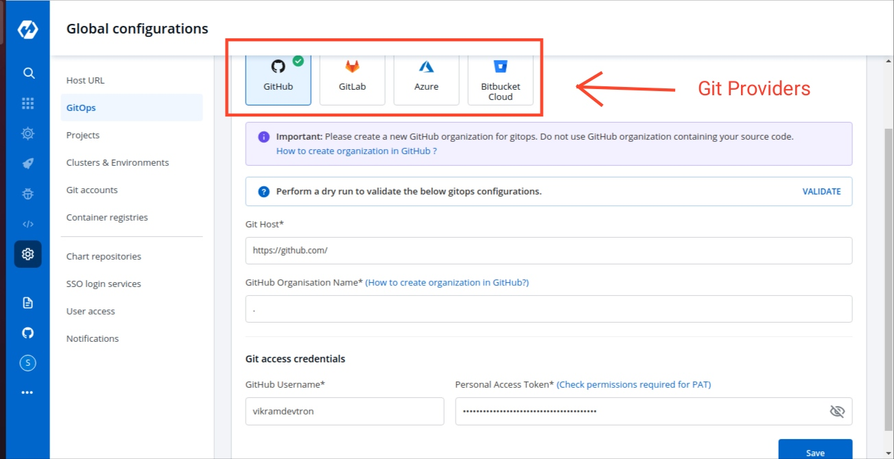

# GitOps

## Why Devtron takes GitOps Configuration?
Devtron uses GitOps and stores configurations in git; Git Credentials can be entered at `Global Configuration > GitOps` which is used by Devtron for configuration management and storing desired state of the application configuration. 
In case GitOps is not configured, Devtron cannot deploy any application or charts. 

Areas impacted by GitOps are:

* Deployment Template, [click here](https://docs.devtron.ai/user-guide/creating-application/deployment-template) to learn more.
* Charts, [click here](https://docs.devtron.ai/user-guide/deploy-chart) to learn more.

## Add Git Configuration

Select the GitOps section of global configuration. At the top of the section, four Git providers are available.

* **GitHub**
* **GitLab**
* **Azure**
* **BitBucket Cloud**

Select one of the Git providers. To add git account, You need to provide the following inputs as given below:
1. Git Host / Azure DevOps Organisation Url / BitBucket Host  
2. GitHub Organization Name / Gitlab Group id / Azure DevOps Project Name / BitBucket Workspace ID  
3. BitBucket Project Key (only for BitBucket Cloud)  
4. Git access credential  

### 1. Git Host: 

This field is filled by default, Showing the URL of the selected git providers. For example- https://github.com for GitHub, https://gitlab.com for GitLab, https://dev.azure.com/ for Azure & https://bitbucket.org for BitBucket. Please replace them(not available for GitHub & BitBucket) if they are not the url you want to use.

### 2. GitHub Organization Name / GitLab Group ID / Azure DevOps Project Name / BitBucket Workspace ID:

In the case of GitHub provide `Github Organization Name*`. Learn more about [Github organization Name](https://docs.github.com/en/github/setting-up-and-managing-organizations-and-teams/about-organizations).  
In the case of Gitlab provide `Gitlab group Id*`. Learn more about [Gitlab group Id](https://docs.gitlab.com/ee/user/group/).  
Similarly in the case of Azure provide `Azure DevOps Project Name*`. Learn more about [Azure DevOps Project Name](https://docs.microsoft.com/en-us/azure/devops/organizations/projects/create-project?view=azure-devops&tabs=preview-page).  
For Bitbucket Cloud, provide `Bitbucket Workspace Id*`. Learn more about [Bitbucket Workspace Id](https://support.atlassian.com/bitbucket-cloud/docs/what-is-a-workspace/).

### 3. BitBucket Project Key: 

This field is non-mandatory and is only to be filled when you have chosen `Bitbucket Cloud` as your git provider. If not provided, the oldest project in the workspace will be used. Learn more about [Bitbucket Project Key](https://support.atlassian.com/bitbucket-cloud/docs/group-repositories-into-projects/).
### 4. Git access credential

Provide Git `Username` and `Personal Access Token` of your git account. 

**\(a\) Username** 
Username for your git account.

**\(b\) Personal Access Token**  
A personal access token (PAT) is used as an alternate password to authenticate into your git accounts. 

#### For GitHub [Creating a GitHub Personal Access Token](https://docs.github.com/en/github/authenticating-to-github/creating-a-personal-access-token):

* repo - Full control of private repositories(Access commit status , Access deployment status and Access public repositories).
* admin:org - Full control of organizations and teams(Read and write access).
* delete_repo - Grants delete repo access on private repositories.

#### For GitLab [Creating a GitLab Personal Access Token](https://docs.gitlab.com/ee/user/profile/personal_access_tokens.html):

* api - Grants complete read/write access to the scoped project API.
* write_repository - Allows read-write access (pull, push) to the repository. 

#### For Azure DevOps [Creating a Azure DevOps Access Token](https://docs.microsoft.com/en-us/azure/devops/organizations/accounts/use-personal-access-tokens-to-authenticate?view=azure-devops&tabs=preview-page): 

* code - Grants the ability to read source code and metadata about commits, change sets, branches, and other version control artifacts.
[More Information on scopes in Azure devops](https://docs.microsoft.com/en-us/azure/devops/integrate/get-started/authentication/oauth?view=azure-devops#scopes).

#### For BitBucket Cloud [Creating a Bitbucket Cloud Personal Access Token (App passwords)](https://support.atlassian.com/bitbucket-cloud/docs/app-passwords/)

* repo - Full control of repositories (Read, Write, Admin, Delete access). 

Click on Save to save your gitOps configuration details.
 

> Note: A Green tick will appear on the active gitOps provider.
