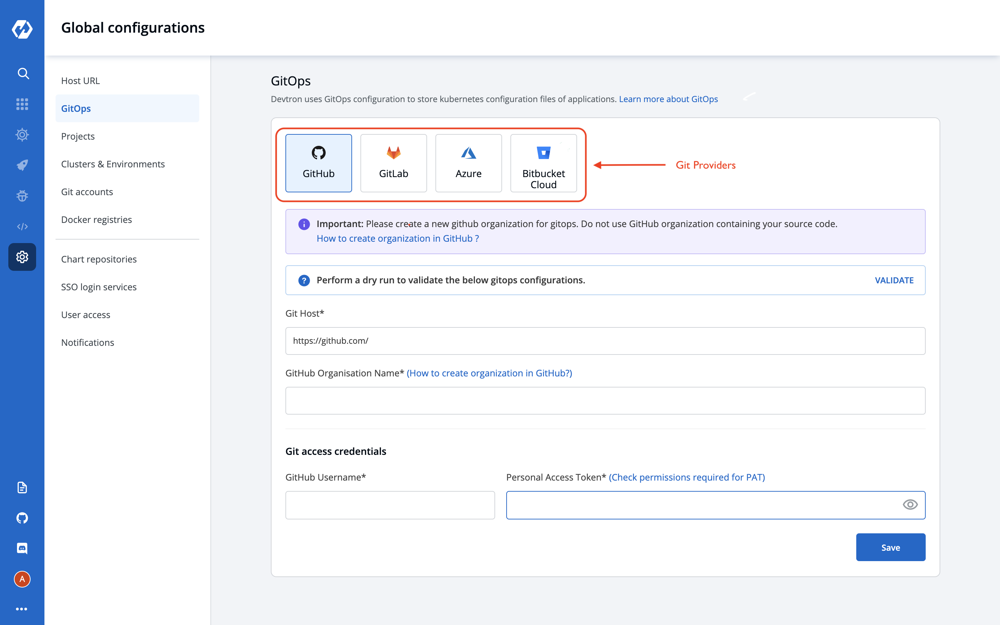

# Gitops

## Why Devtron takes Gitops Configuration?
Devtron uses GitOps and stores configurations in git; Git Credentials can be entered at `Global Configuration > GitOps` which is used by Devtron for configuration management and storing desired state of the application configuration. 
In case GitOps is not configured, Devtron cannot deploy any application or charts. 

Areas impacted by GitOps are:

* Deployment Template, [click here](https://docs.devtron.ai/user-guide/creating-application/deployment-template) to learn more.
* Charts, [click here](https://docs.devtron.ai/user-guide/deploy-chart) to learn more.

## Add Git Configuration

Select the Gitops section of global configuration. At the top of the section, three Git providers are available.

* **GitHub**
* **GitLab**
* **Azure**

Select one of the Git providers. To add git account, You need to provide three inputs as given below:
1. Git Host / Azure DevOps Organisation Url  
2. Github Organization Name / Gitlab Group id / Azure DevOps Project Name  
3. Git access credential  

### 1. Git Host: 

This field is filled by default, Showing the URL of the selected git providers. For example- https://github.com for Github, https://gitlab.com for GitLab, https://dev.azure.com/ for Azure. Please replace them if they are not the url you want to use.

### 2. Github Organization Name / GitLab Group Id / Azure DevOps Project Name:

In the case of Github provide `Github Organization Name*`. Learn more about [GitHub organization Name](https://docs.github.com/en/github/setting-up-and-managing-organizations-and-teams/about-organizations)  
In the case of Gitlab provide `Gitlab group Id*`. Learn more about [Gitlab group Id](https://docs.gitlab.com/ee/user/group/)  
Similarly in the case of Azure provide `Azure DevOps Project Name*`. Learn more about [Azure DevOps Project Name](https://docs.microsoft.com/en-us/azure/devops/organizations/projects/create-project?view=azure-devops&tabs=preview-page)

### 3. Git access credential

Provide Git `Username` and `Personal Access Token` of your git account. 
Permissions required for the gitops are:

#### For GithHub Username* [Creating a Github Personal Access Token](https://docs.github.com/en/github/authenticating-to-github/creating-a-personal-access-token):
* repo
* admin access

#### For GitLab Username* [Creating a Gitlab Personal Access Token](https://docs.gitlab.com/ee/user/profile/personal_access_tokens.html):

* api 
* read_user 
* read_api 
* read_repository 
* write_repository 
* read_registry 
* write_registry

#### For Azure DevOps Username* [Creating a Azure DevOps Access Token](https://docs.microsoft.com/en-us/azure/devops/organizations/accounts/use-personal-access-tokens-to-authenticate?view=azure-devops&tabs=preview-page): 
* repo
* admin access

Click on Save to save your gitops configuration details.
 

> Note: A Green tick will appear on the saved gitops provider.