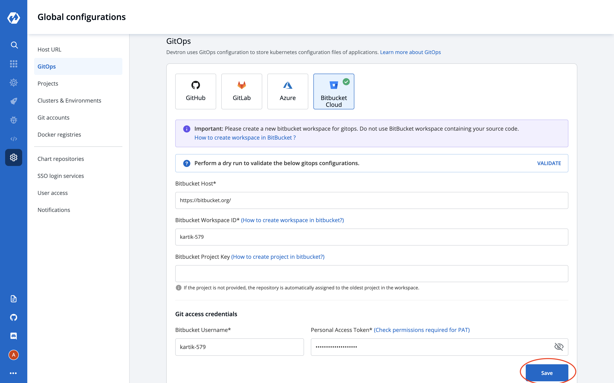

# Gitops

## Why Gitops?
Devtron use argocd to deploy application, This feature in Global Configuration allows you to select Git account to store our application and chart repos. Argocd linked to these gitops repos to fetch manifest files.
Gitops move to global configuration part so that super admin can create accordingly as after cluster installation.

## Add Git Configuration

Select the Gitops section of global configuration. At the top of the section two git tabs are available.

* **GitHub**
* **GitLab**

Select one of the git tab. To add git you need to provide three inputs as below:
1. Git Host
2. Github Organization Name / Gitlab Group id 
3. Git access credential

### 1. Git Host: 

This field is filled by default, Showing url of selected tab. For example- https://github.com for Github, https://gitlab.com for GitLab.

### 2. Github Organization Name / GitLab Group Id:

In case of Github provide `Github organization Name`. Similarly for Gitlab provide `Gitlab group Id`.
What permissions are required for the gitop organization id? 
api, read_user, read_api, read_repository, write_repository, read_registry, write_registry

### 3. Git access credential

Provide Git `Username` and `Personal Access Token` of your git account. Click on Save to save your gitops configuration details.
 

> Note: In case of no gitop configuration, We can't create deployment template for any application or chart. 

Learn more about [Deployment Template](https://docs.devtron.ai/user-guide/creating-application/deployment-template)