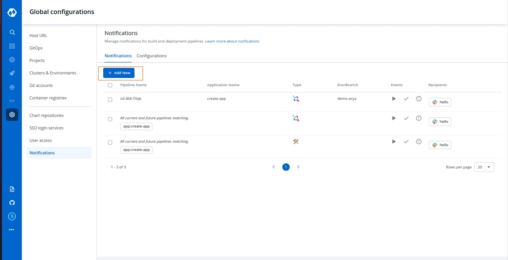
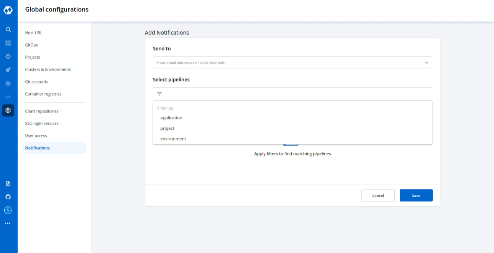

# Manage Notification

With the `Manage Notification` feature, you can manage the notifications for your build and deployment pipelines. You can receive the notifications on Slack or via e-mail.

Go to the `Global Configurations` -&gt; `Notifications`

## Notification Configurations:

Click `Configurations` to add notification configuration in one of the following options:
* [SES Configurations](#manage-ses-configurations)
* [SMTP Configurations](#manage-smtp-configurations)
* [Slack Configurations](#manage-slack-notifications)

### **Manage SES Configurations**

You can manage the `SES configuration` to receive e-mails by entering the valid credentials. Make sure your e-mail is verified by SES.

Click `Add` and configure SES.

| Key | Description |
| :--- | :--- |
| `Configuration Name` | Provide a name to the SES Configuration. |
| `Access Key ID` | Valid AWS Access Key ID. |
| `Secret Access Key` | Valid AWS Secret Access Key. |
| `AWS Region` | Select the AWS Region from the drop-down menu. |
| `E-mail` | Enter the SES verified e-mail id on which you wish to receive e-mail notifications. |

Click `Save` to save your SES configuration or e-mail ID

### **Manage SMTP Configurations**

You can manage the `SMTP configuration` to receive e-mails by entering the valid credentials. Make sure your e-mail is verified by SMTP.

Click `Add` and configure SMTP.

| Key | Description |
| :--- | :--- |
| `Configuration Name` | Provide a name to the SMTP Configuration |
| `SMTP Host` | Host of the SMTP. |
| `SMTP Port` | Port of the SMTP. |
| `SMTP Username` | Username of the SMTP. |
| `SMTP Password` | Password of the SMTP. |
| `E-mail` | Enter the SMTP verified e-mail id on which you wish to receive e-mail notifications. |

Click `Save` to save your SMTP configuration or e-mail ID

### **Manage Slack Configurations**

You can manage the `Slack configurations` to receive notifications on your preferred Slack channel.

Click `Add` to add new Slack Channel.

| Key | Description |
| :--- | :--- |
| `Slack Channel` | Name of the Slack channel on which you wish to receive notifications. |
| `Webhook URL` | Enter the valid [Webhook URL link](https://slack.com/intl/en-gb/help/articles/115005265063-Incoming-webhooks-for-Slack). |
| `Project` | Select the project name to control user access. |

Click `Save` and your slack channel will be added.

## **Manage Notifications**

Click `Add New` to receive new notification.

### **Manage Slack Notifications**

_**Send To**_

When you click on the `Send to` box, a drop-down will appear, select your slack channel name if you have already configured Slack Channel. If you have not yet configured the Slack Channel, [Configure Slack Channel](manage-notification.md#manage-slack-configurations)

_**Select Pipelines**_

* Then, to fetch pipelines of an application, project and environment.
  * Choose a filter type\(`environment`, `project` or `application`\)
  * You will see a list of pipelines corresponding to your selected filter type, you can select any number of pipelines. For each pipeline, there are 3 types of events `Trigger`, `Success`, and `Failure`. Click on the checkboxes for the events, on which you want to receive notifications.

Click `Save` when you are done with your Slack notification configuration.

### **Manage SES Notifications**

_**Send To**_

* Click `Send To` box, select your e-mail address/addresses on which you want to send e-mail notifications. Make sure e-mail id are SES Verified.

If you have not yet configured SES, [Configure SES](manage-notification.md#manage-ses-configurations).

_**Select Pipelines**_

* To fetch pipelines of an application, project and environment.
  * Choose a filter type\(environment, project or application\)
  * You will see a list of pipelines corresponding to your selected filter type, you can select any number of pipelines. For each pipeline, there are 3 types of events `Trigger`, `Success`, and `Failure`. Click on the checkboxes for the events, on which you want to receive notifications.

Click `Save` once you have configured the SES notification.

### **Manage SMTP Notifications**

_**Send To**_

* Click `Send To` box, select your e-mail address/addresses on which you want to send e-mail notifications. Make sure e-mail IDs are SMTP Verified.

If you have not yet configured SMTP, [Configure SMTP](manage-notification.md#manage-smtp-configurations).

_**Select Pipelines**_

* To fetch pipelines of an application, project and environment.
  * Choose a filter type\(environment, project or application\)
  * You will see a list of pipelines corresponding to your selected filter type, you can select any number of pipelines. For each pipeline, there are 3 types of events `Trigger`, `Success`, and `Failure`. Click on the checkboxes for the events, on which you want to receive notifications.

Click `Save` once you have configured the SMTP notification.

