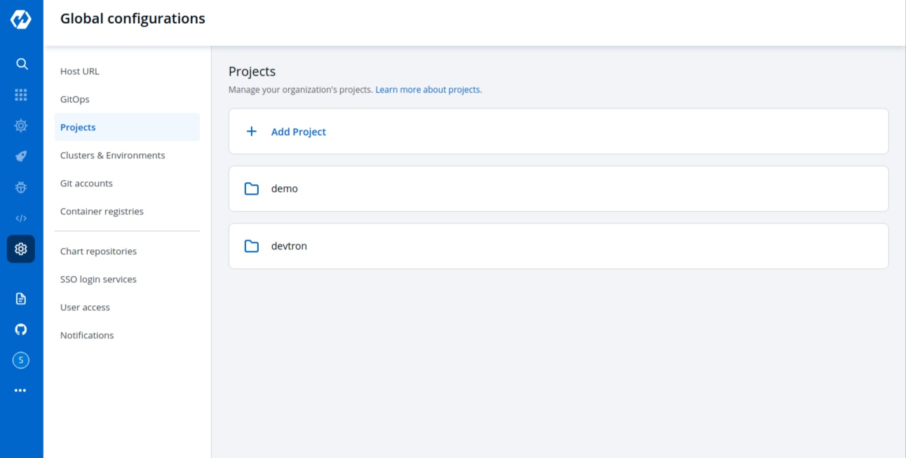

# Projects

Projects are nothing but a logical grouping of your applications so that you can manage and control the access level of users. We will discuss `User Access` in the next step.

## Add Project:

Click on the Projects inside the Global configuration tab. Click on `Add projects` and give a name to your project and press the `Save` button to save your project

