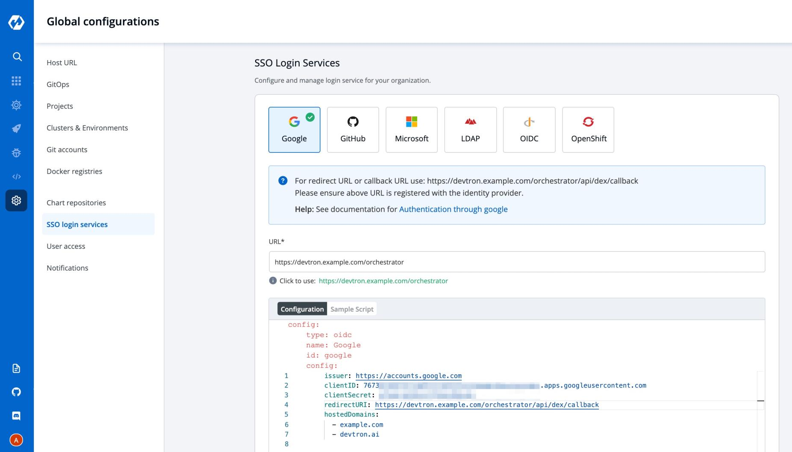

# SSO LOGIN 
## OVERVIEW

Once installed DEVTRON has one built-in `admin` user with super-admin privileges that is complete access to the system. It is recommended to use `admin` user only for initial and global configuration and then switch to local users or configure SSO integration.

Only users with super-admin privileges have access to create SSO configuration. Devtron uses dex for authenticating a user against the identity provider.

To add/edit SSO configuration please go to the left main panel -&gt; Select `Global Configurations` -&gt; Select `SSO Login Services`

## Supported SSO Providers

`LDAP` 
`GitHub` 
`OpenID Connect` 
`Google` 
`Microsoft` 
`OpenShift` 

Dex implements connectors that target specific `identity providers`, for each connector configuration user must have created account for the corresponding identity provider and registered an app for client key and secret.
For examples see 
* https://dexidp.io/docs/connectors/
* https://dexidp.io/docs/connectors/google/

### 1. Create new SSO Configuration

Login as a user with super-admin privileges and go to `Global Configurations` -&gt; `SSO Login Services` and click on any `Identity Provider` and fill the configuration. 

Add valid devtron application `URL` where it is hosted.

Fill correct `redirect URL` or `callback URL` from which you have registered with the identity provider in the previous step along with the `client id` and `client secret` shared by the identity provider.

Only single SSO login configuration can be active at one time. Whenever you create or update any SSO config, it will be activated and used by the system and previous configurations will be deleted.

URL and redirectURI should be same as provided in screenshots except domain substring.

Click on `Save` bottom for creating and activating sso login on bottom right of the configuration.

### 2. Update SSO Configuration

SSO configuration can be changed by the user at any later point in time by updating the configuration and clicking on the `Save` button at the bottom right.
In case of configuration change all users will be logged out of the system and will have to login again.

### 3. Configuration Payload

* `type` : oidc or any platform name such as (google, gitlab, github etc) 
* `name` : identity provider platform name 
* `id` : identity provider platform unique id in string. (refer to dexidp.io)
* `config` : user can put connector details into this key. platforms may not have same structure but commons are clientID, clientSecret, redirectURI.
* `hostedDomains` : domains authorized for SSO login.
