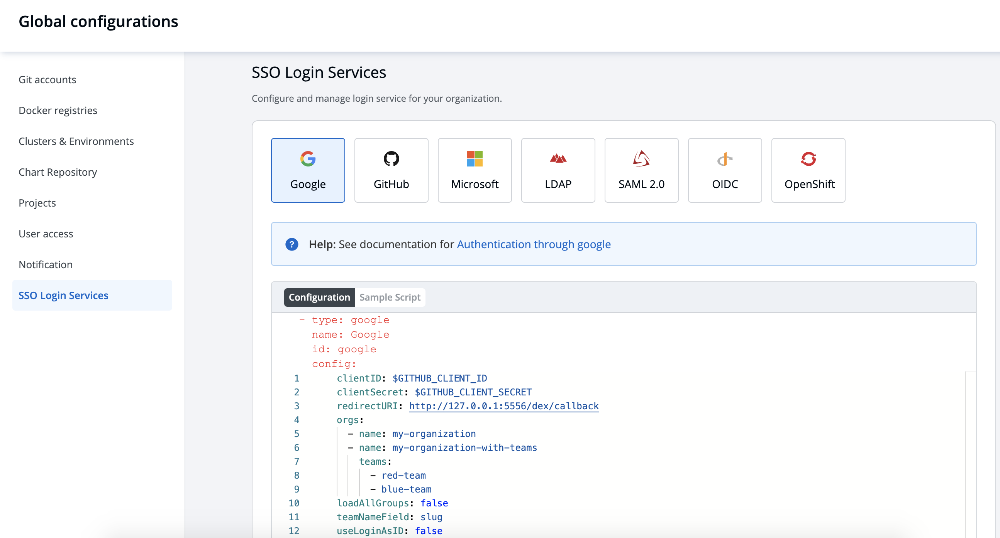

# SSO LOGIN 
## OVERVIEW



Once installed DEVTRON has one built-in super-admin user that has full access to the system. It is recommended to use super-admin user only for initial
and global configuration and then switch to local users or configure SSO integration.

Only super-admin has access to create SSO configuration. we are using dex for authenticating a user against another identity provider

Go to the left main panel -&gt; `Select Global Configurations` -&gt; Select `SSO Login Services`

## SSO Providers

`Connectors`
`LDAP`
`GitHub`
`SAML 2.0`
`Gitlab`
`OpenID Connect`
`Google`
`LinkedIn`
`Microsoft`
`AuthProxy`
`Bitbucket Cloud`
`OpenShift`
`Atlassian Crowd`
`Gitea`

Dex implements connectors that target specific platforms, for each connector configuration user must have create account for corresponding identity provider and register a app for client key and secret.
* see example 
* https://dexidp.io/docs/connectors/
* https://dexidp.io/docs/connectors/google/

### 1. Create new SSO Configuration

Login as a super admin and go to global configuration sso login service. select available providers. fill the client id and client secret which you have register on previous step.
and correct redirect URL or callback URL.

Only single sso login configuration will be active at one time. whichever you create or update any sso config that will be activated and used in the system.

Click on any `Platform` and fill the correct configuration

Click on `Save` bottom for creating and activating sso login on bottom right of the configuration.

### 1. Update SSO Configuration

Once user created sso config for any platform it will be updated from next time. update will be done by same action by clicking `Save` bottom right.

### 3. Configuration Payload

* `type` : oidc or any platform name such as (google, gitlab, github etc) 
* `name` : identity provider platform name 
* `id` : identity provider platform unique id in string. (refer to dexidp.io)
* `config` : user can put connector details into this key. platforms may not have same structure but commons are clientID, clientSecret, redirectURI.
* `hostedDomains` : domain where your application is deployed.