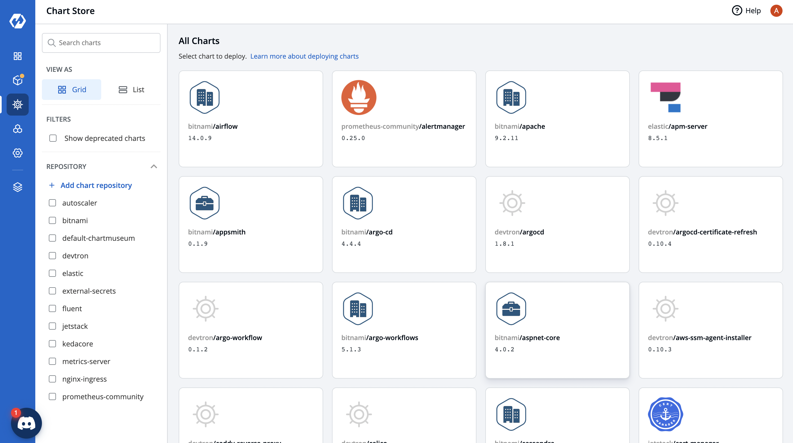
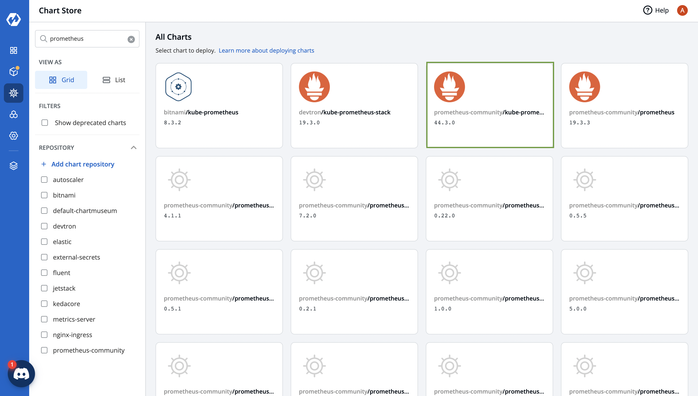
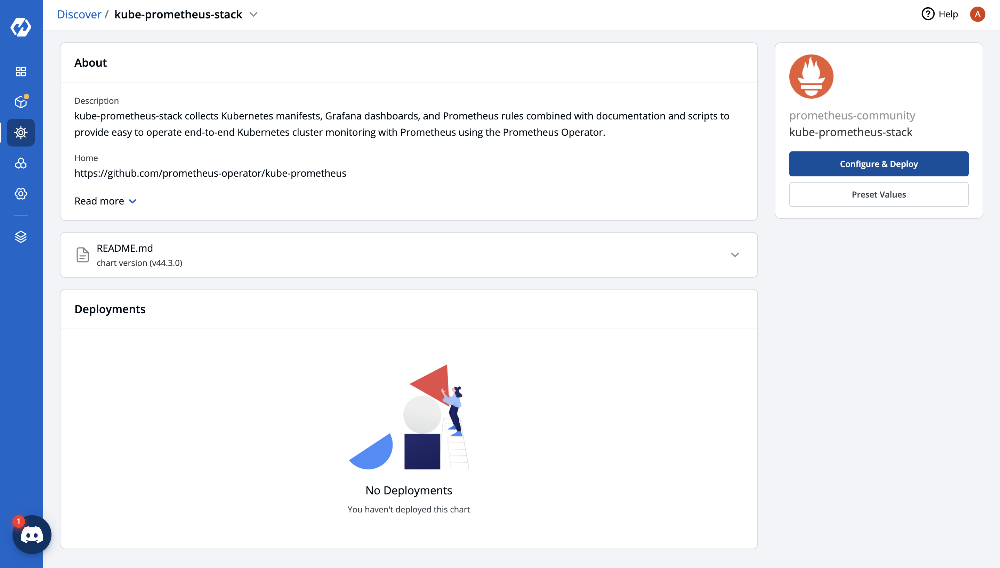
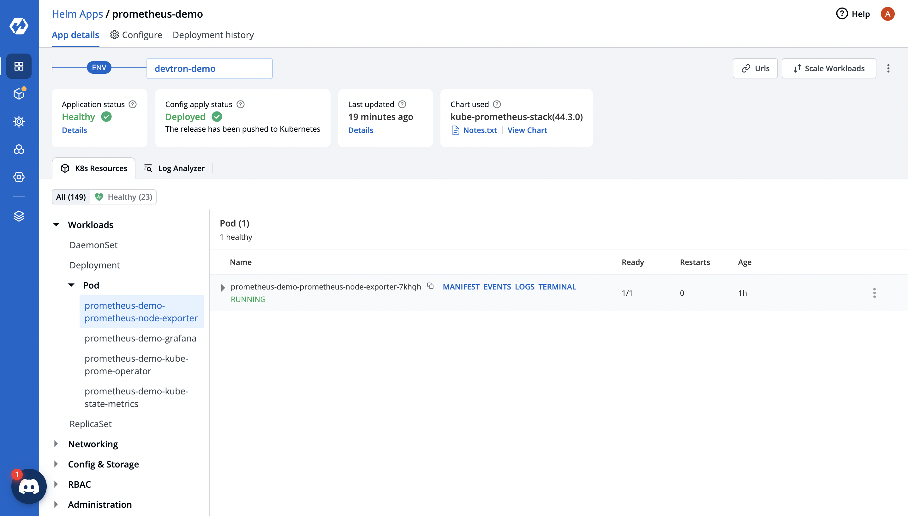

# Prerequisite to setup Prometheus Stack over Devtron

## Introduction

Prometheus is an open-source technology designed to provide monitoring and alerting functionality for cloud-native environments, including Kubernetes. It can collect and store metrics as time-series data, recording information with a timestamp. It can also collect and record labels, which are optional key-value pairs.

### ***Open Devtron DashBoard and Search for ChartStore*** 


### Search for Prometheus and Choose the community kube-prometheus one


### ***Click on the chart*** 

You will see the Configure and Deploy button Click on it you will see the yaml file




### ***You have to make some change in yaml file before deploying***
```yaml
1. search for kube-state-metrics and add

   kube-state-metrics:
    metricLabelsAllowlist:
      - pods=[*]

2. search for podMonitorSelectorNilUsesHelmValues change the value from true to false 
 podMonitorSelectorNilUsesHelmValues: false

3. search for ServiceMonitorSelectorNilUsesHelmValues change the value from true to false
ServiceMonitorSelectorNilUsesHelmValues: false

```

### ***After Making Changes in Yaml file***

Select your Application name and environment in the side bar and deploy it. 

If you see like this then your chart is sucessfully deployed

