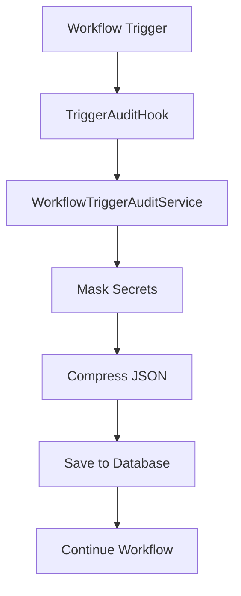
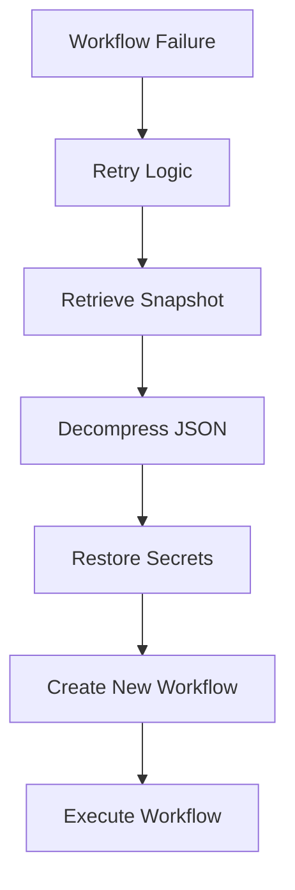

# Workflow Config Snapshot Feature

## Overview

The Workflow Config Snapshot feature is a comprehensive auditing and retry mechanism in Devtron that captures and stores complete workflow configurations at the time of trigger for CI, Pre-CD, and Post-CD workflows. This feature enables reliable workflow retriggers using historical configurations and provides audit trails for troubleshooting and compliance purposes.

## Key Features

- **Automatic Snapshot Creation**: Captures complete workflow configuration at trigger time
- **Secret Sanitization**: Safely stores configurations with sensitive data masked
- **Retry Mechanism**: Enables retrigger of failed workflows using stored snapshots
- **Audit Trail**: Maintains historical record of all workflow configurations
- **Compression**: Uses gzip compression to optimize storage space
- **Schema Versioning**: Supports backward compatibility through schema versioning

## Architecture Components

### 1. Database Schema

The feature uses the `workflow_config_snapshot` table to store workflow configurations:

```sql
CREATE TABLE "workflow_config_snapshot" (
    "id"                             int4        NOT NULL PRIMARY KEY,
    "workflow_id"                    int4        NOT NULL, -- ci_workflow.id or cd_workflow_runner.id
    "workflow_type"                  varchar(20) NOT NULL, -- CI, PRE_CD, POST_CD
    "pipeline_id"                    int4        NOT NULL,
    "workflow_request_json"          text        NOT NULL, -- compressed WorkflowRequest JSON
    "workflow_request_schema_version" varchar(20) NOT NULL DEFAULT 'V1',
    "created_on"                     timestamptz NOT NULL,
    "created_by"                     int4        NOT NULL,
    "updated_on"                     timestamptz NOT NULL,
    "updated_by"                     int4        NOT NULL,
    UNIQUE ("workflow_id", "workflow_type")
);
```

### 2. Core Components

#### WorkflowTriggerAuditService
- **Purpose**: Main service for creating and retrieving workflow snapshots
- **Key Methods**:
  - `SaveTriggerAudit()`: Creates and saves workflow snapshots
  - `GetWorkflowRequestFromSnapshotForRetrigger()`: Retrieves snapshots for retrigger

#### TriggerAuditHook
- **Purpose**: Provides common hooks for auditing workflow triggers
- **Integration Points**:
  - `AuditCiTrigger()`: Called during CI workflow triggers
  - `AuditPrePostCdTrigger()`: Called during Pre-CD and Post-CD triggers

#### WorkflowConfigSnapshotRepository
- **Purpose**: Database operations for workflow snapshots
- **Key Methods**:
  - `SaveWithTx()`: Saves snapshot within transaction
  - `FindLatestFailedWorkflowSnapshot()`: Retrieves snapshots for retrigger

## Workflow Types

The system supports three workflow types:

| Type | Constant | Description |
|------|----------|-------------|
| CI | `CI_WORKFLOW_TYPE` | Continuous Integration workflows |
| Pre-CD | `PRE_CD_WORKFLOW_TYPE` | Pre-deployment workflows |
| Post-CD | `POST_CD_WORKFLOW_TYPE` | Post-deployment workflows |

## Data Flow

### 1. Snapshot Creation Process



### 2. Retrigger Process



## Secret Management

### Sanitization Process

The system automatically masks sensitive fields before storage:

**Blob Storage Secrets:**
- `BlobStorageS3Config.AccessKey`
- `BlobStorageS3Config.Passkey`
- `AzureBlobConfig.AccountKey`
- `GcpBlobConfig.CredentialFileJsonData`

**Docker Registry Secrets:**
- `DockerPassword`
- `AccessKey`
- `SecretKey`
- `DockerCert`

### Secret Restoration

During retrigger, secrets are restored from current environment variables:
- Docker registry credentials from `DockerRegistryConfig`
- Blob storage credentials from `CiCdConfig`
- Cloud provider specific configurations

## Integration Points

### CI Pipeline Integration

<augment_code_snippet path="pkg/build/trigger/HandlerService.go" mode="EXCERPT">
````go
func (impl *HandlerServiceImpl) triggerCiPipeline(trigger *types.CiTriggerRequest) (int, error) {
    variableSnapshot, savedCiWf, workflowRequest, err := impl.prepareCiWfRequest(trigger)
    if err != nil {
        impl.Logger.Errorw("error in preparing wf request", "triggerRequest", trigger, "err", err)
        return 0, err
    }

    err = impl.executeCiPipeline(workflowRequest)
    // ... audit integration happens in executeCiPipeline
}
````
</augment_code_snippet>

### CD Pipeline Integration

<augment_code_snippet path="pkg/executor/WorkflowService.go" mode="EXCERPT">
````go
func (impl *WorkflowServiceImpl) auditTrigger(workflowRequest *types.WorkflowRequest) error {
    if workflowRequest.IsCdStageTypePre() || workflowRequest.IsCdStageTypePost() {
        err := impl.triggerAuditHook.AuditPrePostCdTrigger(workflowRequest)
        // ... handle audit for Pre/Post CD
    } else {
        err := impl.triggerAuditHook.AuditCiTrigger(workflowRequest)
        // ... handle audit for CI
    }
    return nil
}
````
</augment_code_snippet>

## Retry Mechanism

### CI Workflow Retry

<augment_code_snippet path="pkg/build/trigger/HandlerService.go" mode="EXCERPT">
````go
func (impl *HandlerServiceImpl) reTriggerCiFromSnapshot(refCiWorkflow *pipelineConfig.CiWorkflow) error {
    // Retrieve workflow request from snapshot
    workflowRequest, err := impl.workflowTriggerAuditService.GetWorkflowRequestFromSnapshotForRetrigger(
        refCiWorkflow.Id, types.CI_WORKFLOW_TYPE)
    if err != nil {
        return err
    }
    // Create new workflow and execute
}
````
</augment_code_snippet>

### CD Workflow Retry

<augment_code_snippet path="pkg/workflow/dag/WorkflowDagExecutor.go" mode="EXCERPT">
````go
func (impl *WorkflowDagExecutorImpl) reTriggerCdStageFromSnapshot(runner *pipelineConfig.CdWorkflowRunner) error {
    triggerRequest := triggerBean.CdTriggerRequest{
        CdWf:                  runner.CdWorkflow,
        Pipeline:              runner.CdWorkflow.Pipeline,
        TriggeredBy:           bean7.SYSTEM_USER_ID,
        RefCdWorkflowRunnerId: runner.Id,
        IsRetrigger:           true,
    }
    // Execute retrigger logic
}
````
</augment_code_snippet>

## Configuration

### Environment Variables

| Variable | Default | Description |
|----------|---------|-------------|
| `WORKFLOW_RETRIES_ENABLED` | `false` | Enable/disable workflow retry feature |
| `MAX_CI_WORKFLOW_RETRIES` | `3` | Maximum CI workflow retry attempts |
| `MAX_CD_WORKFLOW_RUNNER_RETRIES` | `3` | Maximum CD workflow retry attempts |

### Schema Versioning

The system uses schema versioning for backward compatibility:
- Current version: `V1` (`TriggerAuditSchemaVersionV1`)
- Future versions can be added without breaking existing snapshots

## Error Handling

### Audit Failure Policy

The system follows a non-blocking audit policy:
- Audit failures are logged but don't fail the workflow trigger
- This ensures workflow execution continues even if audit fails
- Provides resilience against audit system issues

### Retry Limitations

- Maximum retry attempts are configurable per workflow type
- Retries are only attempted for specific failure conditions
- System prevents infinite retry loops

## Performance Considerations

### Storage Optimization

1. **Compression**: JSON data is gzip-compressed before storage
2. **Base64 Encoding**: Compressed data is base64-encoded for safe storage
3. **Unique Constraints**: Prevents duplicate snapshots per workflow

### Memory Management

- Large JSON objects are compressed to reduce database storage
- Decompression happens only during retrigger scenarios
- Suitable for high-volume environments (100k+ entries)

## Monitoring and Observability

### Logging

The system provides comprehensive logging at key points:
- Snapshot creation success/failure
- Secret sanitization process
- Retrigger attempts and outcomes
- Compression/decompression operations

### Metrics

Key metrics to monitor:
- Snapshot creation rate
- Retrigger success rate
- Storage utilization
- Compression ratio

## Security Considerations

### Data Protection

1. **Secret Sanitization**: All sensitive data is masked before storage
2. **Access Control**: Snapshots inherit application-level permissions
3. **Audit Trail**: All operations are logged with user attribution

### Compliance

- Maintains audit trail for compliance requirements
- Supports data retention policies
- Enables forensic analysis of workflow configurations

## Troubleshooting

### Common Issues

1. **Snapshot Not Found**: Check if audit was enabled during original trigger
2. **Secret Restoration Failure**: Verify current environment configuration
3. **Compression Errors**: Check JSON structure validity
4. **Retry Exhaustion**: Review retry limits and failure conditions

### Debug Steps

1. Check audit logs for snapshot creation
2. Verify database entries in `workflow_config_snapshot` table
3. Validate secret restoration configuration
4. Review workflow retry configuration

## Future Enhancements

### Planned Features

1. **Selective Field Auditing**: Option to audit only specific configuration sections
2. **Retention Policies**: Automatic cleanup of old snapshots
3. **Cross-Environment Retrigger**: Retrigger workflows in different environments
4. **Enhanced Secret Management**: Integration with external secret managers

### Extensibility

The system is designed for extensibility:
- Schema versioning supports future enhancements
- Modular service architecture allows component replacement
- Hook-based integration enables custom audit logic

## Implementation Examples

### Creating a Workflow Snapshot

```go
// Example: Creating a snapshot during CI trigger
func (impl *TriggerAuditHookImpl) AuditCiTrigger(workflowRequest *types.WorkflowRequest) error {
    impl.logger.Infow("auditing CI trigger",
        "ciWorkflowId", workflowRequest.WorkflowId,
        "ciPipelineId", workflowRequest.PipelineId,
        "triggeredBy", workflowRequest.TriggeredBy)

    _, err := impl.workflowTriggerAuditService.SaveTriggerAudit(workflowRequest)
    if err != nil {
        impl.logger.Errorw("error in auditing CI trigger",
            "workflowId", workflowRequest.WorkflowId, "err", err)
        // Don't fail the trigger if audit fails
        return nil
    }

    impl.logger.Infow("successfully audited CI trigger",
        "ciWorkflowId", workflowRequest.WorkflowId)
    return nil
}
```

### Retrieving Snapshot for Retrigger

```go
// Example: Retrieving snapshot for CI retrigger
func (impl *HandlerServiceImpl) reTriggerCiFromSnapshot(refCiWorkflow *pipelineConfig.CiWorkflow) error {
    // Retrieve workflow request from snapshot
    workflowRequest, err := impl.workflowTriggerAuditService.GetWorkflowRequestFromSnapshotForRetrigger(
        refCiWorkflow.Id, types.CI_WORKFLOW_TYPE)
    if err != nil {
        impl.Logger.Errorw("error retrieving workflow request from snapshot",
            "ciWorkflowId", refCiWorkflow.Id, "err", err)
        return err
    }

    // Create new CI workflow for retrigger
    newCiWorkflow, err := impl.createNewCiWorkflowForRetrigger(refCiWorkflow)
    if err != nil {
        return err
    }

    // Update workflow IDs for new workflow instance
    workflowRequest.WorkflowId = newCiWorkflow.Id
    workflowRequest.TriggeredBy = bean6.SYSTEM_USER_ID

    // Execute the workflow with restored configuration
    err = impl.executeCiPipeline(workflowRequest)
    if err != nil {
        return err
    }

    impl.Logger.Infow("successfully retriggered CI from snapshot",
        "originalCiWorkflowId", refCiWorkflow.Id,
        "newCiWorkflowId", newCiWorkflow.Id)
    return nil
}
```

### Secret Sanitization Example

```go
// Example: Secret sanitization process
func (impl *WorkflowTriggerAuditServiceImpl) maskSecretsInWorkflowRequest(workflowRequest *types.WorkflowRequest) *types.WorkflowRequest {
    // Mask blob storage secrets
    if workflowRequest.BlobStorageS3Config != nil {
        workflowRequest.BlobStorageS3Config.AccessKey = ""
        workflowRequest.BlobStorageS3Config.Passkey = ""
    }
    if workflowRequest.AzureBlobConfig != nil {
        workflowRequest.AzureBlobConfig.AccountKey = ""
    }
    if workflowRequest.GcpBlobConfig != nil {
        workflowRequest.GcpBlobConfig.CredentialFileJsonData = ""
    }

    // Mask docker registry secrets
    workflowRequest.DockerPassword = ""
    workflowRequest.AccessKey = ""
    workflowRequest.SecretKey = ""
    workflowRequest.DockerCert = ""

    return workflowRequest
}
```

## Database Queries

### Finding Workflow Snapshots

```sql
-- Find all snapshots for a specific workflow
SELECT id, workflow_id, workflow_type, pipeline_id, created_on, created_by
FROM workflow_config_snapshot
WHERE workflow_id = ? AND workflow_type = ?;

-- Find snapshots by pipeline
SELECT id, workflow_id, workflow_type, created_on, created_by
FROM workflow_config_snapshot
WHERE pipeline_id = ?
ORDER BY created_on DESC;

-- Count snapshots by type
SELECT workflow_type, COUNT(*) as snapshot_count
FROM workflow_config_snapshot
GROUP BY workflow_type;
```

### Cleanup Old Snapshots

```sql
-- Delete snapshots older than 30 days
DELETE FROM workflow_config_snapshot
WHERE created_on < NOW() - INTERVAL '30 days';

-- Archive old snapshots (if archival table exists)
INSERT INTO workflow_config_snapshot_archive
SELECT * FROM workflow_config_snapshot
WHERE created_on < NOW() - INTERVAL '90 days';
```

## API Integration

### REST API Endpoints

While the feature primarily operates internally, potential API endpoints could include:

```yaml
# Get workflow snapshot
GET /api/v1/workflows/{workflowId}/snapshot?type={CI|PRE_CD|POST_CD}

# Retrigger from snapshot
POST /api/v1/workflows/{workflowId}/retrigger
{
  "workflowType": "CI",
  "triggeredBy": 1
}

# List snapshots for pipeline
GET /api/v1/pipelines/{pipelineId}/snapshots?type={CI|PRE_CD|POST_CD}
```

## Testing Strategies

### Unit Tests

```go
func TestSaveTriggerAudit(t *testing.T) {
    // Test snapshot creation
    workflowRequest := &types.WorkflowRequest{
        WorkflowId: 123,
        PipelineId: 456,
        Type: bean.CI_WORKFLOW_PIPELINE_TYPE,
        TriggeredBy: 1,
    }

    snapshot, err := auditService.SaveTriggerAudit(workflowRequest)
    assert.NoError(t, err)
    assert.NotNil(t, snapshot)
    assert.Equal(t, 123, snapshot.WorkflowId)
}

func TestSecretSanitization(t *testing.T) {
    // Test that secrets are properly masked
    workflowRequest := &types.WorkflowRequest{
        DockerPassword: "secret123",
        AccessKey: "access123",
    }

    sanitized := auditService.maskSecretsInWorkflowRequest(workflowRequest)
    assert.Empty(t, sanitized.DockerPassword)
    assert.Empty(t, sanitized.AccessKey)
}
```

### Integration Tests

```go
func TestRetriggerFromSnapshot(t *testing.T) {
    // Create original workflow and snapshot
    originalWorkflow := createTestCiWorkflow()
    workflowRequest := createTestWorkflowRequest(originalWorkflow.Id)

    // Save snapshot
    snapshot, err := auditService.SaveTriggerAudit(workflowRequest)
    assert.NoError(t, err)

    // Test retrigger
    retrievedRequest, err := auditService.GetWorkflowRequestFromSnapshotForRetrigger(
        originalWorkflow.Id, types.CI_WORKFLOW_TYPE)
    assert.NoError(t, err)
    assert.NotNil(t, retrievedRequest)
}
```

## Deployment Considerations

### Database Migration

```sql
-- Migration script for enabling the feature
BEGIN;

-- Create sequence
CREATE SEQUENCE IF NOT EXISTS id_seq_workflow_config_snapshot;

-- Create table
CREATE TABLE IF NOT EXISTS workflow_config_snapshot (
    id int4 NOT NULL DEFAULT nextval('id_seq_workflow_config_snapshot'::regclass),
    workflow_id int4 NOT NULL,
    workflow_type varchar(20) NOT NULL,
    pipeline_id int4 NOT NULL,
    workflow_request_json text NOT NULL,
    workflow_request_schema_version varchar(20) NOT NULL DEFAULT 'V1',
    created_on timestamptz NOT NULL,
    created_by int4 NOT NULL,
    updated_on timestamptz NOT NULL,
    updated_by int4 NOT NULL,
    PRIMARY KEY (id),
    UNIQUE (workflow_id, workflow_type)
);

-- Create indexes for performance
CREATE INDEX IF NOT EXISTS idx_workflow_config_snapshot_pipeline_id
ON workflow_config_snapshot(pipeline_id);

CREATE INDEX IF NOT EXISTS idx_workflow_config_snapshot_created_on
ON workflow_config_snapshot(created_on);

COMMIT;
```

### Configuration Updates

```yaml
# Environment configuration
WORKFLOW_RETRIES_ENABLED: "true"
MAX_CI_WORKFLOW_RETRIES: "3"
MAX_CD_WORKFLOW_RUNNER_RETRIES: "3"

# Feature flags
ENABLE_WORKFLOW_AUDIT: "true"
ENABLE_SECRET_SANITIZATION: "true"
```

## Conclusion

The Workflow Config Snapshot feature provides a robust foundation for workflow auditing and retry mechanisms in Devtron. By capturing complete workflow configurations at trigger time, it enables reliable retriggers and maintains comprehensive audit trails while ensuring security through proper secret management.

The feature's modular design and extensible architecture make it suitable for various deployment scenarios and future enhancements. Proper monitoring, testing, and maintenance ensure reliable operation in production environments.
